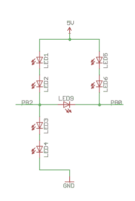
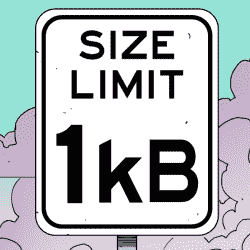

# 7 个发光二极管，2 个引脚——打败它，Charlieplexing

> 原文：<https://hackaday.com/2016/12/10/7-leds-2-pins-beat-that-charlieplexing/>

[Tim]的 [Dice10](https://hackaday.io/project/18595-dice10) 是一个极简主义的练习。使用代码在 1kB 以内的 ATtiny10 制造一个电子骰子并不太困难。多路复用 LED 将使用四个可用 GPIO 引脚中的三个。[Tim]仅使用两个 GPIO 引脚驱动骰子的七个 LED，提升了游戏水平。第三个 GPIO 用作触摸按钮输入。除 ATtiny 和 LED 外，唯一使用的其他元件是电源输入端的一个电容。



2 GPIO for 7 LED’s

LED 分为三对，每对两个 LED 和一个中央 LED。通常，Charlieplexed LED 连接在成对的 GPIO 引脚上。但他的方案除了两个 GPIO 引脚外，还包括 5V 和 GND 端子的连接。建立一个真值表可以很容易地弄清楚发生了什么。

```
STATE PB2 PB0 LED's
1     Z   Z   --
2     L   Z   LED 1/2
3     H   Z   LED 3/4
4     Z   L   LED 5/6
5     Z   H   --
6     H   L   LED9
7     L   H   --
8     H   H   --
9     L   L   --
```

表中只列出了所用的逻辑状态。可以在 PB0 和 GND 之间再增加两个 LED，再增加一个与 LED9 反并联的 LED，这样总共有 10 个 LED 由两个引脚驱动。那是一个相当好的方法。这里重要的是在臂中串联两个 LED，连接到 5V 或 GND。

[Tim]已经在他的[Github repo](https://github.com/cpldcpu/Dice10)上发布了代码和硬件源文件，他在[的博客文章](https://cpldcpu.com/2015/05/24/plexingplus/)上有一些关于他如何解决这个问题的更多细节。

如果你正在寻找更多关于最小骰子设计的灵感，请查看这个" [PIC 供电的电子骰子对](http://hackaday.com/2012/10/25/a-pic-powered-pair-of-electronic-dice/)"，它使用一个 PIC 12F629，五个输出驱动一对 7 点，以制作一个双骰子。



如果你心中有一个很酷的项目，还有足够的时间[参加 1 kB 挑战](https://hackaday.io/contest/18215-the-1kb-challenge)！截止日期是 1 月 5 日，所以检查一下，发动你的装配工吧！


如果你心中有一个很酷的项目，还有足够的时间[参加 1 kB 挑战](https://hackaday.io/contest/18215-the-1kb-challenge)！截止日期是 1 月 5 日，所以检查一下，发动你的装配工吧！