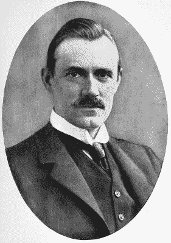

# 人字拖 100 岁生日庆典

> 原文：<https://hackaday.com/2018/06/04/a-100th-birthday-celebration-for-the-flip-flop/>

当我们构建最新的小部件时，很容易陷入创作的兴奋之中。出于同样的原因，有时很难完全了解我们使用的一些电路有多古老。即使是最简单的项目也可能利用一些曾经在一些物理学家或工程师的实验室工作台上一团糟的元件，这些元件用螺丝固定在字面上的试验板上，电源由湿电池组提供。

一个这样的电路在 6 月份就满 100 岁了，这很令人惊讶，因为它实际上是每台计算机的组成部分。这就是触发器，虽然它的发明者可能无法想象他们正在开始做什么，但他们的创新成为数字时代 1 和 0 的基本存储系统。

## 触发继电器

20 世纪的第二个十年是电子技术快速创新的时期，这是由真空管技术的发展和随后的无线电商业化带来的。许多早期的无线电实验是科学家们试图了解自然奥秘的唯一领域，现在是解决实际需求的创新时代。如果世界要有无线电，就必须有人去发明它。

William Eccles. Source: [Grace’s Guide to British Industrial History](https://www.gracesguide.co.uk/William_Henry_Eccles)

进入威廉埃克尔斯和 F.W .乔丹的队伍。英国物理学家埃克尔斯和乔丹都与无线电相伴而生，他们都对这个领域做出了巨大贡献。埃克尔斯是古列尔莫·马可尼的助手之一，也是当时未被验证的奥利弗·亥维赛理论的早期支持者，该理论认为地球大气层中的一层带电粒子使得远距离无线电通信成为可能。埃克尔斯是第一个提出太阳对已经观察到的繁殖的日变化负责的人。

第一次世界大战后，埃克尔斯和约旦在多个项目上合作，其中一个项目导致了他们所谓的“触发继电器”虽然他们的原始论文显示，他们认识到了具有两种稳定状态的电路的实用性，甚至提出了它的用途，例如可以通过无线电控制的锁存继电器，但并不清楚他们是否开始发明后来被称为双稳态多谐振荡器的东西。很明显，他们的电路是基于法国物理学家亨利·亚伯拉罕和尤金·布洛赫之前发表的多谐振荡器电路。该电路由两个控制栅极容性交叉连接的三极管组成，产生方波，而不是当时大多数振荡器的正弦波。由此产生的谐波丰富的信号是有用的校准无线电设备。

## 翻转和翻转

埃克尔斯和乔丹意识到，如果三极管的栅极是电阻性的，而不是电容性的，交叉耦合，那么非稳态多谐振荡器可以保持两个离散的状态。随着电容的消失，三极管被置于不稳定的平衡状态，很快就崩溃到稳定状态，其中一个三极管导通。电路的状态保持稳定，直到它被一个控制信号扰乱，该控制信号使第一三极管截止，第二三极管导通。埃克尔斯-约旦赛道诞生了。

在接下来的 20 年左右的时间里，埃克尔斯-约旦触发机制基本上没有被使用。它最终吸引了布莱奇利公园的科学家的注意，他们正在设计巨像，这种计算机被用来帮助破解德国人使用的洛伦兹密码。战后，仍然使用真空管的埃克尔斯-乔丹触发器进入了计算机，如 T2 的 ENIAC T3，甚至进入了 T4 早期的电子计算器 T5。

20 世纪下半叶，埃克尔斯-约旦触发机制的基本原则发生了巨大的变化和更新。晶体管取代了三极管，各种类型(JK 型、SR 型、D 型和 T 型)被开发出来，所有的东西都被微型化到集成电路上。但无论电路有多小，交叉连接反相放大器的基本拓扑结构仍然是核心。

为了纪念人字拖鞋诞生 100 周年，[Richard Brewster]制作了一个埃克尔斯-乔丹触发器的周期校正工作复制品，见本文的特色图片。当然，不得不做出一些让步——毕竟，一百年前的三极管很难买到，而且埃克尔斯和乔丹可能使用的原始湿电池和十年电阻箱现在太笨重和不实用了。但他确实设法获得了 1920 年就可以得到的 UV201 三极管的最新更新；虽然价格昂贵，但 UX201A 电子管为试验电路板电路增添了一种时代气息。他还使用了老式收音机的老式玻璃管电阻器，去掉了原来的碳元素，重新注入了现代合成电阻器。老式的电报继电器用来转换负载。这是一个很好看的建筑，也是对埃克尔斯-约旦赛道耐力的一个合适的致敬。