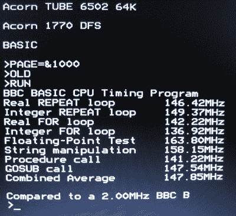

# 150MHz 6502 协处理器

> 原文：<https://hackaday.com/2016/07/05/a-150mhz-6502-co-processor/>

如果你熟悉 ARM 处理器，你可能知道它们在 20 世纪 80 年代英国家用电脑制造商 Acorn 的早期历史。第一个物理 ARM 系统是 Acorn 的 BBC Micro 的插件式协处理器开发板，这种机器在当时几乎每个英国学校都可以找到。

对于一台 8 位家用电脑来说，BBC Micro 的规格非常高。它带有并行、串行和模拟端口，使用 Acorn 专有的 Econet 系统的内置网络，以及 ARM 板使用的协处理器接口 Tube。有几个用于显像管的商用协处理器，包括带有 6502 的协处理器、允许 CP/M 运行的 Z80 协处理器和 80186 协处理器。

与大多数 8 位一代家用电脑一样，BBC Micro 继续保持着强大的爱好者群体，这些人一直没有停止向各个方向扩展其功能。例如，该管道已经与 Raspberry Pi 接口，可以在其上运行原始协处理器硬件的仿真。

 于是我们来到了本文的主题，【猪仔】和【BigEd】的 [150MHz 6502 协处理器为 BBC Micro](http://stardot.org.uk/forums/viewtopic.php?f=3&t=11325) 。当然，它根本不是 6502，而是一个在 ARM 上用汇编程序模拟的 6502，从某种意义上说，它是托管它的机器的非常遥远的后代。整个项目有一种光荣的循环，特别是像 Acorn、BBC Micro 和现代 ARM 这样的 Pi 都植根于剑桥。它有多有用取决于你是否需要快速运行 8 位 20 世纪 80 年代的软件，但他们确实报告说它运行 *Elite* ，如果你当时在那里，我们相信你会同意这是在 BBC Micro 上运行的最重要的应用程序。

我们之前讨论过[一个带有 PDP/11 模式的 FPGA 协处理器](http://hackaday.com/2015/10/03/vintage-bbc-computer-gets-fpga-buddies/)时，我们已经介绍过 Tube 接口，Acorn 绝对没有出售过这种接口。我们还展示了一项努力，即[对第一个基于 BBC 微处理器的协处理器板的原始臂](http://hackaday.com/2016/01/03/reverse-engineering-the-iphones-ancestor/)进行逆向工程。

BBC 微图:斯图尔特·布雷迪，公共领域，通过[维基共享](https://commons.wikimedia.org/wiki/File:BBC_Micro_Front_Restored.jpg)。