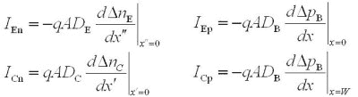

# 3D 印刷结晶体管模型

> 原文：<https://hackaday.com/2017/08/25/a-3d-printed-junction-transistor-model/>

晶体管无疑是人类最伟大的发明之一。然而，相关的伟大也带来了前所未有的复杂性。要完全理解晶体管的工作原理，你需要熟悉一些量子力学！也许任何电子工程专业的本科生都会告诉你，最难理解的学科之一实际上是半导体物理。

Take your pick: Mathematical equations governing the various currents inside a BJT

开始理解任何复杂事物的一个好地方是手头有一个准确但最重要的有形模型。半导体很难用复杂的数学工具来描述，一个物理模型要求太高了吗？

[查克]已经使用 3D 打印模型设计、打印并解释了 BJT 晶体管的工作原理。我们真的很喜欢这个模型，因为它为初学者阐明了 BJT 晶体管的一些更微妙的特性。

例如，最简单的“电子开关”模型完全忽略了晶体管作为线性放大器的应用，无法用于解释重要的晶体管参数，如 hfe (DC 电流增益β)或 VBE(基极-发射极结正向偏置电压)。另一方面,[Chuck 的]模型无疑在这些方面提供了更好的直觉，因为前者可以与杠杆臂的长度相关联，而后者可以与旋转杠杆所需的最小力相关联。t 形结构甚至表示工作期间基极电流和集电极电流的组合！

如果你对物理模型不感兴趣，那么电子艺术中的经典图片描述“晶体管人”可能会感兴趣。如果你已经超越了这一点，那么是时候深入研究与相关的[量子力学了。](http://jas.eng.buffalo.edu/)

 [https://www.youtube.com/embed/RI-7TyVWB3s?version=3&rel=1&showsearch=0&showinfo=1&iv_load_policy=1&fs=1&hl=en-US&autohide=2&wmode=transparent](https://www.youtube.com/embed/RI-7TyVWB3s?version=3&rel=1&showsearch=0&showinfo=1&iv_load_policy=1&fs=1&hl=en-US&autohide=2&wmode=transparent)

