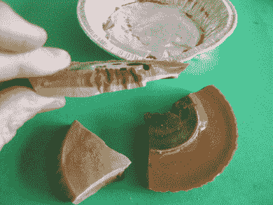

# 不仅仅是麦克风:驻极体的故事

> 原文：<https://hackaday.com/2018/03/07/a-bit-more-than-a-microphone-the-electret-story/>

前几天设计麦克风组件时，我不假思索地伸手去拿驻极体电容麦克风炭精盒。准确地说，我订购了一包，这些小圆柱形话筒以相对低廉的价格提供了极高的品质。

只有在提交订单时，我才第一次有了一个想法:*什么是驻极体电容话筒？*

电容话筒很容易解释。它是一个由非常薄的导电片构成的电容器，充当隔膜，安装在另一个导体(通常是一块网)的前面。声波导致振膜振动，这些振动改变振膜和网格之间的电容。

如果将该电容并入具有非常高阻抗的 RC 电路，并且施加高电压，则该电容上的电荷接近恒定。由于电荷保持不变，改变电容会导致微小的电压波动，这种波动可以作为来自麦克风的音频信号被恢复。以这种方式构建的电容话筒质量极高，但代价是需要一个高压电源来充电，还需要一个放大器来缓冲和放大音频。

[![Electret microphone capsule schematic. wdwd [CC BY 3.0]](img/aa52461fd15adaf5af390f8f399f33fc.png)](https://hackaday.com/wp-content/uploads/2018/02/eelctret-microphone-circuit.jpg) 

驻极体传声器膜盒示意图。[wdwd【CC BY 3.0】](https://commons.wikimedia.org/wiki/File:Electret_condenser_microphone_schematic..svg)

我几分钱买的驻极体电容麦克风是电容麦克风，为什么没有高压供电？答案来自于构成隔膜的材料，驻极体是一种携带永久电荷的材料，不需要高压电源来维持电荷。驻极体麦克风的工作方式与任何其他电容麦克风完全相同，但其驻极体振膜上的永久电荷足以在其上产生可恢复的电压。该胶囊将包含一个 FET 作为高阻抗缓冲器，通过单个 AA 电池的 DC 电源提供可用的输出。

回答了什么是驻极体电容话筒的问题后，还有一个更基本的问题:什么是驻极体？当然，一种材料不可能无限期地保持电荷，这是*魔法*，对吗？网络搜索发现一些人似乎是这样认为的，因为驻极体似乎有一群“另类思考者”，他们正在寻找收集静电荷作为免费能源的方法。很明显，我们需要一些有意义的信息，为此，我们向许多把课程资料放在网上的化学和物理讲师求助。

## 偶极子，它们是如何工作的？

[![A dipole in a water molecule. Jü [CC0]](img/9ff863f290a14aff97136b49618a6f7a.png)](https://hackaday.com/wp-content/uploads/2018/02/water-molecule-dipole.png) 

水分子中的一个偶极子。偶极，在化学意义上，是一种分子，它的不同部分具有不同的电荷。它的一端可能是一个电子过剩的官能团，而另一端可能是一个电子不足的官能团。具有这种性质的分子的一个普遍引用的例子是水，它形成一个 V 形的 H-O-H 分子，氧在其点上带较大的负电荷，氢在其点上带较大的正电荷。

由含有偶极子的分子组成的固体没有静电荷，因为这些偶极子是随机排列的，所以不会出现电荷梯度。但是，如果固体中的所有分子都可以排列成偶极朝同一方向运动，那么它们带负电的一端和带正电的一端就会背靠背排列。你可以把它们想象成一大堆串联的微型电池，负极指向的一侧电子含量丰富，正极指向的一侧电子含量不足。

重要的是要强调，电池类比的作用仅限于帮助想象偶极子如何排列以产生统一的电荷梯度，而不是给人一种表现得好像它们是真实电池的印象。要使驻极体材料具有持久的电荷，它还必须是绝缘体，因为如果它是电导体，电荷就会简单地传导并自我中和。因此，没有电流可以从驻极体材料中流出，我们在网络上另类思考者的自由能源梦想必然会落空。

## 驻极体 DIY

现在知道了驻极体材料是什么，任何有自尊心的 Hackaday 读者的下一个问题应该是“*我怎样才能制造一种驻极体材料？*”。答案出奇的简单，你会很高兴听到一个你有机会自己做的答案。含有偶极分子的固体在大电场的作用下熔化、冷却并凝固。[这份由我们自己的【史蒂文·杜弗兰】撰写的关于制作驻极体](https://rimstar.org/materials/electrets/index.htm)的描述，应该可以让你从设备齐全的厨房开始，假设你的厨房配备了 30 千伏的电源。

 各种各样的材料都可以用来制作驻极体，包括许多常见的聚合物。也有天然存在的驻极体，石英就是其中的一个例子，还有可以用来制作驻极体的天然物质，如巴西棕榈蜡、蜂蜡和松香。[该 PDF 文件列出了一些材料，尤其是聚合物](http://www.ifmpan.poznan.pl/pcmr/Pdf/Sessler1.pdf)(第 5 页)。

如果你决定自己制作一种驻极体材料，除了花大力气复制一个几分钱的麦克风，你还能利用它做什么？谷歌专利搜索返回了压倒性的声学应用，有一长串麦克风、传感器和助听器。不过也有一些其他的应用，例如[一种空气过滤器，其中驻极体所携带的电荷足以捕获气流中的带电尘埃颗粒](https://patents.google.com/patent/US3783588A/en)。网上偶尔会提到它们过去用作阴极射线管显示器的聚焦元件，维基百科驻极体页面提到它们在复印机中的使用，但这些应用都没有太多其他信息。也许最好把家庭驻极体制造看作是一种好奇，你可以试试*，因为你可以。*

如果你成功制作了驻极体，我们恳请你写下来并[提交给我们的提示热线](https://hackaday.com/submit-a-tip/)。

横幅中的驻极体话筒振膜图片:[工程师的车库](https://www.engineersgarage.com/insight/how-electret-condenser-microphone-works)。