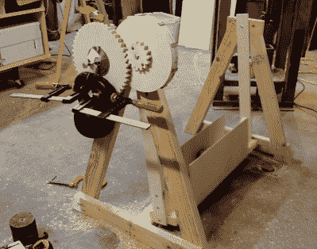

# 发条摇篮是婴儿的第一个擒纵装置

> 原文：<https://hackaday.com/2015/11/25/a-clockwork-cradle-is-babys-first-escapement/>

[斯科特]没有任何孩子，但他是那种喜欢在游戏中领先的类型。当然，这意味着要花时间在他的车库里建造一个摇床。通常，这些都是从一个婴儿洗澡，并由电池供电。考虑到保持钟摆摆动的机制已经存在了数百年，这一点非常不酷。他的最新项目是擒纵摇篮(escapement cradle)——一种借助下落重物保持摇摆的摇篮(或吊床)。

[这个系列的第一个视频](https://www.youtube.com/watch?v=nj0KDOBHodM)讲述了灵感和数学原理，决定了维持一个摆动的钟摆需要多少能量。第二个视频[讲述了一个非常粗糙的擒纵机构原型](https://www.youtube.com/watch?v=NoD59fbDdc8)，做了一些木工活，看起来很危险，但控制得很好。[第三个视频](https://www.youtube.com/watch?v=qI2K1dTWr8M)将所有东西放在一起，每次重量被举到顶部时摇动摇篮大约 10 分钟。

[Scott]已经在 Hackaday 上展示了他的一些项目，他正在慢慢成为排名第二的机械化木工，仅次于[Matthais]。他最近给我们一年前看到的[那张不断扩大的木桌](http://hackaday.com/2014/12/07/an-expanding-wooden-table/)做了最后的润色，而且肯定还有更酷的版本在等待他的 YouTube 频道。

 [https://www.youtube.com/embed/nj0KDOBHodM?version=3&rel=1&showsearch=0&showinfo=1&iv_load_policy=1&fs=1&hl=en-US&autohide=2&wmode=transparent](https://www.youtube.com/embed/nj0KDOBHodM?version=3&rel=1&showsearch=0&showinfo=1&iv_load_policy=1&fs=1&hl=en-US&autohide=2&wmode=transparent)

 [https://www.youtube.com/embed/NoD59fbDdc8?version=3&rel=1&showsearch=0&showinfo=1&iv_load_policy=1&fs=1&hl=en-US&autohide=2&wmode=transparent](https://www.youtube.com/embed/NoD59fbDdc8?version=3&rel=1&showsearch=0&showinfo=1&iv_load_policy=1&fs=1&hl=en-US&autohide=2&wmode=transparent)

 [https://www.youtube.com/embed/qI2K1dTWr8M?version=3&rel=1&showsearch=0&showinfo=1&iv_load_policy=1&fs=1&hl=en-US&autohide=2&wmode=transparent](https://www.youtube.com/embed/qI2K1dTWr8M?version=3&rel=1&showsearch=0&showinfo=1&iv_load_policy=1&fs=1&hl=en-US&autohide=2&wmode=transparent)

