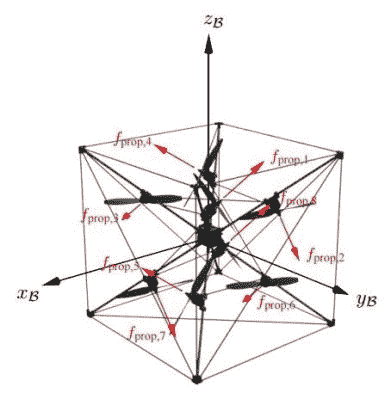

# 一架飞行的、吸引人的、帮助人的全直升机

> 原文：<https://hackaday.com/2017/05/28/a-flying-fetching-helping-hand-omnicopter/>

如果你有一个飞行器，它可以在绕任何轴旋转的同时向任何方向机动，同时保持推力和扭矩，这不是很好吗？装上机械臂，机器就可以把自己定位在任何地方，并根据需要移动物体。苏黎世联邦理工学院动力系统与控制研究所的[Dario Brescianini]和[Raffaello D'Andrea]已经提出了他们的[omni copter，它使用八个旋翼的配置来实现这一点，给了它六个自由度](http://flyingmachinearena.org/wp-content/publications/2016/breIEEE16.pdf)。哦，它还会播放 fetch，如下图第一个视频所示。

Omnicopter propeller orientations

每个螺旋桨都是可逆的，可以向两个方向提供推力。在飞行器本身上还有一台 PX4FMU Pixhawk 飞行计算机、八个马达和马达控制器、一个四芯 1800 mAh LiPo 电池和通信无线电。无线电通信是必要的，因为位置和外部姿态的计算是在一台台式计算机上完成的，然后计算机将所需的力和角速度发送给飞行器。台式电脑知道飞行器的位置和方向，因为它们在[飞行器竞技场](http://flyingmachinearena.org/wp-content/publications/2014/lupashin2014platform.pdf)飞行，这是苏黎世联邦理工学院的一个大房间，配有红外运动捕捉系统。

这个结果看起来有点怪异，好像重力并不适用于全直升机。飞行器可能只是单纯的好玩，正如你在下面的第一个视频中看到的，它通过使用一个连接的网来接球。当回球时，它实际上旋转球网将球倾倒到投掷者手中。但是你可以在视频中看到。

当我们尝试不同数量的螺旋桨时，为什么不尝试一个，作为一个团队，同样来自苏黎世的 ETF，已经用他们的单螺旋桨完成了。

 [https://www.youtube.com/embed/sIi80LMLJSY?version=3&rel=1&showsearch=0&showinfo=1&iv_load_policy=1&fs=1&hl=en-US&autohide=2&wmode=transparent](https://www.youtube.com/embed/sIi80LMLJSY?version=3&rel=1&showsearch=0&showinfo=1&iv_load_policy=1&fs=1&hl=en-US&autohide=2&wmode=transparent)

 [https://www.youtube.com/embed/0gR1ekapOAE?version=3&rel=1&showsearch=0&showinfo=1&iv_load_policy=1&fs=1&hl=en-US&autohide=2&wmode=transparent](https://www.youtube.com/embed/0gR1ekapOAE?version=3&rel=1&showsearch=0&showinfo=1&iv_load_policy=1&fs=1&hl=en-US&autohide=2&wmode=transparent)

[via [IEEE 频谱](http://spectrum.ieee.org/automaton/robotics/drones/eth-zurich-omnicopter-plays-fetch)