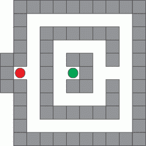

# 事半功倍的游戏

> 原文：<https://hackaday.com/2018/02/04/a-game-that-does-more-with-less/>

[戴维·约翰逊-戴维斯]创造了一个最小的[秘密迷宫游戏](http://www.technoblogy.com/show?20IY)使用一个单独的 ATTiny85 和一些通用组件。这个简单的游戏使用四个按钮，四个发光二极管和一个小扬声器。玩家使用按钮向四个主要方向移动，led 显示墙壁和走廊。如果 LED 亮了，就说明那个方向的路径被墙挡住了，试图往那个方向移动会发出哔哔声。当玩家到达出口时，扬声器会发出简短的胜利曲调。

Sample maze. A 16×16 matrix is allocated for maze designs.

由于 ATTiny85 只有五条 I/O 线，[David]必须变得聪明一点才能读取四个按钮，在四个 led 上显示输出，并驱动一个小扬声器。解决方案是将一个引脚专用于扬声器，另外四个引脚专用于 [charlieplexing](https://en.wikipedia.org/wiki/Charlieplexing) ，这是一种驱动比引脚更多的 led 的方法。它利用了大多数微控制器引脚可以在输出高、输出低或~~低阻抗~~高阻抗输入之间轻松切换状态的事实。

至于按钮，[大卫]查理也把它们弄复杂了。不是把一个 LED 放在一个 charlieplexed“单元”中，这个单元包含一个二极管和一个与二极管串联的 SPST 开关。要读取开关的状态，首先将一条 I/O 线拉低，另一条 I/O 线通过上拉成为输入。闭合的开关在输入端读取低电平，断开的开关读取高电平。使用 charlieplexing，四个引脚足以以任何组合容纳多达 12 个 led(或按钮)，这对秘密迷宫来说绰绰有余。

Charlieplexing 也是这款 [110 LED 微型显示屏](https://hackaday.com/2017/04/04/hackaday-prize-entry-micro-matrix-charlieplexed-displays/)或这款优雅的 [7 段显示屏概念](https://hackaday.com/2016/08/23/charliplexed-7-segment-display-takes-advantage-of-pcb-manufacturers/)的背后原因，它利用了现代 PCB 制造选项。