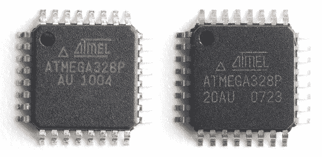

# 假冒零件世界指南

> 原文：<https://hackaday.com/2017/12/27/a-guidebook-to-the-world-of-counterfeit-parts/>

我们都经历过这种情况:当你给最新的电路加电却什么也没发生时，你会有一种沮丧的感觉。也许你在设计中犯了一个错误，或者你在焊接时短路了什么。甚至有可能 ESD 损坏了你的一个芯片。在设计自己的硬件时，所有这些问题甚至更多都是可能的，甚至是不可避免的。

但是，如果你的设计是完美的，你的焊接技术无可指责呢？如果你闪亮的新设备是 DOA，但你做的一切都是正确的，那该怎么办？[Yahya Tawil 的一份有趣的报告表明，你遇到假冒产品的可能性越来越大。虽然业余爱好黑客不太可能被仿冒漏洞咬到，但他报告中引用的数字和例子可能会让你大吃一惊。](https://atadiat.com/en/articles/e-introduction-counterfeit-ics-counterfeiting-detection-avoidance-methods/)

One of these is an ATmega328, the other is literal garbage.

[Yahya]指出了一些政府关于假冒零部件日益猖獗的研究，这些数字相当令人吃惊。例如，美国商务部在 2005 年至 2008 年间进行了一项研究，其中超过 50%的受访制造商和经销商遇到过假冒零部件。另一项估计称，五角大楼购买的半导体中有高达 15%是假冒的，对国家安全构成了严重威胁。

但是，究竟怎样才能伪造微控制器或晶体管呢？有趣的是，在绝大多数情况下，旧的芯片是从回收的电路板上取下的，新的标签写在原来的上面。有时伪造很简单，只需改变元件上的日期代码或提升其性能(例如在它不是军用规格时将其标记为军用规格)，但在某些情况下，具有相同封装的芯片将被标记为完全不同的东西。其他技巧显然是低技术含量的:设备的文档可能会列出它根本不具备的功能和能力，人为地提高它的价值。

这份报告值得一读，即使对我们这些可能没有像五角大楼那样大量采购零部件的人来说。这可能会让你在点击不明网站上的“购买”之前三思，那里的价格似乎好得难以置信。

从我们所处的位置来看，假冒零部件的数量显然在上升。我们已经报道了许多关于这一日益普遍趋势的其他研究，以及从成功复苏到令人沮丧的失败的第一手报道[。](https://hackaday.com/2015/02/08/unbricking-a-counterfeit-ftdi-chip/)