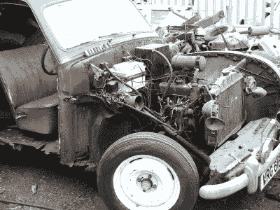

# 一辆来自生锈残骸的飞车手罗德跑车

> 原文：<https://hackaday.com/2016/06/12/a-hot-rod-roadster-from-a-rusty-wreck/>

在我们的黑客和制造者社区中，你有时可能会遇到这样一种信念，即我们不知何故重新获得了被其他人失去的工作室。虽然一些普通人可能几乎不知道螺丝刀的一端和另一端，这可能是真的，但声称排他性是一个巨大的夸大。有许多其他场景被赋予了惊人的工程技术水平，令人惊叹的项目从中涌现出来，但令人遗憾的是，有时它们彼此孤立存在。

一个这样的场景是汽车改装。这里我们指的不是那些开着动力不足的底馈汽车的年轻人，他们的汽车上装饰着变形的塑料、假碳纤维和来自 Halfords 或 Advance Auto 的劣质排气管，我们也不是指某些有线电视真人秀节目所钟爱的价格低廉的专业汽车。相反，我们指的是普通的汽车黑客，他们把汽车世界中不令人兴奋和不受欢迎的东西带进他们的车库，通过视觉和技能的结合，把它变成令人惊奇的东西。作为这种艺术的例证，我们想向你介绍[ScaryOldCortina]的“五月天”。这是几年前的一个版本，但对于过去的时间来说，同样令人印象深刻。

A very rusty Austin Somerset indeed

如果你是英国人，你的祖父母很有可能在 20 世纪 50 年代初就开着一辆奥斯汀·萨默塞特。一辆平淡无奇的中型底盘轿车，设计并不差，但防锈性能却不尽如人意。一辆萨默塞特(Somerset)抵达[ScaryOldCortina]的车库，它看起来很坚固，但检查后发现锈迹斑斑，几乎可以通过用力拉一些面板来拆卸。他本可以放弃它，但他却将其改造成了一款更令人兴奋的双座 hotrod 跑车。特别令人印象深刻的是，他以不同的形式在新车身中重新使用了 Somerset 的大部分金属，例如将其弯曲的车顶切成两半，形成新车的侧板。

完整的版本在复古赛车论坛的一个很长的帖子里。如果你从头到尾阅读它，你会发现对 20 世纪 50 年代英国汽车零件箱细节的深入描述，但如果这对你来说有点多，我们有一些亮点。

当汽车到达时，在他的第一篇文章中，你可以看到锈迹已经侵蚀了一辆外表完整的汽车，他可以轻而易举地剥去它的面板。幸运的是，萨默塞特是一辆底盘车，所以在生锈的车身下面是一个滚动的底盘，奇迹般地躲过了最严重的腐蚀。他对汽车的愿景要求底盘缩短，但[他能够在底盘](http://retrorides.proboards.com/post/569973/thread)上放置面板，以便在[拿出切割机和焊接机并组装新的车身浴缸](http://retrorides.proboards.com/post/576680/thread)之前了解它可能看起来是什么样子。经过大量艰苦的工作，他将传动装置组装成适合道路行驶的形式，并将不太好看的奥斯汀“B”系列发动机改造成更有用的东西，他终于能够驾驶它进行短暂的试驾。这款车通过了英国道路适用性的所有相关测试，是一款非常酷的交通工具。

令人高兴的是，尽管这是第一个出现如此多锈迹的故事，但这并不是第一个黑客攻击古代汽车的故事。我们最近看了一下大众标志性的甲虫车的黑客潜力，我们检查了 T2 专业电视热播演员在真实性受到挑战时的作品，我们看了 T4 古巴幸存的革命前美国汽车，我们还展示了一个疯狂的项目，包括一辆迷你车和一辆丰田切利卡。