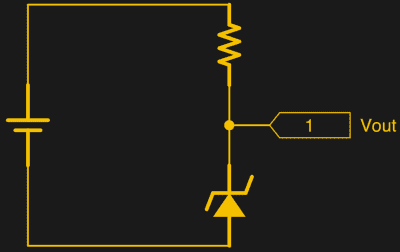

# 齐纳稳压器的一课

> 原文：<https://hackaday.com/2017/10/11/a-lesson-on-zener-regulators/>

长期以来，齐纳二极管稳压器一直是被广泛使用和高度误解的电路之一。第一次尝试使用它来为他们的实验提供动力，并想知道为什么事情没有按计划进行。[詹姆斯·刘易斯]发布了一个关于这个主题的有价值的教程，标题是[“齐纳二极管是一个糟糕的调节器”](https://www.baldengineer.com/zener-diode-regulators.html/)，澄清了使用这种设备背后的误解。

[詹姆斯·刘易斯]在简要介绍齐纳二极管之后，用 ESP8266 做了一个稳压电路实验。对于外行来说，齐纳二极管可以在反向偏置下安全工作，并且可以在特定电压下工作。这使得器件两端的电压为固定值。

然而，这取决于流过电路的电流，而电流又取决于负载。对于消耗少量电流的负载，电路将按预期工作。这使得它适合为微控制器等产生参考电压。

要使齐纳二极管成为“合适的”电压调节器，你只需要用某种放大器缓冲输出。一个[单晶体管](http://www.radio-electronics.com/info/data/semicond/zener-voltage-reference-diodes/applications-circuits.php)是最小的，但实际上可以工作得很好。你也可以在齐纳二极管上并联一个电容来消除一些噪声。

齐纳二极管是很棒的小器件，像这样的文章对初学者来说是不可或缺的，应该像[齐纳和肖特基教程](https://hackaday.com/2016/09/12/diodes-with-hats-zener-and-schottky/)和[二极管作为开关](https://hackaday.com/2016/12/09/diodes-the-switch-you-never-knew-you-had/)一样经常分享。