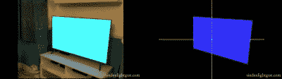

# 液晶显示器的光枪——感谢数学！

> 原文：<https://hackaday.com/2018/06/28/a-lightgun-for-lcds-thanks-to-maths/>

轻型枪是一种在游戏机上学习射击的有趣方式，在 80 年代和 90 年代享受着它的全盛时期。最初的设计很大程度上依赖于 CRT 电视的独特特性和绘制画面的时间安排。不幸的是，由于各种原因(取决于所使用的具体技术)，它们通常根本不能与现代的 LCD 和等离子屏幕一起工作。

The light gun contains a camera, and reportedly works by using the distortion of the rectangular image of the screen to calculate the position of the light gun itself.

最近，出现了一个新项目，称为辛登光枪。在[它是如何工作的视频](https://www.youtube.com/watch?v=grcGpr_8W9Y)中，它似乎使用了一个相当标准的 30fps 相机来拍摄游戏使用的电视屏幕。然后，在矩形边框内，在 16:9 宽高比的显示器上以 4:3 的比例进行显示。然后来自摄像机的图像被处理，游戏图像的变形被用来计算枪的位置和它的瞄准方向。处理由运行 MAME 的主机处理，必要的坐标被反馈到游戏代码中。

这个基本概念听起来不错，尽管和往常一样，围绕这个项目有相当多的怀疑。我们很想听听你对这个概念是否合理的看法，以及陈述的滞后数字是否是 cromulent。我们总是很高兴看到 lightgun 领域的新发展！休息后的视频。

我们自己的[威尔·斯韦特曼]写了一篇精彩的文章,讲述了人们可以用各种方式复活古老的猎鸭游戏。

 [https://www.youtube.com/embed/grcGpr_8W9Y?version=3&rel=1&showsearch=0&showinfo=1&iv_load_policy=1&fs=1&hl=en-US&autohide=2&wmode=transparent](https://www.youtube.com/embed/grcGpr_8W9Y?version=3&rel=1&showsearch=0&showinfo=1&iv_load_policy=1&fs=1&hl=en-US&autohide=2&wmode=transparent)

