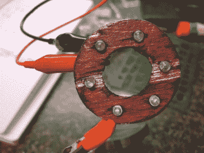
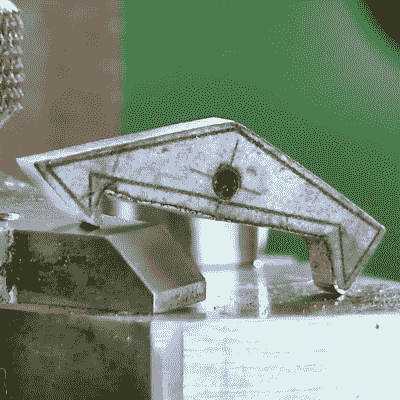
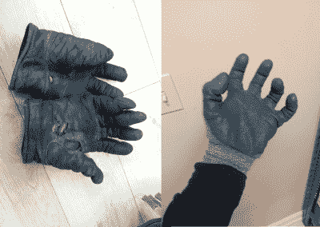
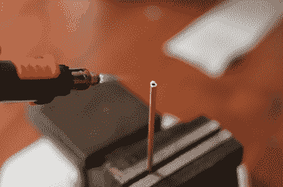
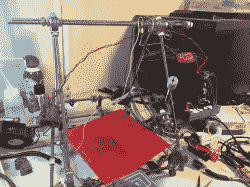

# 工具箱里的机械商店:只是增加时间

> 原文：<https://hackaday.com/2016/10/21/a-machine-shop-in-a-toolbox-just-add-time/>

你不需要任何花哨的工具。数控机床很好。3D 打印机可以有所帮助。激光切割机太棒了。然而，当谈到实际制造东西时，这些都不是完全必要的。有了一套基本的手工工具和一些简单的电动工具，其中大部分可以以很低的价格买到，许多复杂、精确和高质量的东西都可以制作出来。

Not as pretty, but worked just the same.

不久前，我在为我的 3D 打印机做一个环形灯。我已经收集了一批发光二极管，因为所有黑客都不喜欢一个五美元的盒子。所以我用我选择的 CAD 软件制作了一个戒指，我打算用激光从胶合板上切割下来。每个发光二极管都有孔。为激光切割准备一份文件大约需要 10 分钟。我开始准备离开房子，花十分钟开车去 hackerspace，花十分钟启动并使用激光切割机(假设它没有被占用)，然后开车回来。我突然意识到我很傻。我拉出一张胶合板。用圆规在上面画了三个圆，再把圆细分。用基本的布局工具，一个电钻和一个顶锯工作了 10 分钟，我得到了这个角色。相比之下，我启动激光切割机需要 40 分钟。

我们今天使用的许多工具都是为了对抗规模经济而设计的。然而，我们通常没有做到这些。我们正在建造一两个。通常纯粹的设置成本是不值得的。同样，不用机器就能做到的技能也会派上用场。正确使用文件并获得预期结果是一门艺术。因此，现在花时间练习和发展手工技能是很好的，你永远不知道你什么时候会出去尝试对零件进行紧急装配，而且该地区没有人有一台铣床闲着。

那么，黑客需要什么工具才能在没有工具或花费太多的情况下最接近一家机械商店呢？对于大多数需求，一个人只需要以下工具就可以制造出数量惊人的东西。

**基础计量:**现在，如果你真的想做精密的工作，你可能需要更昂贵的工具，但我们经常被精度宠坏了。我们可以在设计零件时多留一点余地，然后花时间调整它们。

*   卡尺——因为它们现在很便宜，没有理由不拥有一个简单的数字或刻度盘卡尺。对于大多数工作来说，这将能够很好地测量大多数东西，足以满足所有实际用途。老实说，如果你正在构建一个需要完整的计量套件的东西，你可能会让自己很难。这甚至适用于生产工作。
*   Rule – Not a ruler. A steel rule. This will have a ground flat edge and precise graduations. You can use this for layout.

    click spring 的克里斯总是使用粘纸的技巧来做一些非常精确的工作。

*   正方形——木匠用的组合正方形可以用于很多布局。它不像一个真正的机械师广场那样精确，但我还没有真正需要一个真正的机械师广场每天黑客的精度。
*   指南针和量角器——能够画圆和角度是关键。买结实的，不要买好看的。适合小学生的那种挺好的。
*   划线和打孔-铅笔和永久记号笔-代替布局流体，永久记号笔足以在金属上划出划线。铅笔对于其余的材料来说是很棒的。最后，打孔机对于钻孔是必不可少的。
*   胶棒 CAD 软件既神奇又免费，没有理由不打印出一个模板，然后粘在你的零件上。接触水泥或一个简单的胶棒是你所需要的

**加工:**接下来是加工材料本身。手工作业通常分两步进行。大量去除和精细去除。要做到第一点，你需要良好的布局和一点经验。要做第二件事，你需要更好的布局、非凡的耐心、结实的背部(或高度合适的工作台)以及牢牢抓住零件的方法。

Trust me when I say I’ve worn out a lot of work gloves and these hold up the longest.

*   短粗刀(和防割手套)——让你的手指靠近工件的刀，例如 exacto 刀片或美工刀。也就是说，我很幸运仍然有完整工作范围的数字。不管你有多小心，从统计学上来说，最终不被刀子割伤是不可能的。接下来就要看这种削减的破坏力有多大了。大多数会打到手上的肉，相对无害，只是疼。然而，如果你击中了肌腱，那就永远告别全方位运动，向手术和拿起器械问好吧(来源:从小和职业治疗师一起长大的父母，那会吓到你的)。为此，我强烈推荐一套好的凯夫拉尔防割手套。我最喜欢的是安塞尔蓝腈涂层凯夫拉尔 HyFlex 手套。它们价格昂贵，但却经久耐用(在我开始看到 HyFlex 手套磨损的时候，我已经穿过了五套皮手套),并且为工作提供了几乎正常的运动范围和感觉。
*   大锉刀——粗锉刀是必备的。如果你只能买得起一个，那就买一个平的和圆的。不切成直角会有点困难，但一点胶带或一段塑料可以帮助做到这一点。此外，像尼科尔森这样的传统品牌不再值得信任，这些天在支付超过五美元购买常规文件之前做一些研究。只有少数品牌提供持久的档案。最后，看一些关于正确使用文件的视频。如果你做得好，它们会切割得很快，并持续很长时间。
*   圆形锉刀——圆形锉刀对很多事情都很有用，但主要是用于安装孔和修整半径。
*   小文件——我建议花一点钱买一套高质量的文件。一个小圆形、小三角形和小 D 形的锉刀是一个好的开始。我还推荐一个安全的小锉刀来磨尖边角。
*   日本拉锯——木材是很好的原型材料，没有比日本拉锯更好的普通木工锯了。如果你想更深入地了解这门手艺，那么使用其他的锯是有原因的，但是一般的接合、成型等都可以用锯快速而精确地完成。
*   Hacksaw – A hacksaw can cut through any material as long as you buy the right blade and are willing to sweat. A good hacksaw frame can put a lot of tension on a blade without a lot of added bulk. If it has both a lever action and a thumb screw it is likely to be able to do this. A good hacksaw blade is almost never sold with the frame.

    如果你想知道人们是如何制造盔甲或热棒的,《金属制造者手册》会让你大吃一惊。这很难，但技术上很简单。

*   顶部锯——把顶部锯想象成一个手动激光切割机。有一些不错的，但刀片是最重要的东西买。奇怪的是，现在越来越难找到他们了。我认为使用电锯的人越来越少，但没有一家商店应该没有电锯。
*   钳子套件–一套钳子。针鼻，端切刀，侧切刀，和 Lineman 的是一个很好的开始。
*   钳子——我把钳子定义为任何你可以加热的钳子。把这个和你的普通钳子分开。当你用锤子敲打某物时，它也很适合用来拿东西。你最终可能会打破它。
*   夹钳或老虎钳——任何商店都应该有某种方法来牢牢地夹住工件。这是你最重要的工具之一。真正高质量的通常出现在车库拍卖或 Craigslist 上；被无知的家人卖掉。找一只下巴厚，背部平坦的。
*   锤子和碎木头——你会惊讶于一个人用锤子和碎木头从普通的板材上画出的形状。这是商店必备的东西。一把普通的羊角锤和一把球头是绝对必要的。

**现代奢侈品:**不过没必要完全靠手工。可怕的运费就在眼前，或者在家装店有稍微好一点的选择，没有必要拥有一些现代奢侈品。

A pencil torch and vise come together for a brazing operation.

*   dremel——一种便宜的旋转工具可以快速完成许多成型任务。绝对节省时间，而且有些事情没有它是做不了的。也适用于将连续不断的切割盘送入切割板材，而不会使板材变形。如果你想变得漂亮，也可以节省抛光的时间。必须小心，不要浪费太多的时间来设置和强迫这个工具做工作。与一些手摇和手摇锉刀相比，它通常动力不足。
*   Power Drill and Bits – There is absolutely no reason not to have a decent power drill these days. Get a corded one if you can’t swing the money for a nicer model cordless. This will drill holes, sand, and occasionally act as a shitty lathe. Especially handy if you just want to bring something round into a tolerance for some sort of fit. Get a decent set of drill bits unless you hate yourself. I bought a 30 dollar set with decent coatings and have been replacing the individual bits with their higher quality counterparts as I burn through them. I’m currently on my third 1/8th inch bit. 

    说实话吧。3D 打印的爱好并不能真正节省任何时间。

*   铅笔电筒——最后，一个高质量的电筒或铅笔电筒会创造奇迹。我烧掉了几个便宜的手电筒，最后花了 100 美元买了一个质量很好的 Portasol。用焊炬可以对金属、软钎料、硬钎料等进行热处理。一个人可以切割塑料，焊接塑料，热收缩。这是一个必不可少的工具。

除此之外，我不会发疯。我会把它们归入“按需购买”这一类。当然还有螺丝刀之类的东西。但这是为了整形手术，而不是一般的修复。我建议不要购买丝锥和板牙套装，而是挑选一个尺寸的紧固件(在我的例子中，是 M3、M6 和 M8)并为它们购买丝锥、板牙和钻头套装。

最后，即使在今天，大多数原型设计都以一个黑客不得不做一些 19 世纪的工作来适应它而告终。然而，如果你曾经见过一个真正的制表师在工作，你会知道你可以用一把锉刀在金属知识上取得多么可笑的进步。

 [https://www.youtube.com/embed/QL35SAwDB6U?version=3&rel=1&showsearch=0&showinfo=1&iv_load_policy=1&fs=1&hl=en-US&autohide=2&wmode=transparent](https://www.youtube.com/embed/QL35SAwDB6U?version=3&rel=1&showsearch=0&showinfo=1&iv_load_policy=1&fs=1&hl=en-US&autohide=2&wmode=transparent)

我知道你们中有很多人在这类事情上比我有更多相似的经历。在什么情况下你会求助于现代工具？你发现有什么任务用传统方式更快吗？我遗漏了什么工具吗？无论从哪方面来看，手工都不是一项正在衰落的技能，但随着 3D 打印机越来越便宜，人们很容易忘记它。然而，对于任何技术人员来说，如果你能手工完成，它会增加即时价值和对设计和制造更深刻的理解。