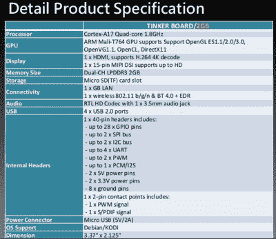

# 主板制造商对 Raspberry Pi 竞争对手的看法

> 原文：<https://hackaday.com/2017/01/21/a-motherboard-manufacturers-take-on-a-raspberry-pi-competitor/>

在最初的 Raspberry Pi 发布以来的近五年时间里，我们已经看到在廉价的单板计算机市场上出现了大量的竞争对手。许多人创造了自己的外形，但越来越多的人通过尽可能接近地复制剑桥的水果板的外形和界面，直奔要害。我们已经看到了 Banana Pi、Odroid 和其他几个人的努力，但还没有人成功地将它从基座上推翻。

The ASUS Tinker specification.

这一领域的最新竞争者可能会产生更大的影响，因为它来自一家大型制造商，一个你可能听说过的名字。华硕悄悄地发布了他们的 Tinker，这是一款非常符合 Pi 外形的主板，它装有 1.8 GHz 的四核 ARM Cortex A17，还有一个令人印象深刻的规格，我们已经为本文捕捉到了这个图片。尽管他们在其网站上对此讳莫如深，但有一个幻灯片演示介绍了一些细节，我们把它放在了休息时间的下方。

55 美元(约 68 美元)比 Pi 贵，但华硕竭尽全力证明它的速度明显更快。我们将毫无疑问地核实这一说法的准确性，因为这些董事会找到了我们社区的手中。尽管如此，它仍然具有一个与 Pi 兼容的 I/O 接口，以及与 Pi 相同的显示器和摄像头连接器。没有关于后两者兼容性的信息。

这一领域的其他主板拥有令人印象深刻的硬件，但在对其操作系统的支持方面却落后了。当你购买一个 Raspberry Pi 时，你要考虑的不仅仅是硬件，还有 Raspbian 操作系统及其令人印象深刻的社区支持。补锅匠支持 Debian，所以如果华硕要留下印记，他们必须确保它的支持与它所针对的董事会的支持相匹敌。如果他们成功了，那么结果对我们来说是好消息。

[https://www.slideshare.net/slideshow/embed_code/key/NYEzBPjTPiETDZ](https://www.slideshare.net/slideshow/embed_code/key/NYEzBPjTPiETDZ)

**[Asus Tinker Board](https://www.slideshare.net/NiyaziSARAL/asus-tinker-board "Asus Tinker Board")** from **[Niyazi SARAL](http://www.slideshare.net/NiyaziSARAL)**

为了了解修补匠面临的产品，请阅读我们去年的 [Raspberry Pi 3](http://hackaday.com/2016/02/28/introducing-the-raspberry-pi-3/) 和 [Odroid C2](http://hackaday.com/2016/03/16/hands-on-with-the-odroid-c2-the-raspberry-pi-3-challenger/) 评论。但是[不要把我们所有的 SBC 报道看得那么重](http://hackaday.com/2016/04/01/apple-introduces-their-answer-to-the-raspberry-pi)。

谢谢【Mynasru】。

标题图像:[CPC 目录页面链接于](http://cpc.farnell.com/asus/90mb0qy1-m0eay0/tinker-board-2gb-1-8ghz-4k-gb/dp/SC14363) e。