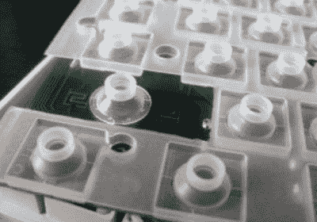
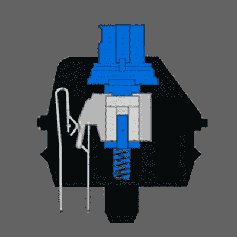

# 对最好的热情来自机械键盘

> 原文：<https://hackaday.com/2017/11/22/a-passion-for-the-best-is-in-mechanical-keyboards/>

有一整个亚文化群的人都对电脑键盘着迷。虽然大多数人对电脑自带的键盘或雇主提供的键盘(通常是底层的湿软薄膜键盘)感到满意，但仍有一小部分键盘爱好者热衷于定制键帽、开关模块、二极管矩阵和成熟的基础产品。

Ariane Nazemi 就是这些机械键盘爱好者之一。在 2017 年的 Hackaday 超级大会上，他真的拿出了一台配有漂亮溴化键帽的康柏电脑，并推出了 IBM 型弯曲弹簧键盘。

受 wordcraft 这些漂亮工具的启发，[Ariane]着手打造自己的机械键盘，并想出了一些令人惊叹的东西。这是暗物质键盘，一种定制的，分离的，符合人体工程学的，交错柱状的，RGB 背光的机械键盘，在 2017 年 Hackaday 超级大会上，[他告诉大家他是如何和为什么制造它的](https://www.youtube.com/watch?v=KIFiLnPHUoM)。

A rubber dome keyboard. The only spring pressure comes from a sheet of rubber

你见过的 99%的键盘都是蹩脚的橡胶圆顶键盘。这是一种特殊类型的开关，由 PCB 上的两个触点、一片含有一串小气泡的橡胶以及安装在按键底部的导电泡沫垫制成。按键从这些橡胶圆顶中获得弹性，当按键被按下时，它会撞上 PCB 触点，闭合电路。

这当然是一种廉价的键盘制造方式，但与真正的机械开关相比，感觉就像垃圾一样。按键在触底之前不会激活，每个开关的寿命是以数万个周期来衡量的，而不是机械按键开关可以处理的数百万个周期。

The Cherry MX Blue keyswitch

另一端是机械按键开关，最好的代表是 Cherry MX 开关；switch 的品牌和型号，克隆产品也由 Gateron 和 Kailh 制造。这些开关使用真正的弹簧和黄铜片来关闭开关，并向打字员提供触觉反馈。甚至还有不同品种的 MX 式开关；红色音干的反馈几乎是线性的，而棕色、透明和蓝色在键的行程中间有一点阻力。蓝调很清脆，不知何故比 IBM 型中的弯曲弹簧更响。它们听起来像机关枪，非常棒。

一个完整的社区围绕着将这些 MX 风格的开关放入定制设计的外壳中以获得完美的打字体验而成长起来。在人体工程学方面有一些创新，比如列间距，其中 Q、A 和 Z 键在一条直线上。有分离式键盘，键盘的左右两边通过电缆连接。阿丽亚娜决定他想要终极键盘。这将是一个分裂键盘，它应该有一个柱状布局。因为他是 Hackaday 人群中的一员，这个键盘肯定有一大堆 blinkies。这导致了[暗物质键盘](http://atomcomputer.us/store/project-dark-matter-beta)的诞生，这是我们很久以来见过的最令人印象深刻的技术键盘之一。

像许多机械键盘项目一样，Ariane 使用 Teensy 作为他键盘每一半的控制器。与大多数机械键盘项目不同，Ariane 使用的是 [Teensy LC](https://www.pjrc.com/teensy/teensyLC.html) ，这是该系列开发板的低成本版本。直到最近，最流行的键盘固件还没有被带到小 LC 上。Ariane 做到了这一点，并增加了对驱动 WS2812 RGB LEDs 的支持。将这一点与 MX 兼容的按键开关结合起来，该按键开关具有透明的外壳和一些聚碳酸酯键帽，Ariane 制成了你所见过的最闪亮的键盘，每个键帽中都没有嵌入单独的有机发光二极管显示器。

阿丽亚娜的演讲是关于如何制造键盘的大量信息，从固件和软件开发到如何建造外壳。键盘在我们 Hackaday 的小圈子里是一个非常受欢迎的话题，我们很高兴 Ariane 能做这个演讲，并赞美机械键盘的优点。

 [https://www.youtube.com/embed/KIFiLnPHUoM?version=3&rel=1&showsearch=0&showinfo=1&iv_load_policy=1&fs=1&hl=en-US&autohide=2&wmode=transparent](https://www.youtube.com/embed/KIFiLnPHUoM?version=3&rel=1&showsearch=0&showinfo=1&iv_load_policy=1&fs=1&hl=en-US&autohide=2&wmode=transparent)

