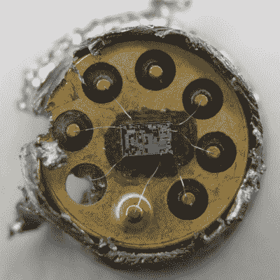

# 741 运算放大器的内幕

> 原文：<https://hackaday.com/2015/10/31/a-peek-under-the-hood-of-the-741-op-amp/>

早在 1968 年首次作为 IC 推出，但其根源可追溯到 1941 年，741 多年来一直在调整和优化，可以说是典型的运算放大器。[Ken Shirriff]决定[看看大家最喜欢的运算放大器](http://www.righto.com/2015/10/inside-ubiquitous-741-op-amp-circuits.html)的内部，最终在芯片上得到了一些好看的显微照片和大量背景。

肯明智地选择了 TO-99 罐格式，用钢锯进行攻击，而不是冒险使用通常用于环氧树脂封装 IC 的沸腾酸方法。由于他的显微镜裸芯片，他能够找到所有的主要组件，并显示每个组件是如何在硅中实现的。特别引人入胜的是 NPN 和 PNP 晶体管结构的不同，以及作为恒流源的“电流镜”的概念。他甚至发明了一个便捷的交互式芯片浏览器——点击芯片图像上的某个东西，就能找出它是 741 原理图上的哪个元件。非常好。

我们以前见过很多芯片解封，包括[这种 TTL 和 CMOS 逻辑芯片的展示](http://hackaday.com/2012/08/13/taking-a-look-at-decapped-ics/)。不过，很高兴看到古老的 741 展出，而且[Ken]的旅行既是新手的绝佳入门，也是老手的坚实回顾。不要错过他在文章结尾提到的一小段历史。