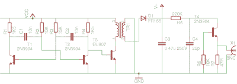

# 一个快速组装的雪崩脉冲发生器

> 原文：<https://hackaday.com/2016/10/04/a-quickly-hacked-together-avalanche-pulse-generator/>

有时候你会努力在一个电子项目的建设中做得非常出色。你仔细选择元件，设计出完美的印刷电路板，然后等着所有的零件一个接一个地邮寄过来。然后你小心翼翼地组装它，印刷焊膏，手工放置元件，一丝不苟。接下来是在回流炉旁焦急的等待，神秘的烟雾飘向烟雾探测器，然后你取出一批完美的电路板，等待它们冷却。

或者，也有其他时候，你想要设备，但你太不耐烦等待，无论如何，你只有一半的组件和一堆垃圾。所以你在一个晚上用示波器和烙铁在一个剩余的原型 PCB 的铜接地面上一起黑了一些有点脏的东西。它一点也不漂亮，但很有效，所以你可以使用它，继续你的生活。

Our avalanche pulse generator schematic. The pulse generator itself is the single 2N3904 on the right.

当你是一个有一些示波器带宽要测量的黑客作家时，你需要[一个皮秒雪崩脉冲发生器](https://hackaday.io/project/15500-avalanche-pulse-generator)，而且你需要一个快。幸运的是，它们是一个非常简单的电路，只有一个 2N3904 晶体管，但问题是它们需要一个远高于 100 V 的高压电源，所以挑战不是制造脉冲发生器，而是制造它的电源。

对于我们的脉冲发生器，我们缺少我们正在复制的雪崩脉冲发生器项目所使用的便捷的线性技术切换器。是时候来点返璞归真的反激式电源创造了，从 ATX PSU 抢走多余的基极驱动变压器、高压二极管和电容器，并通过由双晶体管非稳态多谐振荡器供电的 CRT 线路输出晶体管来驱动它。令人惊讶的是，它成功了，当输出电压调整到 150 伏以上时，脉冲发生器开始正常振荡。

我们在 Hackaday 之前已经看过一次雪崩脉冲发生器，最近我们展示了一个用于测量光速的 T2。我们明天将用它来做一个“范围比较”。