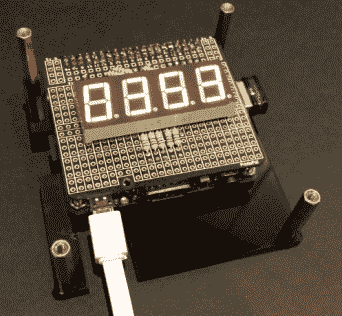
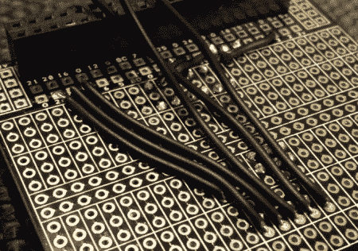

# 一个树莓派整洁的潮汐跟踪器预测吉祥的长廊

> 原文：<https://hackaday.com/2016/01/02/a-raspberry-pi-tidy-tide-tracker-predicts-propitious-promenades/>

潮汐的变幻无常会让在海边散步变得不那么愉快。某一天美丽的海景，第二天可能会变成一片阴暗、肮脏的滩涂。厌倦了这种疲惫的散步，普通人发明了一个整洁的潮汐跟踪器来预测吉祥的散步时间。

Raspberry Pi A+通过使用 Python 代码抓取网页[，从网上获取潮汐时间信息。涨潮的时间，当河口将充满水时，显示在一个 4 位数的 7 段显示器上。它全部夹在两个烟熏黑面板之间，提供了一个整洁的外壳，同时仍然让 led 显示通过。](http://pastebin.com/rGr4PwEX)

  Wired Display Board  ProtoPal Board

代码来自两个项目【平均】从一个 [kickstarter 计时项目](http://raspi.tv/2014/programming-a-kickstarter-tracker-in-python-part-1)和一个 [7-seg 显示项目](http://raspi.tv/2015/how-to-drive-a-7-segment-display-directly-on-raspberry-pi-in-python)中召回。正如他指出的:

> 向他人学习编程是很好的，但是如果你学得足够好，能够记住、重用和组合这些代码，那就更好了。

显示芯片安装在他自己的产品上，不再提供 ProtoPal 板。这是一个 Pi A+尺寸的板，有 288 个原型孔和用于安装在 Pi GPIO 接头上的标准连接器。它保持了项目的整洁。