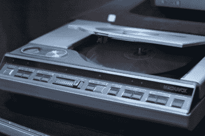
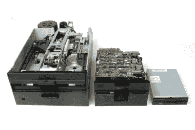
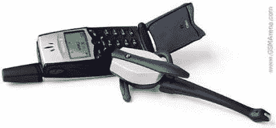
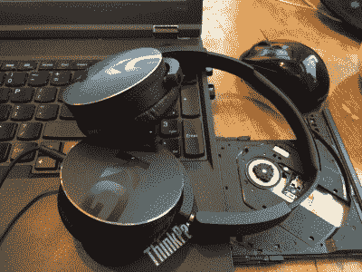

# 对标准之死的现实审视

> 原文：<https://hackaday.com/2016/11/07/a-realistic-look-at-the-death-of-a-standard/>

不久前，我写了一篇文章，名为“3.5 毫米音频插孔死亡，无线技术万岁”一些读者支持我，一些不关心，许多强烈反对我，还有一部分人对一个心爱的连接器的潜在退休感到恐慌。现在，我使用了大量带有主观评价事实的自以为是的语言来证明连接器出了问题。也许今天不会，但在不远的将来，电子商店里的无线耳机肯定会比有线耳机多。

I think I saw a Laserdisc player in operation exactly once.

那么当一个标准消亡时会发生什么呢？当技术开始向前发展时会发生什么？让我们看一下光盘。

两年前，我放弃了最后一叠 DVD-r。当然，我说的送人是指内疚地藏在黑客空间的墓地里。以防有一个精神更强大的成员真的可以扔掉它们。

我已经多年不需要 DVD-R 了。我可能一年在电脑里放一张 DVD 或 CD。注意，我在一年前刚买了一台电脑，强烈地感觉到 DVD 阅读器是绝对必要的。我的意思是，我的第一台电脑，200 兆赫奔腾 MMX，有一个光盘托盘。对我来说，它不是电脑，除非它有一台。我已经舍不得我的旧笔记本电脑的串口和并口了。我将如何控制我不再拥有的数控机床？USB？求你了。他们换了键盘，弄坏了鼠标。我绝对不会妥协。

Dropbox 发生了。廉价的拇指驱动器出现了。SD 卡发生了。这并不是说 DVD 驱动器本身有什么问题。这是一个美丽的工程和世界标准，可以阅读整个格式的历史。我只是不再使用它了。技术赶上了，然后超过了它。我的下一台笔记本电脑将不会在磁盘驱动器上浪费空间、电力和重量。为什么要这样？

## 承诺

让我们假设今天是我们所知道的 CD-ROM 和光盘格式的死亡日。打印机将不再附带一个装有过时驱动程序的小信封。你的 IT 人员再也不用带着那个满是磁盘的油腻的皮革活页夹到处走了。今天死了。官方说法是，它已经 58 岁了。

这意味着什么？这是否意味着外星人会降临并带走一切？我明天醒来时，我今天的磁盘驱动器会变成光滑的塑料？不。仍然会有一家公司在某个地方生产磁盘。仍然会有一个原始设备制造商把它塞进某个缝隙里。在可预见的未来，它仍将存在。只是没人会使用它。这是一件怪事，也是一件遗物。

The fourth iteration is air.

标准很难改变。标准消亡缓慢。有些人永远不会完全死去。2002 年，在电脑中安装软盘驱动器仍然是标准，2007 年，只有 2%的电脑安装了软盘驱动器，2016 年，微软忽略了在标准安装中安装软盘驱动器。没有理由为这一发展感到惋惜。结束了。如果需要的话，即使是业余爱好者现在也会模仿这种驱动。

截至今天，3.5 毫米音频插孔，以这样或那样的形式，已经存在了近 138 年。这比我们理论上的光盘驱动器的消亡时间还要长 80 年。一夜之间被取代的几率有多大？明年没有一种设备提供世界上最流行的连接器的可能性有多大？非常非常接近于零。

## 不是砰的一声

我真的认为音频插孔坏了。三十年后，大多数便携式设备都不会有。然而，如果三十年后它接近死亡，我会感到惊讶。我是说，这是标准。它工作了。如果我们不把自己炸飞，如果它在流淌之前再停留一百年，我也不会感到惊讶。

Behold! The Ericsson T36, the first phone to support Bluetooth!

那么它会怎么死呢？嗯，就像所有的技术都会被替换一样。首先，将会有一些最初绝对糟糕的技术，但有可能取代现有的播放器。例如，2000 年第一款支持蓝牙的手机问世，第二年一款支持蓝牙的免提汽车扬声器问世。我很同情买了第一个模型的人。那一定非常糟糕。

现在快进到今天。从第一部手机到现在已经 16 年了。我们使用的是蓝牙 4.0+,每一部手机都有连接的能力。蓝牙 5.0 刚刚宣布，并承诺 50 兆比特的带宽，这是一个比 CD 质量音频需求多一个数量级的带宽。几乎没有笔记本电脑的技术是可选的。自 2000 年以来，围绕无线耳机、汽车音响和耳机已经形成了一个小市场。下一步是什么？

一家公司不得不说，我们没有在笔记本电脑中安装磁盘驱动器。在这种情况下，这是我们最讨厌的水果主题公司。他们这样做是有道理的。提出只有他们拥有世界上最令人印象深刻的制造能力并没有错。他们拥有的数控机床比任何人都多。如果有人能推动一项技术，那就是这个科技巨头。如果有人能打得起赌，那就是他们。

当一家公司做出这样的事情时，末日就开始了。结束的很慢，但已经开始了。看看三星在 2017 年广泛的产品线中是否有至少一款没有插孔的探索性手机型号是不值得的。这将是一个很好的，他们将有一个几乎相同的模型旁边。消费者会在意吗？这有关系吗？他们会从蓝牙耳机中赚很多钱吗？

One day Simba, everything you see before you will be obsolete.

更重要的问题。服务费率更低吗？手机是否有更高的客户满意度？他们会看着这些数据思考。接下来的一年，其他一些手机制造商将会尝试。人们并不真的介意加密狗。很烦但是还好。他们不太喜欢收费。

也许 Bose 制造了一套充电两天的高级耳机。几乎所有东西都支持 3.5 毫米插孔。几年过去了，直到一些用户发现他们的笔记本电脑有蓝牙功能，汽车有蓝牙功能，手机有蓝牙功能。他们已经在耳机上投资了，所以他们每年使用有线电视的次数会少一些。下次他们丢了一副，就会再买一副蓝牙耳机。他们只是市场中很小的一部分，但他们已经买了最后一对有线电话，甚至不知道。

快进十年左右。也许 25%的消费者已经淘汰了有线耳机。无线有一个真正的市场，大多数制造商都推出了非常好的对子。有了这么大的市场，许多琐碎的问题都解决了。配对很快。串扰和干扰很低。蓝牙 8.0 比音频需要更多的带宽。电池技术一直在进步，手机也运行了相当长一段时间。有一个蓝牙耳机比有线耳机更好。

之后，标准开始消失。这并不突然。一点都不难过。只是无线选项将会证明自己更好。没人会介意。也许二十年后，笔记本电脑就不再有了。手机没有，但昂贵的音频设备可能有。像直升机耳机这样的任务关键型设备将使用传统的插孔(不使用军用标准卡口连接器)。自动取款机和博物馆都会有。飞机会给他们提供。

也许 50 年后，我们所知道的耳机将会被扔进旧货店的那个奇怪的垃圾箱，但不会是明天。从现在开始甚至不会超过十年。标准消亡缓慢。谁知道呢，也许市场会说话，iPhone 8 又会有插孔了。不管怎样，我去年刚买了有线耳机。如果他们不插入我的下一部手机，我会很不高兴的！