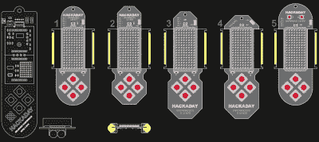
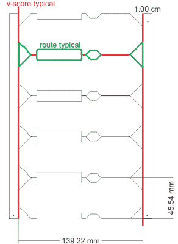
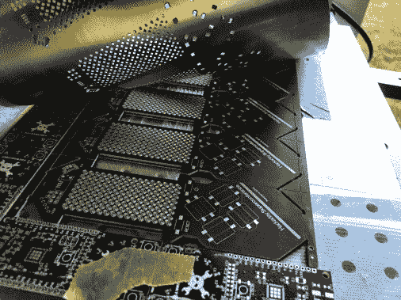
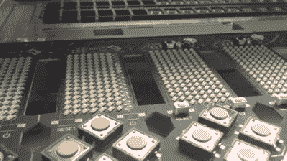
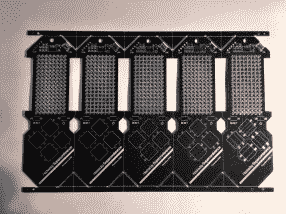

# 电子制造的故事

> 原文：<https://hackaday.com/2016/11/25/a-tale-of-electronic-manufacturing/>

从概念到最终用户手中的成品是怎样的？“聚在一起”是一个故事，它将世界各地的人和零件聚集在一起，制作出一件硬件艺术品。

举办一个关于硬件创造的会议提供了一个建立硬件徽章的绝佳机会。但是门槛设置得相当高——每个看到它的人都会注意到设计选择、元件选择和制造过程的所有迹象。幸运的是，我们有一个很棒的团队在制作 [Hackaday SuperConference 徽章](https://hackaday.io/project/16401-supercon-ii-badge)，结果非常棒。让我们来看看它是如何实现的。

### 概念、设计和原型

我们已经有了一个来自贝尔格莱德黑客大会的经过验证的用户界面。它是如此的互动，如此的快乐，以至于它为超级会议提供了一个很好的开始平台。第一次迭代保留了所有的优点，但是做了许多改变来构建我们所达到的令人愉快的美感。

Early badge design tests

[Voja Antonic]是徽章设计师。他开发了一个醒目的徽章形状，并布置了一个视觉上迷人的 LED 矩阵，各部分与电路板的两侧呈 45 度角。电池架安装在电路板的边缘，无光泽的黑色丝网、按钮颜色和丝网颜色相互配合。不，这款产品没有注塑外壳或其他外壳，有些人可能会认为这是一个不完整的制造故事。但是如果被掩盖，硬件设计的美就会消失。

在 6 月份发出最初的原型后，我们有了一个获胜者，是时候转向制造了。如果你发现自己渴望更多关于徽章设计的细节，请查看[【Voja 的】关于主题](http://hackaday.com/2016/10/17/design-and-hacking-drilldown-supercon-badge/)的文章。

### 收集材料并找到一个 CM

[Chris Gammell]开始推动生产工作。他的第一项任务是审查来自[Voja]的[物料清单](https://docs.google.com/spreadsheets/d/1yM-VkAw2XC35VYwjCUbVrPl6A42SD2oxYMteF3KZlzc/edit?usp=sharing)，这引起了一些疑问。[Voja]住在塞尔维亚的贝尔格莱德，他选择的零件只能从一家供应商处获得:贝尔格莱德的[彗星电子](http://store.comet.rs/)。这包括一些难以更换的项目(至少在不改变设计的情况下)，如按钮和恒流 LED 驱动器。

我们很早就做出了决定，以最大限度地减少单一供应商零件的数量，仔细检查库存，并确保我们在生产前及时获得零件。大部分组件由众多经销商库存，在为订单的其余部分选择 [Digikey](http://www.digikey.com/) 时会仔细考虑库存数量和价格。

组装 300 块电路板是一个有趣的挑战。合同制造商一直在处理 300 块电路板的订单，但通常情况下，它们不会像这个徽章那样复杂。[Chris]联系了多个 CMs 进行报价，并缩小了范围。我们最终和我们的朋友鲍勃·考格斯哈尔一起去了，他是华盛顿 DC 地区小批量组装公司的创始人。[Bob]是 Hackaday 的朋友——几年前，我们采访了他关于[在发明 UNIX“sudo”命令](http://hackaday.com/2014/05/28/interview-inventing-the-unix-sudo-command/)中的作用，后来我们见过他几次。和你认识的人一起工作很愉快。

### 组装电路板

[Bob Coggeshall]立即投入进来，努力让设计为最流畅的生产技术做好准备。

他的第一步是审查焊膏格伯文件。这些告诉他电路板的哪些区域具有严格的公差，并且可能被证明是困难的。在我们的例子中有两个:加速度计和 USB 连接器。加速度计是 0.5 毫米间距的 LGA-16 封装(小批量装配的限制是 0.45 毫米)，USB 连接器是一个通孔部件，每个部件都需要手动干预。在与[Chris]和[Voja]讨论了这些问题后，我们决定继续推进这一进程。

接下来是面板 PCB 文件。[Bob]基于他的设备限制，他的回流炉决定了最大面板尺寸。接下来，他将面板文件发送给他在 MG Circuit 的朋友[Rocky]，以确保他的直通布线和 v 形刻痕面板计划得到理解。这是一个聪明的做法，因为它允许设计具有有趣轮廓的板，但具有 v-score 的 4 边仍将面板保持在一起，同时在填充后易于分离。

电路板到达时看起来棒极了，在等待期间[Bob]已经为这项任务编写了他的选择和放置程序——这个过程花了一整天。他的第一个命令是组装一个单独的面板。这被运到[Voja]进行测试。好消息，各位，小组表现出色。是时候全面生产了！

  Using the solder stencil  LED pick and place  Panel of 5 badges

之前提到的复杂性？每块板都必须用模板涂上焊料，用机器放置零件，通过回流焊炉，检查……两次，因为板的两面都需要检查。首先安装背面，然后是正面，有 128 个发光二极管和各种其他部件。每个徽章的正面需要 4 分钟(每个面板需要 20 分钟)来挑选和放置。复杂性表现在 300 块电路板上放置了 50，000 个零件，总装配时间约为 30 小时。

### 测试、返工和最终装配

超级会议召开前两周，组装好的徽章被运送到帕萨迪纳的供应框架设计实验室。这些是五个一面板的单元，需要几个步骤进行最终组装。

首先，需要对电路板进行去平面处理……简单地对 v 形刻痕区域施加一些力。因为它们在面板上，边缘安装的电池座还没有安装。[Voja]开始手工焊接 600 个 AAA 电池座(每块电路板两个)。

Left-to-right: Dusan gluing bezels, Marco flashing and testing, and Chris reworking as necessary.

接下来是刷新固件和测试每一块电路板。故障率约为 7.5%，加速度计在大多数情况下是罪魁祸首。这是[Bob]在开始时提出的两个“麻烦”部分之一——精细的间距使得焊膏对齐至关重要，并且封装没有可见的引线，因此无法进行目视检查(您需要使用 X 射线)。[Chris Gammell]通过用热空气提起芯片，用助焊剂笔击打芯片，然后再次用热空气重新涂抹，对这些进行了返工。这使得几乎所有的缺陷板都能工作。

继续机械组装，我们增加了丙烯酸挡板，增加了电池座的刚性，看起来很棒。设计实验室有一个激光切割机，所以制作这些挡板是容易的部分。问题是激光切割丙烯酸树脂有一层涂层，需要从两侧去除，这些部分非常窄，很难剥离。[Marco]花了一天的大部分时间移除薄膜，并与[Dusan]一起用强力胶将它们粘合到位。下一个扳手是挂绳夹，它对于 PCB 上的孔来说太大了。解决办法是用钳子打开孔眼，取下夹子，插入徽章，然后再合上。

最后一步是给每个徽章重新刷上一个独特的序列号，作为红外通信的看门人。

### 硬件很硬

这是非常令人惊讶的，如果不看看我们倾斜天平的一些方式，制造业的故事就不会完整。

我们的 BOM 成本目标是 20 美元，包括组装费用。有很多方法可以篡改数据，但一个合理的折中估计是我们超出了 20%左右。但是这个数字不包括一些我们不需要直接支付的成本:硬件设计、项目经理以及最终组装和测试的成本不包括在内。此外，小批量组装给了我们“黑客之友”的比率，这是我们非常高兴得到的。我们在 Microchip 的朋友，特别是 Garrett Scott，投入了他们的时间和才能来升级我们的引导程序，使其可以作为 USB 大容量存储设备使用。

这些额外的成本不包括在底线中，但它们都捆绑在一起，使这个项目变得神奇。大多数会议没有足够的空间来承担这种风险，但 Supplyframe 将这些徽章作为优先事项，让我们掷骰子，让它发生。

任何参加 SuperCon 的人都会同意，这一切都是值得的。我们的徽章是一个美丽的电子产品，展示了我们对设计、工艺和硬件创造文化的热爱。这是 Hackaday 的完美体现，在这里分享这个过程是这种精神的延续。