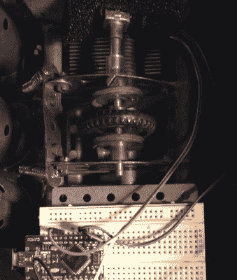

# 现代收音机的老式接口

> 原文：<https://hackaday.com/2016/11/06/a-vintage-interface-for-a-modern-radio/>

在过去几十年中，经济实惠的软件定义无线电技术的出现彻底改变了业余无线电爱好者和其他无线电爱好者使用电波的方式。不过，大多数软件定义的接收器都有一个小问题，由于本质上是软件驱动的，它们通常依赖主机作为接口。因此，这种体验是点击鼠标按钮或使用键盘快捷键，而不是机械模拟拨号界面，这种界面提供了对老式收音机的轻松控制。

Meccano encoder mounts for the win!

这个问题已经由[Jon Hudson，G4ABQ]用他的一个 SDRplay 接收机解决了。他将它和它的控制 PC 安装在一个非常陈旧且无法使用的马可尼 CR100 通信接收器的底盘上，并[给它一个只使用马可尼前面板控制的控制界面](https://www.youtube.com/watch?v=LG4n6_A8OxU) (YouTube 链接)。一个旋转编码器被移植到马可尼调谐电容器上，看起来像一些 Meccano，反过来，它为 Arduino 供电，Arduino 的行为就像一个键盘，有利于 PC。增加了一些额外的按钮，用于模式选择、光谱缩放和移动，并且似乎已经注意到给它们的标签一种时代的感觉。Arduino 代码由[Mike Ladd，KD2KOG]提供。结果是一个非常可控的 SDR 接收器，尽管是在一个相当大的情况下。

如果你对这个项目感兴趣，那么我们被告知，它将于下周在慕尼黑电子展的 RS 展台上展出，同时我们将视频放在休息时间下方。

 [https://www.youtube.com/embed/LG4n6_A8OxU?version=3&rel=1&showsearch=0&showinfo=1&iv_load_policy=1&fs=1&hl=en-US&autohide=2&wmode=transparent](https://www.youtube.com/embed/LG4n6_A8OxU?version=3&rel=1&showsearch=0&showinfo=1&iv_load_policy=1&fs=1&hl=en-US&autohide=2&wmode=transparent)

一方面，以这种方式玷污一个经典的通信接收器似乎是一种亵渎，但另一方面，这个时代也不乏类似的破损套件，只不过是垃圾。至少这一个已经从在一些 om 的长凳下聚集灰尘的命运被解救。

如果特别提款权对你来说是陌生的，[下面是我们对它们的介绍](http://hackaday.com/2016/05/30/hackaday-dictionary-software-defined-radio-sdr/)。在 GNU Radio 中，我们在[之前就已经推出了 SDRplay，而且这些年来，我们已经在](http://hackaday.com/2015/11/12/your-first-gnu-radio-receiver-with-sdrplay/)[推出了不止一款自制 SDR](http://hackaday.com/2016/07/28/amazing-sdr-built-by-16-year-old/) 。