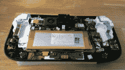

# 既是电脑又是主机的 Wii U。

> 原文：<https://hackaday.com/2017/08/02/a-wii-u-that-is-both-computer-and-console/>

传奇的 sudomod 论坛用户[banjokazooie]再次展示了他们在 Wii U 主机改造方面的实力——这一次是通过将它改造成一台[发电站便携式电脑](http://www.sudomod.com/forum/viewtopic.php?f=13&t=3331)！

我们喜欢[banjokazooie]的[retro pie Wii U mod](http://hackaday.com/2016/11/01/wii-u-retropie-console-looks-gorgeous/)，很高兴看到他们以这个版本再次回归。这次这里面是什么？系好安全带，因为这是一次旅行:他们的计算棒上的英特尔 M5 处理器 core M，4gbRAM，64GB 固态硬盘，2K LCD 触摸屏，蓝牙，WiFi，128GB SD 卡插槽，两块 3.7V 4000 mAh 电池，Pololu 5V，6A 降压稳压器，Teensy 2.0++开发板，电池保护 PCB，USB DAC 声卡，立体声放大器，用于插入一切的 USB 集线器，以及 TP5100 电池看看吧！

 [https://www.youtube.com/embed/WdmV7iIXdI0?version=3&rel=1&showsearch=0&showinfo=1&iv_load_policy=1&fs=1&hl=en-US&autohide=2&wmode=transparent](https://www.youtube.com/embed/WdmV7iIXdI0?version=3&rel=1&showsearch=0&showinfo=1&iv_load_policy=1&fs=1&hl=en-US&autohide=2&wmode=transparent)

它运行 Windows 10 和 Cemu——一个 Wii U 模拟器——因此在这个过程中几乎没有丢失主机的原始功能！主页按钮通过操纵杆的彩色 led 进行循环，一旦电池达到临界状态，电池监控软件就会安全地关闭它——这需要大约两个小时才能完成。LCD 可能看起来有点大材小用，但它只有 2.5 毫米厚，为其他电子设备留下了足够的空间，同时也具有更有效的功耗。

令人印象深刻的是，这并不是我们第一次看到[控制台变成电脑](http://hackaday.com/2013/06/03/the-thinnest-xbox-laptop-yet/)。

【感谢提示，神奇的骨架！]