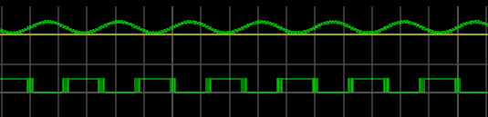
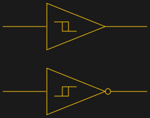
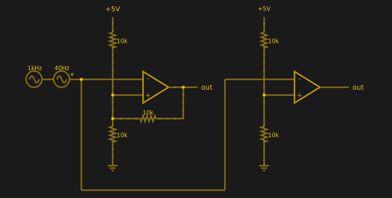

# 关于施密特(触发器)

> 原文：<https://hackaday.com/2017/02/24/about-schmitt-triggers/>

有句老话:“理论上，理论和实践是一样的。实际上，他们不是。”我们花时间在纸上或电脑屏幕上画画，完美的电线、理想的电阻和完美的波形。唉，现实世界没那么善良。元件有各种讨厌的寄生效应，没有信号看起来像在教科书的页面。

考虑以下问题。输入的正弦波电压在 0 V 至 5 V 之间变化，当正弦波电压超过 2.5 V 时，您希望将其转换为高电平方波，这很简单，对吗？您可以使用 CMOS 逻辑门或比较器。理论上…

问题是，正弦波并不完美。其他组件不会有什么问题。如果你在现实生活中尝试过，你会发现当正弦波正好在 2.5 V 标记时，输出可能会在稳定下来之前来回摆动。正弦波中的任何噪声或拉伸都会加剧这种情况。您将得到类似这样的结果:

注意到方波的边缘有点粗了吗？这是输出在比较器的阈值处快速来回切换。

## 滞变

答案是不要将阈值设置为 2.5 V 或任何其他单一值。取而代之的是，设定一个范围，超出这个范围它就会切换，当它离开范围的低端时切换到低电平，当它超过范围的高端时切换到高电平。也就是说，你想引入迟滞。例如，如果 0 至 1 转换发生在 1.9 V 处，1 至 0 开关发生在 0.5 V 处，您将获得一个清晰的信号，因为一旦 0 至 1 转换发生在 1.9 V 处，将需要大量噪声才能将其翻转回 0.5 V 以下。

例如，你可以在温度控制器中看到同样的效果。如果你有一个加热器和一个热探头，当温度达到 100 度时，你不能马上关掉加热器，然后在 99.9999 度时再打开，这样就很容易设定一个 100 度的设定点。在这种情况下，您通常也会使用滞后(如果不是像 PID 这样更复杂的东西)。例如，你可以在 99 度时关闭加热器，然后在 95 度时再打开。事实上，你家里的恒温器就是一个滞后系统的典型例子——它有几度的死区，所以它不会不停地开关。

## 施密特触发器和

施密特触发器基本上是一个具有迟滞的比较器。它不像简单的比较器那样将输入电压与 VCC / 2 进行比较，而是集成了一个死区，以确保即使存在高噪声输入信号，逻辑电平转换也只发生一次。

[Schmitt Trigger Symbol](https://commons.wikimedia.org/w/index.php?curid=5894307) by Selket CC-BY 2.5

假设你想在电路中使用施密特触发器，你有很多选择。有些 IC，如 74HC14，内置六个(反相)施密特触发器。在示意图上，每个门由右边的一个符号表示；方框中的小标记是迟滞曲线，输出上的小气泡表示当它是反相器时的逻辑否定。

你也可以自己用晶体管 T1 或者 T2 555 T3 芯片来制作它们。但到目前为止，最简单的方法是在普通运算放大器比较器电路中引入一些反馈。

下面是两个运算放大器，一个带有正反馈，使其像施密特触发器一样工作。另一个只是普通的比较器。可以[在线模拟设计](http://tinyurl.com/zypz8wh)。

如果你没有分析过很多运算放大器电路，这是一个很好的尝试。首先，假设运算放大器具有以下特性:

*   输入是完全开放的。
*   输出将尽一切努力使输入电压相同，直至达到电源轨。

这两者都不完全正确(还是理论对实践)，但它们足够接近。

右边的比较器根本不加载输入，因为输入引脚开路，输出摆幅为 0 V 或 5 V，试图使输入匹配，但没有成功。它不能改变输入，因为没有反馈，但它确实是一个很好的比较器。+引脚上的分压器提供基准电压。低于这个电压的任何东西都会使输出向一个方向摆动。过电压会使它向另一个方向摆动。如果电压完全相同呢？这是你需要滞后的一个原因。

比较器的分压器将+引脚设置为电源电压的 1/2(2.5V)。看看施密特触发器(在顶部)。如果输出在 0 V 至 5 V 之间，则分压器的顶部或底部电阻将与 10K 反馈电阻并联。也就是说，反馈电阻要么连接到 5 V，要么接地。

当然，两个并联的 10K 电阻实际上是 5K。因此，根据输出状态，分压器可能是 5000/15000 (1/3)或 10000/15000 (2/3)。给定分压器的 5 V 输入，阈值将为 5/3 V (1.67 V)或 10/3 V (3.33 V)。当然，您可以通过适当改变电阻值来改变阈值。

## 实际应用

施密特触发器用于许多需要平方噪声信号的应用。高噪声传感器，例如红外传感器，可以受益于施密特触发器。此外，当您试图“读取”正在充电和放电的电容器时，为所有电压范围定义的输出非常方便。你可以利用这个原理把施密特触发器做成振荡器，或者用它来[去抖开关](https://hackaday.com/2015/12/09/embed-with-elliot-debounce-your-noisy-buttons-part-i/)。

如果你想看一个使用基于 555 的施密特的实际项目，看看这个[光传感器](https://hackaday.com/2011/04/08/light-sensing-circuit-for-power-saving-applications/)。施密特触发器只是用来对抗真实世界和真实元件不精确性的一种工具。事实上，当您想要将模拟信号直接转换为一位开关数字表示时，它们几乎是必不可少的。