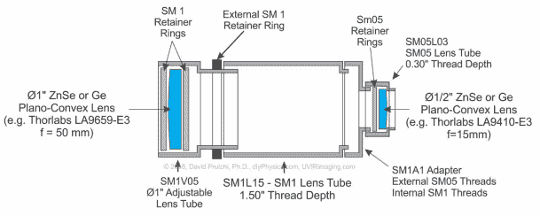

# 为消费类热感相机添加光学元件

> 原文：<https://hackaday.com/2018/03/08/adding-optics-to-a-consumer-thermal-camera/>

[David Prutchi]写信告诉我们他最近为热成像相机制作镜头的[实验，据他所知这是第一次(至少就 DIY 硬件而言)。凭借其定制设计和制造的光学系统，他不仅展示了放大远处目标的能力，还展示了近距离观察小物体的能力。他正在使用 Seek RevealPro，但这个概念也应该适用于其他制造商的硬件。](http://uvirimaging.com/2018/03/05/thermal-camera-diy-macro-and-telephoto-converters/)

 在他详细的白皮书中，[大卫]首先描述了适合热成像的镜头类型。玻璃不能传输热感相机需要的波长，因此镜头需要由锗或硒化锌制成。这些并不是你能在当地相机商店买到的那种东西，甚至由这些材料制成的小镜头也要数百美元。他建议密切关注易贝过剩的光学器件，你可以把它们拿出来以降低成本。

创建微距适配器非常简单，你只需在热感相机前放置一个凸透镜。但是远摄有点复杂，白皮书的其余部分详细介绍了用于组装光学系统的数学和构造技术。[David]给出了他的长焦转换器的完整的材料清单和成本明细，但准备好迎接一轮价格冲击吧:所有新硬件的总成本将近 500 美元。不过，其中大部分是特殊镜头，所以如果你能在二手市场上买到一些，就能大幅降低成本。

最近，我们已经看到了一系列令人印象深刻的[热感相机黑客和项目，毫无疑问，这是由于](https://hackaday.com/2017/02/08/diy-thermal-camera-thats-better-and-cheaper-than-a-flir/)[消费级成像硬件价格下降](https://hackaday.com/2017/12/27/dead-ebay-thermal-camera-is-an-organ-donor/)。鉴于热感相机作为诊断工具的实用性，它可能是[值得加入你的锦囊妙计](https://hackaday.com/2018/03/03/thermal-camera-diagnoses-thermal-issue-on-a-sonoff-switch/)的东西。