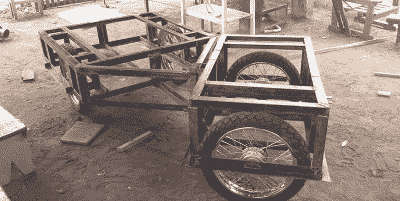

# 获奖之后:轻型电动多功能车的下一步是什么

> 原文：<https://hackaday.com/2016/04/13/after-the-prize-whats-next-for-the-light-electric-utility-vehicle/>

去年 Hackaday 奖的第三名得主是[Chris Low]的轻型电动多功能车。如果你认为 Hackaday 奖已经到手，那么就这样了，项目创建者打包回家，[Chris]打消了这个想法，他将奖金直接投资到他的项目中，[发布了他在改进的 Mk3 模型](https://hackaday.io/project/4997-light-electric-utility-vehicle/log/35442-mk3-finished)上的最新进展。

Light Electric Utility Vehicle, 2015-style

我们[第一次报道轻型电动多功能车](http://hackaday.com/2015/06/07/hackaday-prize-entry-a-light-electric-utility-vehicle/)是在 2015 年 6 月，当时它首次入围 2015 年 Hackaday 奖。我们的目标是生产一种坚固而简单的小型电动汽车，这种汽车可以由太阳能驱动，并且适合[Chris]工作的南苏丹的条件。我们当时看到的车辆是铰接式设计，链条驱动自行车式车轮。相比之下，Mk3 版本已经失去了有利于齿轮齿条式转向的铰接，采用轮毂电机而不是链传动，现在采用螺旋弹簧悬架。你可能会评论说，它已经失去了一些原始的简单性，变得更像传统的电动 UTV 的东西[，但随着时间的推移，它也成为了一个更实用的日常交通工具。](http://www.polaris.com/en-us/ranger-utv/ranger-ev-avalanche-gray)

你可以在 hackaday.io 上的[轻型电动多功能车项目页面上查看完整的构建日志，并在休息时间下方查看[Chris]展示其运行的视频。](https://hackaday.io/project/4997-light-electric-utility-vehicle)

 [https://www.youtube.com/embed/qGB5CJhW5KQ?version=3&rel=1&showsearch=0&showinfo=1&iv_load_policy=1&fs=1&hl=en-US&autohide=2&wmode=transparent](https://www.youtube.com/embed/qGB5CJhW5KQ?version=3&rel=1&showsearch=0&showinfo=1&iv_load_policy=1&fs=1&hl=en-US&autohide=2&wmode=transparent)

这个项目是去年奖项中的一个参赛项目，但 2016 年的比赛正在如火如荼地进行。前往[hack aday 大奖网站](https://hackaday.io/prize)了解全部详情。

多年来，我们在 Hackaday 展示了许多电动汽车，其中一些比这一款更具娱乐性。[有这辆电动沙滩车](http://hackaday.com/2014/05/25/introducing-the-flux-buggy-a-serious-electric-dune-buggy-conversion/)比如，[这辆电动 Posche 911 改装](http://hackaday.com/2012/11/16/porsche-911-made-electric/)，或者[这辆电动摩托车](http://hackaday.com/2012/02/16/build-an-electric-motorcycle/)。拜托，让他们来吧！

The [HackadayPrize2016](http://hackaday.io/prize) is Sponsored by:       