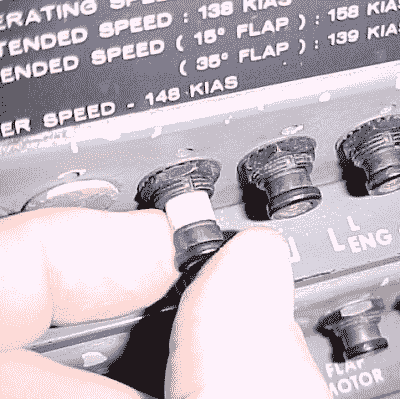

# 亚航坠机分析:谁或什么失败了？

> 原文：<https://hackaday.com/2015/12/04/airasia-crash-analysis-who-or-what-failed/>

去年圣诞节后几天，飞往新加坡的亚航 8051 航班不幸坠入大海。印度尼西亚完成了对坠机事件的调查，刚刚发布了最终报告。媒体报道很多，尤其是在亚洲。这些故事以飞行员失误为标题，但作为技术专家，在报告中有更深层次的教训可以吸取。

空客 A320 是一个电传操纵系统，这意味着飞行员和操纵面之间没有机械连接。一切都是电子的，飞行的大部分都在自动控制之下。不幸的是，根据一份报告，这也意味着飞行员实际驾驶飞机的时间不多，可能不到一分钟。

这是印尼报告中描述的场景:方向舵行程限制计算机系统报警四次。飞行员按照正常程序解除警报。第五次警报后，飞机滚转超过 45 度，快速爬升，失速，然后坠落。

## 飞行员失误？

媒体头条关注的是故障链中的后几个步骤，部分原因是飞行员从未接受过处理这类突发事件的训练。不仅仅是亚航在 A320 上省略了这项训练。所有的航空公司都这么做了，因为飞机制造商空中客车公司没有想到飞机会经历如此极端的颠簸。请注意，法国作为空客的东道国，参与了调查。

作为技术人员，我们需要看得更远。技术根本原因是方向舵限位控制系统电路板上的焊点开裂。该系统限制了高速时方向舵的移动量。一个关键点是，同样的系统*在 2014 年*发生了 23 次故障。这被认为是*轻微损坏*，从未修复。

在许多情况下，故障链是对技术故障做出正确响应的人为失误的级联。大多数报告很少提到飞行员是如何试图修复第五个方向舵操纵故障的。他们遵循第一次故障的正常程序，但最后一次他们在飞行中打开并重置了一个断路器。不知何故，这意味着自动推力和自动驾驶仪断开，永远无法恢复。这使得飞行员通过电传系统单独控制飞机。

## 一系列悲惨的事件

总而言之，这里有三个主要的失败之处:

1.  焊点不良，
2.  循环断路器，
3.  恢复训练不足。

我们会忽略没有正确排除电路板故障的错误。这是人为失误，但也是亚航更大的政策问题，而不是直接的技术问题。

尽管在制造过程中尽了最大努力来防止不良焊点的出现。诊断间歇性关节故障可能是一场噩梦，因此我们可以同情飞机维修人员。我们应该如何处理关键或重要系统中的间歇性故障？显然，该系统正在检查其完整性，因为它在整个 2014 年一直发出警告。如果出现一定数量的故障，让一个系统拒绝运行是可行的吗？我建议，在 6 次故障后，它可能会有一个更高的警报，比如在安全的环境中开机时拒绝启动(例如，停在地上)。基本上系统说，“我知道我不好，现在修复我。”

Aircraft Circuit Breaker

为什么飞行员会乱动断路器？一份报告称，飞行员看到一名维修工人循环操作断路器来排除故障。在地面上可以，但在空中不行。为什么一个飞行员会尝试这样做，特别是有建议飞行员不要重置断路器，除非系统对飞行至关重要？这里的控制系统是一个安全功能，但不是关键，所以为什么不把它关掉呢？

一般来说，人们对技术感到过度舒适，因为它无处不在。有各种各样的笑话说，非技术亲戚对一台电脑做了一些疯狂的事情，因为同样的动作修复了其他东西。

不幸的是，这通常意味着人们不知道他们不知道的事情。在这种情况下，飞行员似乎不知道循环那个断路器会扰乱其他系统。是的，这听起来很奇怪，我无法解释，因为我不知道为什么会这样。如果属实，这似乎是一个应该解决的系统性问题。在我们的工作中，我们需要确保系统中某个部分的故障不会扰乱其他地方的关键部分。

飞行员没有受过处理飞行混乱的训练，因为即使是飞机制造商空中客车公司也没有想到飞机会经历如此极端的混乱。我想因为墨菲不是法国人，他们不希望他的影响发生在那里。这种假设可能来源于飞机的电传操纵。期望是飞机不会让自己变得如此沮丧。但是自动飞行系统被断路器的循环破坏了。

## 包裹

复杂系统中的故障需要很大的努力来追踪。在这种情况下，我们可以看到三个独立的行为是如何导致故障的，而第四个行为，即维护故障，起了很大的作用。这指出，如果焊接点没有失效，整个失效可以避免多次。如果飞行员没有打开断路器。如果飞行员修复了自动飞行电脑。如果飞行员在事故发生后反应恰当。

即使作为黑客，我们也需要记住故障何时以及如何发生。我们写过[篇关于黑客创造的电子门锁](http://hackaday.com/?s=door+locks)的文章。如果在数百次开门和关门后，停电或焊点不良，你如何进入？希望有一把钥匙能控制电子设备。幸运的是，我们看到的大多数黑客攻击都不是关键的。幸运的是，失败不会危及生命。让我们保持这种方式。