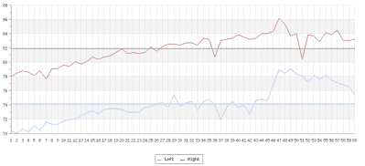

# Alexa 保持宠物蛇体温调节

> 原文：<https://hackaday.com/2017/01/15/alexa-keeps-pet-snake-thermoregulated/>

[Chris Grill]得到了一条宠物大蟒蛇，它需要一个相当严格的温度控制环境。它的外壳需要始终保持一致的温度，否则蛇可能很难调节自己的体温。[Chris]想要[记录温度](http://www.wb6cqa.com/2017/01/alexa-enabled-terrarium-temperature.html)并拿了几个 TTF-103 热敏电阻和一个 Arduino Yun，这使他能够记录外壳每一侧的温度。他使用一些代码将 temp 读取到 Arduino 云的 linux 端，然后使用 PHP 图形库 [jpgraph](http://jpgraph.net/) 显示结果。

 但这还不够。为什么不有点想象力，让亚马逊的 Echo 在你问的时候读回这些临时数据呢！多亏了 Amazon 有据可查的设置定制命令的步骤，设置起来还不算太糟。

由于 SSL 问题，他最终在让 Echo 与 Yun 上的 web 服务器对话的战斗中失败了，但是他通过使用代理找到了一个现有的解决方法。

 [https://www.youtube.com/embed/adcpVExPGPM?version=3&rel=1&showsearch=0&showinfo=1&iv_load_policy=1&fs=1&hl=en-US&autohide=2&wmode=transparent](https://www.youtube.com/embed/adcpVExPGPM?version=3&rel=1&showsearch=0&showinfo=1&iv_load_policy=1&fs=1&hl=en-US&autohide=2&wmode=transparent)

