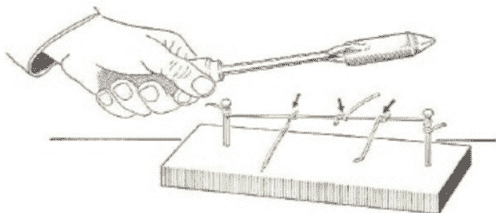
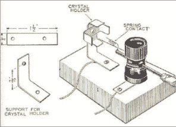

# 阿尔弗雷德·p·摩根:一代无线电黑客

> 原文：<https://hackaday.com/2015/12/11/alfred-p-morgan-a-generations-radio-hacker/>

前几天我在网上冲浪寻找有趣的项目时，我遇到了[SkyKing 的] [精致的晶体管解调器无线电构建](http://theradioboard.com/rb/viewtopic.php?f=4&t=6654)。他提到它们是“阿尔弗雷德·p·摩根式的”,这让我回想起一位引领整整一代人接触电子和无线电的人。

[摩根]出生于 1889 年，在 20 世纪早期，他对制造和驾驶飞机感到兴奋。显然，没有一次成功的飞行。然而，他最终成功了，写了他的第一本书:《如何建造一架 20 英尺的双翼滑翔机》1910 年，他和一个合伙人成立了亚当斯·摩根公司，经销无线电设备。我们可能不会因为[摩根]的飞机而记住他，但是我们会因为他在无线电方面的工作而记住他。

到 1913 年，他出版了一本书《男孩电工》，该书涵盖了电学和磁学的基础知识(当时这些学科远比今天更神秘)。[摩根]在 1947 年版的序言中预言了黑客。在描述了一个男孩对他的模型火车自动化到了无事可做的地步感到沮丧之后，[Morgan]评论道:

> 几乎所有玩耍的男孩的本能都是*制造*和*创造*。他将*用手头的这些材料做出*东西，用全部的梦想和想象的力量*无中生有*。

当然，我们知道这也适用于女孩，但[摩根]写于 1913 年，所以你必须填空。不过，我想我们都能认同这种观点。

然而，[摩根]最令人难忘的书是 20 世纪 50 年代和 60 年代的，第一本名为《男孩的第一本无线电和电子学书》。“你可以猜猜连续的标题(只要把‘第一’这个词换掉就行)。

第一本书涵盖了一些关于[赫兹]如何进行实验和理论的基础知识，但针对的是年轻人。[摩根]擅长让话题变得容易理解。他曾在麻省理工学院学习，所以他知道这个主题的复杂性，但他也知道他的观众。这些书谈到了当时感兴趣的主题，如“水下声音”(声纳)如何帮助赢得第二次世界大战。然而，这本书的第 5 章及以后的部分由于不断的检查而变得皱巴巴的。这是第五章的开头:

> 不到一美元，你就可以买到一个了不起的科学设备——也就是一个无线电接收器的“管子”。这项廉价的科学研究成果以惊人的精确度和确定性完成了它的工作。

如果你是一个小孩，盯着你家电视后面的洞，看到里面那些发光的东西，这一章是一个启示。第六章甚至更实际。它涵盖了原理图符号和电阻颜色代码。那一章为每个读者想要的东西奠定了基础:建筑计划！第七章展示了如何用一些废料和硫铁矿、方铅矿或硅制作一个探测器(基本上是一个二极管)。在那之后，这是一个逐渐变得更加复杂的无线电接收机的短暂旅程。

    

这些项目被很好地描述了，有详细的计划和注释，最重要的是，有你能得到的二手零件。这本书不只有广播项目。第 10 章包含一个音频放大器(所以你可以把你的无线电信号放在一个扬声器上)。还有关于天线和莫尔斯电码的章节。关于焊接的部分内容丰富，但我讨厌用[摩根]选择的熨斗来处理 SMD(见左)。

那时候建造东西比今天的大多数项目都要艺术得多。看看上面的水晶收音机布局，上面的[SkyKing]收音机的图片，或者你可以在下面的[kc9kep]视频中看到一些[Morgan]的构建。你在木头或钢底盘上建造项目。你手工布线。在一个包含数百个晶体管的 IC 中，放大器、产品检波器和混频器不可能成为功能模块。但是不要误解我。我不是想把那个时代浪漫化。我喜欢在印刷电路板上用集成电路制造复杂的东西，做出会让[摩根]和他同时代的人感到惊讶的东西。想象一下，在 1950 年遇到摩根，告诉他你的最新项目有数千个晶体管(当然，大多数都捆绑在一个 Arduino 中；甚至一个旧的 RCA 1802 内部也有 5000 个晶体管)。

然而，我真正想知道的是，一个初露头角的电子实验者今天是如何取得这样的成就的？当然，拼凑一些非常复杂的项目比以往任何时候都容易。但是你能从车库里找到的东西拼凑出简单的项目在哪里呢？(好吧，好吧，你不想用我的车库做那个例子，但是你知道我的意思。)如今，即使是 LED 闪光灯也可能内置微控制器。这也是一件好事，但也许你可以通过构建一个张弛振荡器来了解更多。当然，在真实的项目中我们永远不会这么做。但是，让起步项目开始也有一些好处。

所以挑战来了:你理想的初学者项目是什么？也就是说，如果一个中学生来问你“我从哪里开始？”你会让她做什么项目，为什么？当然，即使许多项目不适合初学者，Hackaday 也是一个很好的资源。有[几个](http://hackaday.com/2015/11/18/speaker-science-project/)，不过，[来](http://hackaday.com/2005/11/16/crystal-radio-built-from-modern-junk/)到[心里](http://hackaday.com/2014/06/14/repurpose-an-old-crt-computer-monitor-as-a-high-voltage-science-project-power-supply/)。你还会给我们假设的学生发送哪些网站或书籍？也许更大的挑战是你将为目标受众创建什么项目(也许，把他们发布在 Hackaday.io 上)？

 [https://www.youtube.com/embed/cfxrM74Tk4M?version=3&rel=1&showsearch=0&showinfo=1&iv_load_policy=1&fs=1&hl=en-US&autohide=2&wmode=transparent](https://www.youtube.com/embed/cfxrM74Tk4M?version=3&rel=1&showsearch=0&showinfo=1&iv_load_policy=1&fs=1&hl=en-US&autohide=2&wmode=transparent)

