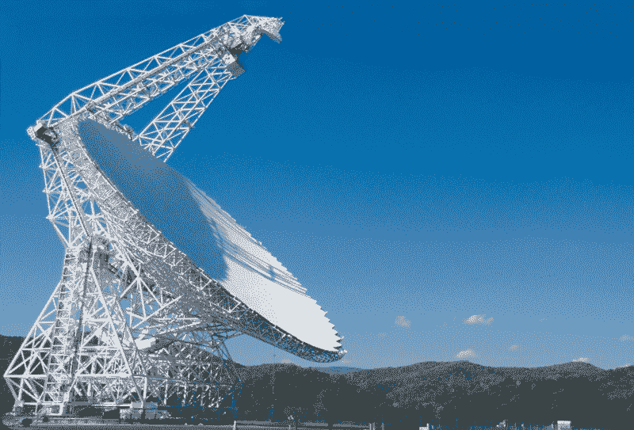
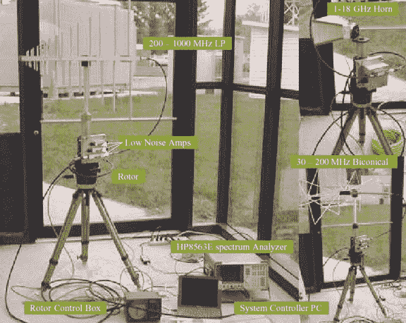

# 西弗吉尼亚边境上一切安静:国家电台安静区

> 原文：<https://hackaday.com/2016/04/13/all-quiet-on-the-west-virginia-border-the-national-radio-quiet-zone/>

问一百个人为什么他们喜欢逃到森林里，你可能会得到一百个理由，但很可能有很多人会说他们寻求森林的和平与宁静。虽然森林在野生动物和人类游客之间可能是一个喧闹的地方，但它确实是一个远离繁忙的城市街道的世界，至少在音频方面是这样。但在电磁频谱上，大多数森林的噪音几乎和你的普通立方体农场一样大，如果你碰巧使用非常灵敏的无线电接收器，这将是一个巨大的问题。这就是国家无线电静默区的原因，这是一个位于华盛顿州 DC 西部森林中的 13000 平方英里的电磁安全区。谁在听什么，为什么听，这是这个故事的一个迷人的部分，也是为了尽可能保持这个区域电磁安静而采取的步骤。

### 伟大的事情

像我们当代科技生活的许多方面一样，NRQZ 可以追溯到冷战时期。当苏联发射人造卫星并开始太空竞赛时，美国远远落在后面，并且知道这一点。追赶包括建设支持航天文化所需的所有基础设施，射电天文学是这些早期努力的重要组成部分。当务之急是找到一个方便的地方来建造不受干扰的基础设施。

NRQZ 由 FCC 于 1958 年建立，是一个大约 110 英里乘 120 英里的大致矩形土地，横跨弗吉尼亚州和西弗吉尼亚州之间的边界，几乎触及马里兰州的西端。该地区坐落在阿勒格尼山脉中，被选为国家射电天文学计划的一部分，首先是因为它靠近华盛顿，但也因为它有可能使用地形屏蔽来保护尚未建成的天线免受杂散射频干扰。该地区也十分偏远，交通不便，因此人们并不指望它能突然分享战后的发展繁荣；即使在 20 世纪 50 年代，郊区也可能是嘈杂的射频环境。

The “Great Big Thing”. Source: [NRAO](//science.nrao.edu/facilities/gbt)

国家射电天文台(T1)(NRAO)位于该区域的西三分之一，多年来一直是许多望远镜的所在地。最初的主菜从 1962 年开始供应，直到 1988 年倒闭。目前的碟形望远镜，正式名称为罗伯特·c·伯德格林班克望远镜，建于 2000 年。

这项技术的顶级列表几乎和它本身一样庞大，它是目前世界上最大的完全可控的射电望远镜，因此也是世界上最大的移动陆基物体。它的 2 英亩大的主反射器有 2000 多个面板，可以单独重新定位，精度为 0.003 英寸，这有助于它调整重力引起的扭曲。缩写为“GBT”，难怪他们称它为“伟大的大事”

### 降低噪底

但是，超敏感的耳朵对高噪声基底没有好处，所以 NRQZ 对射电天文学重要的频率发射设置了严格的限制。这主要是指微波频率，由于 GBT 的活性表面允许它在高达 116 GHz 的频率下有效工作，因此有很大一部分频谱是禁区。它恰好对应于对我们当前的无线世界最重要的波长。该区域由联邦通信委员会管理，因此规则主要涉及获得许可的发射机，许可证申请受到严格审查，优先考虑公共安全系统。

Portable Emissions Measurement Setup (PEMS) used by the NRAO Interference Protection Group. Source: [NRAO](https://science.nrao.edu/facilities/gbt/interference-protection/ipg/)

但是，该地区未经许可的发射机的大量增加让天文学家感到最悲伤。蓝牙、WiFi、无线座机电话、报警系统，甚至微波炉——顺便说一下，GBT 自助餐厅的微波炉就在法拉第笼里——都可能毁掉一次望远镜观测会议。即使是来自伪源的宽带射频干扰也可能造成严重破坏，包括产生电弧的破旧电热毯，或者来自汽油发动机点火系统的射频。

后者通过将天线一英里范围内的车辆限制为没有 ECU 的柴油发动机来缓解。追踪和纠正前者是 NRAO[干扰保护小组](https://science.nrao.edu/facilities/gbt/interference-protection/ipg/)的工作。借助频谱分析仪和定向天线，该团队搜索 RFI 的点源，并与望远镜的邻居合作解决问题。对于用来安慰一对老年夫妇的老狗的不可靠的电热毯来说，解决办法就像给他们买一条新毯子一样简单和人道。当来源是鱼类和野生动物服务机构正在研究的飞行松鼠的遥测标签时，事情变得有点困难，但不知何故，IPG 设法保持该地区足够安静，以进行重要的科学研究。

### 区域内有间谍吗？

但是科学是这个区域唯一发生的事情吗？一点也不。该区域的东部三分之一是西弗吉尼亚州的 Sugar Grove 的所在地，这里显然是内陆，曾是海军信息作战司令部 Sugar Grove 的所在地。2015 年退役，NIOC·苏格格罗夫在该地区开始了另一个射电望远镜装置的生活，这是一个 600 英尺的抛物面天线，通过捕捉从月球反弹回来的苏联无线电信号来收集信号情报。建设于 1962 年停止，通过参议员伯德的游说努力，并由于该地区良好的收听条件，糖树林成为一个海军收听站。

“Fred-10” arrays at Sugar Grove. [Source](http://www.navy-radio.com/commsta/sugargrove.htm)

Sugar Grove 的使命并不明确。海军坚持认为，两架[安/FRD-10](https://en.wikipedia.org/wiki/AN/FRD-10) 环形布置阵列天线(CDAA)主要用于研究和海上搜救工作。但“弗雷德-10”阵列是巨大的圆形天线，射程为 3200 海里，可以电子操纵，并用于世界各地的其他海军设施，以监控和三角测量苏联潜艇的高频传输。无论其建造背后的真正原因是什么，Sugar Grove 的 Fred-10 阵列在冷战结束时已经过时了。

海军并不是唯一一个利用该区域无线电静默的间谍机构。糖果林曾经是，也许现在仍然是国家安全局一个梯队监听站的所在地。爱德华·斯诺登(Edward Snowden)在其泄露的美国国家安全局文件中称，Sugar Grove 是一个代号为“Timberline”的网站，是一个拦截大西洋上空轨道通信卫星发出和接收信号的网络的一部分。这些年来，随着越来越多的通信转移到[更低延迟的海底电缆](http://hackaday.com/2016/03/18/what-lies-beneath-the-first-transatlantic-communications-cables/)上，窥探通信卫星对间谍来说已经变得不那么有利可图，所以 Timberline 可能不再活跃。但是 NRQZ 是电子情报的无价资产，它是否会被浪费是值得怀疑的。

### 呆在这个区域

可悲的是，“伟大的大事”正在艰难时期降临。尽管地理位置优越，技术先进，能够让 13000 平方英里的土地保持近乎无线电静默的状态，但 NRAO 每年 1000 万美元的预算正在接受审查，随时可能被取消。我们希望天文台能与大学合作，这样它就不会像 Sugar Grove 一样倒下，安静地带会保持安静，并在未来很长一段时间内使伟大的科学成为可能。