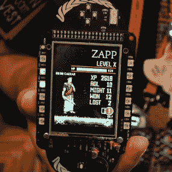
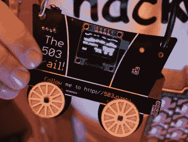
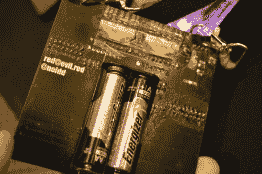

# DEF CON 25 的所有硬件徽章

> 原文：<https://hackaday.com/2017/08/04/all-the-hardware-badges-of-def-con-25/>

硬件是未来。没有比围绕 DEF CON 成长起来的硬件部落更好的证明了这一点，DEF CON 最近几年被称为 Badgelife。早在 2014 年的 DC22 上，我第一次被威士忌海盗队的定制硬件徽章所吸引。当时有几个团体正在制作硬件徽章，但这主要是在孤立的情况下进行的，而今年徽章制造商之间保持着持续的联系。

一个专为那些开发自己的 DEF CON 徽章的人准备的空闲频道出现了。这充当了技术支持、社交时间和频道上所有人的头脑风暴的功能。在过去，徽章的开发在设计过程中没有太多的信息泄露。今年，由于统一的 badgelife API，有了一个巨大的飞跃:徽章制造商根据统一的通信协议相互勾结。在下面的众多图片中，你经常看到使用里加多模块。这些游戏，以及其他一些使用不同硬件的游戏，通过制造商的“上帝模式”徽章和参与者徽章之间的无线游戏，采用了统一的 API 进行命令和控制。

我得以参加周四 DEF CON 的徽章制造商会议。接下来是疯狂几个小时的结果，试图通过大量的徽章和人们与你分享所有展出的定制硬件。有一点是肯定的——在 DEF CON 期间，实际上有数千个定制徽章被制造和销售/分发。我迫不及待地想看看手工硬件行业在五年后会是什么样子。

### MrRobot 徽章

  Photo by [Cat Murdock](https://twitter.com/catmurd0ck)  

我知道布莱恩·本考夫在业余时间研究徽章。我不知道他从事的生产。布莱恩的[机器人先生徽章](https://hackaday.io/project/18508-mr-robot-badge)是 DC25 中最受欢迎的之一。他已经为此工作了几个月，订购了几个 PCB 测试运行，以获得正确的外观。这不是定制的肤色阻焊膜颜色。当布莱恩让 [Seeed 工作室](https://www.seeedstudio.com/)生产 PCB 时，他使用了一个透明的阻焊膜和两层丝网印刷。它由 ESP8266 驱动，包括一个由 IS31FL3731 驱动的 144 LED 矩阵。查看 [@MrRobotBadge](https://twitter.com/mrrobotbadge) 来看看他建立的社交媒体的鼓点，并在他最近的项目页面更新中听到 Brian 的话[的整个故事。](https://hackaday.io/project/18508-mr-robot-badge/log/64526-how-i-created-the-mr-robot-badge)

【替补队员手持机器人先生徽章照片由[@ catmurdk](https://twitter.com/catmurd0ck)】

### DC 暗网徽章

    

DarkNet 已经成为 DEF CON 上最受欢迎的竞赛。它始于一个名为 casefile 的会前在线挑战。任何解决这个案件的人都可以在这些徽章出售给一般与会者的两个小时前购买其中一个。徽章是解决其余比赛挑战所必需的

我们的朋友[克鲁斯]是徽章设计的幕后策划者。如你所见，它的布局类似于旋转式电话。表盘上的每个数字都是一个电容式触摸传感器，数字/字母是铜线上的开路点。这些让背面安装的发光二极管发光。徽章是一个套件，因此要使用它，首先必须焊接那些表面贴装 LED 以及屏幕和背面 LiPo 的连接器。

### 谁不爱 Blinky？

  Blinky Tindie Badge  Sean McCabe 3D printed and lighted  ATtiny85 controls LED  NetworkGeek acrylic badge

[Brian Benchoff]实际上为 DEF CON 造了三个徽章，[第二个是可怕的](https://hackaday.io/project/25150-the-official-hackaday-defcon-25-badge)，但第三个是[一个焊接套件](https://hackaday.io/project/26056-tindie-blinky-led-badge-v1)的 Ohm，Tindie 狗。[Jasmine Brackett]和[Shulie Tornel]在现场与人们谈论 [Tindie](https://www.tindie.com/) (一个出售额外硬件徽章的好地方)和[分发焊料套件](http://hackaday.com/2017/07/27/building-a-def-con-badge-in-two-weeks/)，其中包括两个自闪烁 led、硬币电池和支架，以及一个定制的 PCB。

肖恩·麦凯布有一个 3D 徽章。这是 DEF CON 25 的标志(注意，2 和 5 组成了一个骷髅，关键是交叉的骨头)。定制 PCB 上有一个由 ATtiny85 和硬币电池控制的 RGB LED。抓住他的回购上的设计文件[。](http://github.com/seanleftbelow)

还有一个“平底船”徽章。SecKC 的人制作了一个徽章(在本文后面显示),但不能及时生产足够的徽章，所以他们展示了边缘发光的丙烯酸徽章。

### DC 阿姨 505

  Cherry MX caps on this year’s badge  Badge is an arduino shield  Past badge was a Raspberry Pi Shield  Fidget spinners are popular as giveaways this year

DC·齐亚团队今年有大约 10 人在制作徽章。这是他们第三年为 DEF CON 制作徽章，这款徽章有四个 Cherry MX 机械键盘开关… clicky！徽章是一个 Arduino 101 ( [RIP](http://hackaday.com/2017/07/25/the-end-of-arduino-101-intel-leaves-maker-market/) )的盾牌。去年，他们制作了一个徽章，作为树莓派的盾牌，并有一个全彩色视频屏幕，他们在 meetup 上展示了这个屏幕。他们也加入了另一个趋势，几个徽章团体(包括 MrRobotBadge)正在赠送定制的坐立不安旋转器作为赠品。

### 还有！XOR 神徽

我不打算深入讨论这个问题！XOR 徽章自从我在 con 之前用徽章做了[一次全动手，这里可以看到只有核心团队才有的“神”徽章。如果不是最受欢迎的，那么“狂欢派对”是本次展会上最受欢迎的三个徽章之一。他们有一个非常成功的 Kickstarter，每个人都想在展会上得到一个。](http://hackaday.com/2017/07/12/hands-on-new-andxor-unofficial-def-con-badge/)

在输入密码之前，他们会禁用多人游戏功能。这是在骗局开始时发布的，一旦人们解锁了他们的，僵尸网络游戏就开始了。我可以进入终端，并提升我的权限以获得 root 权限([ [@Hyr0n](https://twitter.com/Hyr0n1) ]确实帮助了我，建议我重新访问他的哪些提示推文)。我在冷藏室里碰到了穿着衣服的萨米·卡姆卡。ARM 处理器上运行的代码是读保护的，而[Samy]正在使用芯片密语试图对徽章进行旁道攻击。太棒了！

注意脑蛞蝓插件板。大约有 10 个这样的测试硬件黑客突破头。

### 汽车黑客村徽章

Badgelife 经常赶在截止日期前完成所有事情——毕竟这是一项课外活动。这是未填充的[汽车黑客村](https://twitter.com/carhackvillage)徽章。组装时间比预期的要长，截至周四晚上，成品木板还没有到达，但周五就在村子里销售了。其中 900 个售价 50 美元。

你可以在[这条动画推文](https://twitter.com/donds/status/892968772872552448)中看到全部荣耀。一个有机发光二极管显示器组成了卡车的格栅(它本身就是一个 PCB ),四周都是琥珀色的闪光灯。这毕竟是汽车黑客，所以左边的足迹是一个 ODB-II 连接器。

### 特里布尔徽章

      

特里布尔徽章对我来说完全是个惊喜。[[@ emilin carnate](https://twitter.com/emilyincarnate)]造了 58 个而且都是手工缝制手工焊接的。这些小绒毛球是围绕着 Adafruit 饰品板建造的，带有可寻址的 LED 眼睛盘。我对内置挑战游戏的 PCB 徽章情有独钟，但我爱上了它，它是我在骗局中佩戴的最爱。也许我在拟人化？我查看了[的相关网站](https://tribb01.party/)，似乎那里有一些加密挑战等待解决。开始工作。

### DC801

    

看看 [DC801](https://twitter.com/dc801) 绵羊徽章的背面，你会发现熟悉的 Rigado 模块驱动它，并将它链接到统一的僵尸网络游戏，该游戏跨越许多徽章和蓝牙问候，可以来回交谈。此外，固件广播用户名，然后玩一个传染病的游戏。

[ [@rushan_ee](https://twitter.com/rushan_ee) ]一直在开发板子。核心开发人员携带的原型板具有“上帝”模式，可以使客户进出派对模式。他们总共制作了 290 块电路板和 10 个原型。预售通过盐湖城的[801 实验室黑客空间](https://www.801labs.org/)进行协调。这是如山第二年领导这个设计，也是他 5 年来领导这个黑客空间。

### 温哥华附近的八达通卡

    

章鱼徽章是几个月前为温哥华建造的。[杰克·金]总共为布赛德·温哥华打了 120 分。它由 ATtiny85 驱动，八个触角中的四个上有蓝色发光二极管。眼睛有两个 WS2812 模块，但[杰克]通常会关闭它们，因为它们会很快耗尽纽扣电池。你可以在他的博客上找到设计文件[。](https://jakeking.co/)

## 定义组合的 Ides

    

我认为 DEF CON 徽章是另外三个最受欢迎的徽章之一。它本质上是一个多人徽章，让你在视频角色扮演游戏中无线发现并与其他徽章所有者战斗。你可以在会场周围走动，看到人们像游戏机一样粘着这些徽章坐着。

周四晚上是第一个大家聚在一起的晚上，当我们遇到来自 the AND 的[Zapp]时！他的等级和经验值都已经超过了。固件没有读保护(像和！XOR 固件)所以[Zapp]转储和拆卸它，以人为地提高他的球员排名。简直是瞬间经典。

您可以在 DEF CON 项目页面的[ide 上阅读开发流程。今年夏天早些时候，他们有一个非常成功的 Kickstarter](https://hackaday.io/project/14756-the-ides-of-defcon-an-unofficial-electronic-badge)[。](https://www.kickstarter.com/projects/1887776662/indie-defcon-badge-the-ides-of-defcon)

### 团队火箭筒徽章

    

这个徽章是作为唯一一个上面有真空荧光显示屏的徽章介绍给我的。VFD 是一个 HD44780 可寻址字符显示器。它的电源是电池座中的一个 18650 电池。这正在成为一个令人难以置信的流行设置徽章和其他定制硬件。您可以在团队火箭筒报告上查看基于 ATmega382 的设计。这是一枚极其罕见的徽章——到目前为止只有一枚。

### 硬件仓库

在大会之前，我们还仔细观察了黑客仓库徽章，它的 ESP8266 就在电路板上，而不是选择焊接在城堡状模块上。该徽章是一个内置的 WiFi 测试单元，利用 ESP 芯片在该领域的灵活性来扫描 AP，侦听数据包，甚至吐出 deauth 数据包。我不认为今年在这方面有太多的伤害。

伴随着 [Hacker Warehouse](https://twitter.com/hackerwarehouse) 徽章而来的一件非常酷的事情是，他们与其他 Badgelife 人分享他们在供应商区的空间。这为获得本文中展示的任何徽章的人提供了一个区域，一个与徽章创建者见面的地方和时间。整洁！

值得注意的是，这是黑客仓库的第一次硬件努力，迄今为止一直专注于攻击性安全。

### DC503

    

DC503 举办了 503.party，感谢[[Joe Fitz](https://twitter.com/securelyfitz)]让我们撞机。该党是私人资助的，支持这些徽章是让你加入该党的一种方式。[乔]在这个徽章后面，还有我们在 DC23 上看到的自行车设计[。](http://hackaday.com/2015/08/10/all-the-unofficial-electronic-badges-of-def-con/)

100 个这样的徽章是通过四个团队成员的努力和专业组装的劳动力节省而制成的。你可以在背面看到里加多熟悉的里加多模块，以及为徽章供电的硬币电池。我真的很喜欢看到挂绳，这是一种 USB 到串行电缆。你实际上是在脖子上戴着你需要东西。徽章黑客大赛是 503 晚会期间在凯撒酒店的套房里评审的。

### SecKC 徽章

    

SecKC 是堪萨斯城信息安全会议。他们希望徽章是一个开发板，并以 Sparkfun 的 NRF 模块为基础。到目前为止，他们已经看到了许多设计上的漏洞，其中最好的是把它变成了一个带旋转拨号的手机。

工作人员预定了 50 块电路板，最后做了 60 块。有更多的需求，但他们不能足够快地得到板，所以他们做了丙烯酸徽章，我们在本文前面提到过。

### 膨胀徽章

    

蓬松徽章是另一个我们在会议前深入研究过的东西。徽章形状像河豚，基于来自“中国某个家伙”的路由器芯片组模块。为了寻找可以运行 linux 的路由器芯片，该项目订购了 40 个模块。关于开发过程的更多细节可在网站上的[获得。](https://shiftj.is/post/puffy/)

### Megabling 和 Derbycon 黑色徽章

      

有些人觉得他们需要回答“会议徽章到底能有多亮？”。【Blenster】用一个由 6 个 18650 锂电池供电的巨大三角形徽章回答了这个问题。看看那东西背面的功率调节！

(他自己)也不甘示弱，【Blenster】还展示了他自己设计和制作的[一枚德比康 2016 黑色徽章](https://www.youtube.com/watch?v=5mxm4Umpk14)。这些发光二极管有一个微小的间距，他手工放置和手工焊接铁-难以置信。

### 蜻蜓徽章

蜻蜓徽章在大会前的 Hackaday 上出现过。它主要是一个闪闪发光的徽章，但将多个徽章放在彼此的视线范围内，它们会同步闪烁。其中一个非常棒的地方是尾部的红外接收器。

其中 106 座已经建成，但只有 85 座在周四晚上完全投入使用。在真正的黑客时尚中，其余的都是在酒店房间里重新制作的。我在展会上看到了很多这样的东西，所以我怀疑返工是值得的！

### 加密和隐私村徽章

              

加密和隐私村徽章是目前最华丽的硬件之一。该团队全力以赴，甚至将徽章装在漂亮的哑光黑盒子里，盒子上有 guilded 字样和磁性封口。挂绳上有密码，徽章背面也有密码。有印刷电路板的按键，雕刻成有趣的形状。该徽章基于 WROOM32 (ESP32)模块。它驱动一个背光显示器，前面有一个旋转编码器和几个电容式触摸传感器。包裹里有耳塞；该徽章有一个耳机插孔，并设置为整个周末播放 DEF CON 广播。这是一个不同的颜色和相当有趣的功能！

插入徽章后，MicroPython 会为您自己的徽章黑客行为向您致意。在无线端，它会找到其他徽章。我不能得到肯定的确认，但我听说这些是把后门到一个弯曲的徽章弯曲。是的，这是无线徽章战争，朋友们。这些板在加密村卖 120 美元。当他们售罄时，该团队试图让非功能性徽章工作，但会根据要求以 50 美元的价格卖给有进取心的硬件黑客。

### 除了旧金山徽章/生活是一个缺口

          

Bsides SF 徽章背后的团队[bon]和[edited]今年推出了两个徽章。他们的“官方”徽章被定位为二月份会议的“人体相机徽章”。他们的第二个徽章是我们见过的最好的 3D 打印作品。

Life's A Breach / Tiki 徽章或多或少是你对会议徽章的期望——PCB 上有闪亮的小块、电池和一些漂亮的丝网印刷艺术。当添加 3D 打印零件时，这个数字会增加到 12。Tiki 徽章上的塑料部件是搭扣配合的，徽章上有塑料凸台，小壁架可以牢牢抓住 PCB，还有一点牛皮纸用作眼睛的扩散器。我们已经经历了 3D 打印，我们还从未见过任何将研磨过的印刷电路板和打印零件结合得如此之好的东西。我们真的是在恳求 Tiki 的工作人员写一篇关于他们是如何制作塑料零件的文章。

### 1Bitsy 1UP

    

1 bitsy 1 up 徽章应该是一种非常熟悉的外形。它的形状就像一个游戏机，但像旧的 SNES 控制器一样，有一套额外的右手按钮。凭借漂亮的彩色显示屏和音频，这是您记忆中的便携式游戏体验，但作为会议徽章挂在脖子上。

前端的开发板是 [1Bitsy](http://1bitsy.org/) 。这是去年 10 月在开放硬件峰会上发给所有与会者的。我的仍然在我的桌子上等待一些爱，这是我需要的类型的演示真的很兴奋。在展会上，[ [Piotr Esden-Tempski](https://hackaday.io/esden) ]正在运行一个他为其编写的定制游戏，这个游戏速度非常快。此处显示的模式演示以 80 FPS 运行，并且没有帧缓冲区。正是 STM32F4 利用 DMA 将 8 位数据送入 ILI9325 显示器，才使这一切成为可能。在背面，您会发现一个 18650 电源，以及电池管理电路和 SD 卡插槽。我们迫不及待地想在下一次现场活动中与[Piotr]不期而遇，看看在标记为:

> 这里有龙。嗯，不是现在，但很快，我保证！就等着吧。:D

### 瑞德的洛拉徽章

      

我错过了在聚会上与他同步，但后来在冷藏室遇到了[瑞德]。他一直在为 [SkyDogCon](https://twitter.com/SkyDogCon) 做硬件徽章，还专门为 DC25 做了一个特别的徽章。它正在嗅探 LoRa 包并在两个屏幕上显示它们。他在飞机上写了固件。这个平台是为发展而设计的，所以这里有很大的发展空间。它有许多开关，包括瞬时按压和倾斜，由运行电路板的螺旋桨芯片控制。为了连接，有一个 LoRa 模块和一个 ESP8266。

这里实际上有一个很酷的概念。他在另一家酒店的房间里安装了一台服务器作为互联网网关。徽章在 LoRa 上打电话回家，这有很大的范围，消除了在 con 期间导航可疑 WiFi 选项的需要。

四轴飞行器徽章

这个徽章集多种功能于一身。主要是它是一个四轴飞行器，配有一个基于徽章的遥控器。[Brian] [在大会前对其进行了深入报道](http://hackaday.com/2017/07/18/def-con-badgelife-someone-finally-did-it/)，在[DEF CON meetup](http://hackaday.com/2017/08/01/look-what-people-brought-to-breakfast-at-def-con/)的早餐会上，我们非常兴奋地收到了这个徽章套件。

开发过程中仔细考虑了重量。但由于某种原因，在所有东西都组装好之后，这东西就是不能起飞。因此，骷髅头徽章有两个版本，一个会飞，一个会闪。你可以看到原型制作的附加板，看起来像海盗的大手帕，在左上角你可以看到双棒控制器，配有蜂鸣器和屏幕。

### 迄今为止最伟大的电子会议徽章年

Badgelife 真的很棒。你应该试一试吗？是的，但不是为了钱。这是一门艺术，而不是商业努力。制造商之间没有徽章竞争，只有庆祝每个徽章的努力和独创性的意愿，无论是闪烁的 LED 灯还是联网的多人游戏。这是开发者的动力，也是徽章成为大会热门商品的原因。

这是 badgelife 有史以来最伟大的一年，我们迫不及待地想看看明年大家会想出什么。

【精选图片来源[猫默多克](https://twitter.com/catmurd0ck)拍摄的所有徽章。你应该在推特上关注她。]