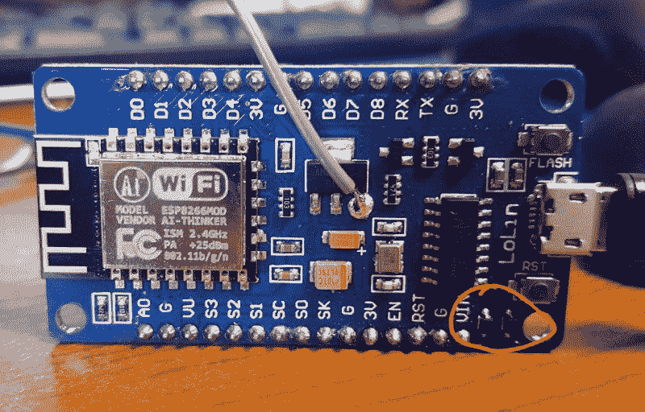

# 带 ESP8266 的婴儿环境照明

> 原文：<https://hackaday.com/2018/06/07/ambient-lighting-for-baby-with-the-esp8266/>

生孩子有很多很好的理由。也许你觉得被一个小人物严厉批评的想法很有吸引力，或者也许你喜欢当你努力工作时有人对你大喊大叫。但是对我们来说，我们认为生育的最好理由是得到另一个建造东西的借口。婴儿至少需要两年时间才能焊接或编程一个微控制器？在那之前必须有人替他们做这件事。

为了帮助他的小女儿获得更好的睡眠时间表， [[Amir Avni]决定给她的房间装上一些“智能”照明](http://www.whatimade.today/automated-light-for-better-sleeping-habits-or-my-baby-is-a-great-excuse-for-playing-with-my-gadgets/)，以确定她什么时候该起床。他和他的妻子不仅可以控制灯光进入“白天”模式的时间，还可以改变颜色。例如，他们可以在晚上切换到红色发光。尽管学习经历了一些挫折，但父母和婴儿都对最终产品非常满意。

 一个 ESP8266 控制一个 WS2812 LED 灯条来提供可调节的照明，一个 DHT22 传感器被添加到混合物中来检测婴儿房间的温度和湿度。[Amir]使用 Blynk 快速组装了一个精巧的移动应用程序，可以完全控制房间内光线的亮度和颜色，并提供从 DHT22 中提取的环境数据的读数。

但并非一切都按计划进行。[Amir]认为他可以通过焊接到其 AMS1117 稳压器的 5 V 侧，从 ESP8266 开发板为 LED 灯供电。这很好，直到他打开了太多的发光二极管。然后，它通过连接到调节器的电阻器拉了太多的电流，让所有的魔力烟消云散。这是一个重要的提醒，当我们对电路的要求超过设计要求时，会发生什么。

我们已经报道了许多因父母需要而诞生的令人敬畏的项目，从功能齐全的婴儿监视器到似乎是为了在孩子的潜意识中对怀旧情绪进行编程的设备。