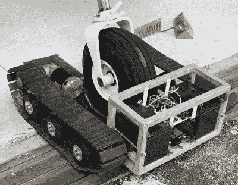

# 一种 Arduino 动力坦克，用于牵引飞机

> 原文：<https://hackaday.com/2018/06/19/an-arduino-powered-tank-built-to-pull-planes/>

当然，我们的读者很清楚拥有一架飞机的所有缺点。当然，燃料成本是个大问题。鸟类可能是个问题。那个旅行螺旋桨磨刀机的比尔也是个杀手…对吗？好吧，好吧，我们承认，这里没有人拥有一架飞机。但可能你们大多数人也不知道。所以别那么自鸣得意，伙计。

 但是如果你*拥有一架飞机，或者至少在一个小机场工作，你就会知道在地面上移动东西是一件麻烦事。较小的飞机可以用手拉，但是一旦它们达到一定的尺寸，你就会需要某种交通工具来帮忙。[Anthony DiPilato]想要找到一种方法来移动大约 5200 磅的 Cessna 310，并认为所有商业选项都太贵了。所以他[建造了自己的 Arduino 动力坦克，让飞机绕着停机坪行驶](http://anthonydipilato.com/2018/06/08/aircraft-tug/)(如果网站瘫痪[试试谷歌缓存](http://webcache.googleusercontent.com/search?q=cache:http://anthonydipilato.com/2018/06/08/aircraft-tug/))，他从想法到成品的旅程绝对引人入胜。*

 *所以这里的想法很简单。一个小金属推车，配备了两个结实的电机，一个 Arduino Mega，一对电机控制器和一个 HC-08 蓝牙模块，这样你就可以从你的手机控制它。会有多难，对吧？事实证明，将所有这些原始部件组合成一个足够强大的小机器来牵引一架全尺寸飞机需要一些试错。

[安东尼]花了五次迭代才把设计调整到能够成功拖动塞斯纳飞机而不在压力下瘫痪的程度。早期版本以车轮为特色，但最终决定需要履带式车辆才能在柏油路面上获得足够的抓地力。幸运的是，每一个失败的设计都有一个简短的解释。诚然，我们中的任何人都不太可能重新创建这个特定的项目，但我们总是喜欢看到有人不厌其烦地解释哪里出错了。当你包含这种信息时，在某个地方，不知何故，你为另一个制造者节省了一点时间和烦恼。

黑客绝对喜欢坦克履带的机器。从[巨大的 3D 打印设计](https://hackaday.com/2018/05/03/3d-printed-tank-scores-suspension/)到[隐约令人不安的人形机器人](https://hackaday.com/2011/03/22/remote-controlled-tank-tread-robot-will-walk-the-dog-for-you/)，在黑客武器库中可能没有更好的运动形式了。

 [https://www.youtube.com/embed/a2BCOUgnuo4?version=3&rel=1&showsearch=0&showinfo=1&iv_load_policy=1&fs=1&hl=en-US&autohide=2&wmode=transparent](https://www.youtube.com/embed/a2BCOUgnuo4?version=3&rel=1&showsearch=0&showinfo=1&iv_load_policy=1&fs=1&hl=en-US&autohide=2&wmode=transparent)

 [https://www.youtube.com/embed/n8N9eN2YPqI?version=3&rel=1&showsearch=0&showinfo=1&iv_load_policy=1&fs=1&hl=en-US&autohide=2&wmode=transparent](https://www.youtube.com/embed/n8N9eN2YPqI?version=3&rel=1&showsearch=0&showinfo=1&iv_load_policy=1&fs=1&hl=en-US&autohide=2&wmode=transparent)

*