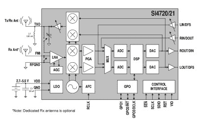

# 一个来自意想不到的芯片的调频收发器

> 原文：<https://hackaday.com/2018/04/22/an-fm-transceiver-from-an-unexpected-chip/>

Silicon Labs 的 Si47xx 系列集成电路是一个引人入胜的消费广播无线电产品系列，这些芯片应用 SDR 技术来提供一系列曾经复杂得多的功能，只需最少的外部元件和 RF 设计技巧。[Kodera2t]被其中一款 Si4720 所吸引，这款手机拥有不同寻常的功能，包含一个 FM 广播波段的接收器和一个发射器，主要面向移动电话和类似的向 FM 汽车收音机发送音频的设备。结果是[一个 PCB，带有由 ATmega328 控制的完整收发器](https://hackaday.io/project/144477-an-exotic-fm-transceiver-using-si4720),并带有有机发光二极管显示屏，以及对这些设备的有趣介绍。

The Si4720 internal block diagram, from its [data sheet](https://www.silabs.com/documents/public/data-sheets/Si4720-21-B20.pdf).

从 Si4720 的框图可以看出，为什么它和它的同类产品如此吸引人。片上是一个 SDR，包括天线在内的所有方面都很完整，如果不是板载 DSP 不可重新编程用于芯片设计模式之外的任何其他用途，这可能会让黑客读者中的无线电爱好者垂涎三尺。本地振荡器也令人失望，只限于世界范围内的 FM 广播波段，而不是一些更有用或更有趣的频率。然而，有许多其他类似的硅实验室接收器芯片覆盖了所有可以想象的广播波段，所以实验者至少有一个好的接收器选择。

如果你需要一个小型的调频发射机，并且对频谱纯度抱着漫不经心的态度，那么很容易使用树莓派或者 T2 制造一个调频窃听器。但是这个项目开辟了另一种选择，并提供了一个试验一种迷人芯片的机会。