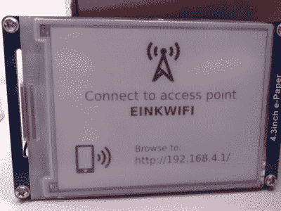

# 一种改进的 WiFi 连接 E-Ink 显示器

> 原文：<https://hackaday.com/2016/06/12/an-improved-wifi-connected-e-ink-display/>

[David]创建了一个很棒的电子墨水 WiFi 显示项目,它有点像一个联网的相框，与其他类似的项目相比有一些改进。在 ESP8266 的帮助下，它启动，通过网络抓取 800×600 的图像，更新屏幕，然后回到睡眠状态。由于一些逆向工程，他能够为板载控制器制作自己的固件，以处理显示器的低级驱动。由于电子墨水显示器不需要电力来保存图像，并且该单元的其余部分大部分时间都处于睡眠或关闭状态，因此功耗极低。[David]希望几个月不需要给内部锂聚合物电池充电。

Lithium-polymer charger (top left); Single-cell lithium-polymer battery (center); pullups and power cutoff for nonessential electronics (green board, lower right); ESP866 (lower left).

我们之前介绍了另一个 WiFi 连接的电子墨水显示项目，它实际上也是这个版本的灵感来源。[David]使用 4.3 英寸 800×600 GDE043A 电子墨水显示器，并为用作显示控制器的 STM32F103ZE ARM CortexM3 SoC 编写了自己的固件，这个过程需要一些逆向工程，但制造商提供了一个闭源驱动程序供他使用。[David]写道，该显示器的一些逆向工程工作已经完成，但他很难从中获得清晰的理解，因此他对固件进行了逆向工程，并将文档主要用于验证和指导。

因此，[David]能够利用电路板上已经存在的低级驱动电子器件，而不必自己制作和连接。电子墨水显示器有一些不寻常的驱动要求，包括产生相对较高的正负电压，并在更新显示器时快速切换。利用电路板现有的低级驱动电子设备是一大优势。

ESP8266 通过定期启动、连接到无线网络和下载图像、将图像数据馈送到 STM32 以更新显示、然后断开所有非必要电子设备的电源并返回睡眠来完成该项目。我们特别喜欢该设备如何自动创建 WiFi 接入点，以方便(重新)配置。

还有一个更好的方法。[David]使用服务器软件(以 PHP 脚本的形式)设计屏幕，显示天气预报、股票价格和汇率等数据。在项目的 github 库中查看它。