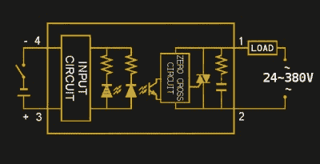
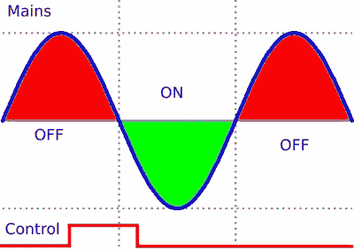
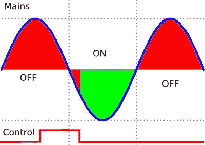
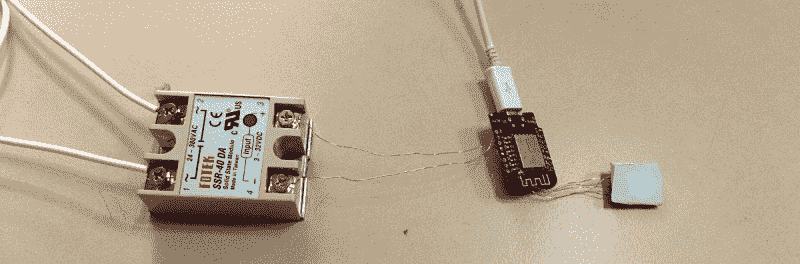
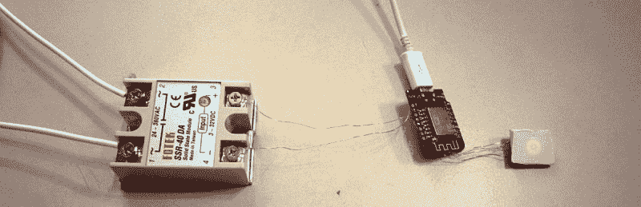
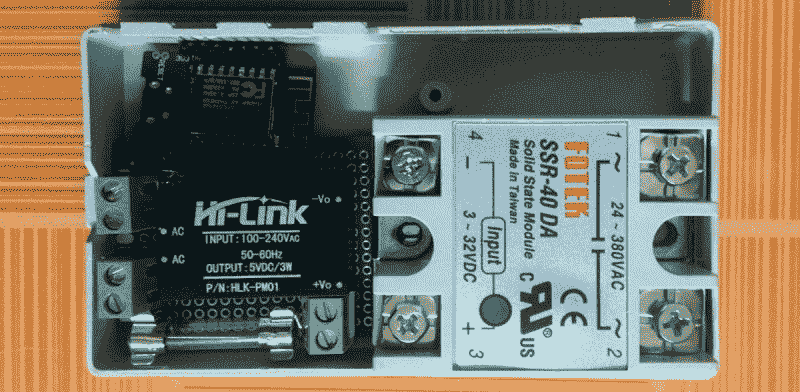
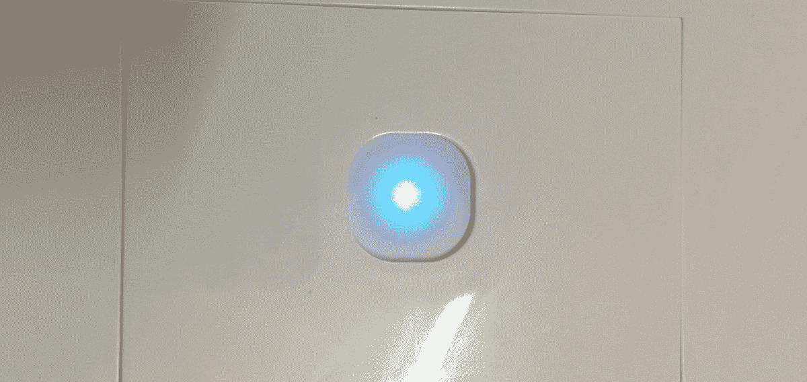

# 固态继电器介绍

> 原文：<https://hackaday.com/2017/09/26/an-introduction-to-solid-state-relays/>

当我们想到继电器时，我们往往会想到那些在启动时发出令人满意的“咔嗒”声的大型机械装置。尽管它们对于基于继电器的计算机来说很好，但有时你不想处理噪音或移动部件的不可靠性。这就是固态继电器(SSR)值得考虑的地方。它们开关速度更快，无声，没有反弹或电弧，持续时间更长，并且不包含大电感。

Source [Fotek SSR Specifications Sheet](http://www.fotek.com.hk/solid/SSR-1.htm)

一个 SSR 由封装在一个模块中的两三个标准组件组成(你甚至可以[自己构建一个](http://hackaday.com/2013/11/01/making-a-solid-state-relay-with-i2c-interface/))。第一个元件是光耦合器，它将控制电路与所控制的主电源隔离开来。第二个是三端双向可控硅开关、可控硅整流器或 MOSFET，它利用光耦合器的输出来切换主电源。最后，通常(但不总是)有一个“过零检测电路”。这导致继电器在关闭之前等待，直到它控制的电流达到零。大多数固态继电器同样会等到电源电压过零后再接通。

当提供交流电时，如果机械继电器在接近峰值电压时打开或关闭，电流会突然下降或上升。如果你有一个电感性负载，如电动机，当你关闭继电器时，这可能会导致一个大的瞬态电压尖峰，因为电感性负载周围的磁场崩溃。在电源电压峰值期间切换继电器也会在继电器端子之间产生电弧，磨损它们并导致继电器的机械故障。

当使用支持过零检测的 SSR 时，它将保持其状态，直到交流输出波形自行过零。在这一点上，它打开或关闭安全。

## 用 SSR 调光

这种行为的一个缺点是，尽管它们的开关速度相对较快，但您不能轻松地将典型的 SSR 用作脉宽调制调光器。每当您试图控制输入信号的“开启”时间时，过零检测会等到交流信号过零后再进行切换。

另一种类型的固态继电器称为“随机开启”固态继电器，用于实现调光。它的工作方式与普通 SSR 相同，只是没有过零检测电路。它只要接收到信号就会打开。这使您可以对某些类型的负载(如灯或加热器)仅使用部分交流波形。不过，它仍然会等到交流信号的过零点才关闭。

固态继电器有 DC 和交流开关两种类型。您需要使用的类型取决于您要切换的电源类型。DC SSR 倾向于使用功率 MOSFETs 或晶体管来处理开关，而不是三端双向可控硅开关或可控硅整流器。

交流 SSR 的一个奇怪之处是，当在输入端施加信号时，测量 SSR 输出端的电阻变化不会提供非常有用的信息。您将继续在输出端看到高电阻。在这种情况下，我们测得 22kω，这并不能让我们得出 SSR 工作正常的结论。使用之前，可以用[9v 电池和灯泡](http://www.crydom.com/en/tech/tips/how%20to%20test%20an%20ac%20solid%20state%20relay.pdf)对 SSR 进行台架测试(PDF 警告)。

## SSR 的其他缺点

另一个潜在的缺点是，与机械继电器相比，固态继电器在关闭时输出端的电阻较低，此外还有一些泄漏电流。泄漏通常非常小，但如果您用万用表测量连接到电源的 SSR 的输出，无论它是否打开，您都可能会记录到电压。

由于固态继电器的内部结构，它们仅提供单刀单掷(SPST)配置。单极意味着它只能控制单个电路，单掷意味着开关只能处于两个位置(一个开，一个关)。机械继电器没有这种限制，可用于多电极和投掷。

固态继电器比同等的机械继电器产生更多的热量。这是因为固态继电器内部的半导体上有一个电压降，而机械继电器在工作时只是一个导体。重要的是将散热器连接到固态继电器，并为任何需要大量电流的应用提供足够的气流。关于 SSR 安全性的详细论述，请查看欧姆龙的[这篇文档(PDF 警告)。它还为不同类型的负载提供了一些有用的设计考虑。](http://www.omron.com/ecb/products/pdf/precautions_ssr.pdf)

## 当固态和机械合作时

在某些情况下，同时使用 SSR 和机械继电器是有益的。假设 SSR 在设计中的主要缺点是它们比等效继电器产生更多的热量。同样，继电器在设计中的主要缺点是，它们有机械故障的风险，因为每次打开时触点之间都会产生电弧。

在这种情况下，可以将两个部分以独立输入并行组合。为了激活它，控制系统首先打开 SSR。这建立了通过负载的电流。接下来，控制系统激活继电器，继电器不会产生电弧，因为它基本上与闭合的开关并联。最后，在短暂延迟以允许继电器去抖之后，SSR 被去激活。现在所有的电流都流经机械继电器。这可以实现高效耐用的开关，同时降低 SSR 的散热要求。

## **快速测试应用——使用 ESP8266 控制 SSR**

固态继电器有一些怪癖，但在当今花哨的开关互联网中，它似乎是机械继电器的可行替代品。我宁愿关注自动化项目中有趣的部分，而不是机械故障，坦率地说，所有的咔哒声都有点多。为了更熟悉 SSR，我基于 Fotek SSR-40DA SSR 构建了一个简单的测试电路。原理上类似于[这个 SSR 开关插座项目](http://hackaday.com/2013/11/26/diy-home-control-using-a-ssrelay)。

数据表称它们的额定电流高达 40 安培，尽管这需要一个大型散热器、通风设备和原装零件。在我的测试中，我用它来控制一个使用 220VAC，50Hz 电源的 47W 风扇。这个快速测试不需要散热器，但我在电源输入端加了一个一安培的保险丝，以防它被意外用于大型设备。当你有很多项目时，很容易忘记几个月后每个项目的局限性。

我将 ESP8266 的数字输出 D0 直接连接到 SSR 的输入端。该芯片闪烁着 NodeMCU，并被编程为当电容式触摸开关被切换时切换 D0，我让它改变状态 le D 的颜色。

我注意到的第一件事是，在启动序列期间，ESP8266 上的引脚短暂地升高。这导致 SSR 在启动时短时间激活，这是不可接受的！这可以通过用晶体管将硬件中的信号反相，然后用软件来解决。

当按下按钮时，风扇相应地打开或关闭，SSR 上的指示灯也相应地打开或关闭。总的来说，这非常简单，虽然我肯定会适当蚀刻电路板，并在更高电流或更长时间使用它之前添加散热器。

我的电源接线不包括电气接地。这不是因为疏忽，而是因为我在越南建造这个，这个国家的基础设施中没有住宅电气接地。如果您有接地的住宅布线，请利用这一点使您的设计更安全。

虽然这是一个微不足道的测试，但我学到了两个实用的经验。首先，布线占用的空间比我想象的要大得多。其次，在承载电源的电线和来自 ESP8266 的信号之间保持安全距离需要在外壳设计方面进行一些思考(特别是对于 SSR 上的散热器)。这不仅仅是把它塞进一个箱子的问题，如果我不打算 3D 打印一个定制的，我肯定会选择更大的东西，并为高低压组件提供不同的部分。换句话说，不要只是这样做:

Cramming a haphazardly constructed project into a case is a less than excellent approach here.

我还了解到，照明电容式触摸开关非常适合灯光开关外壳，看起来非常可爱，如果你修剪一些塑料，就可以与墙壁齐平。在后来的测试中，按钮不在继电器附近。它使用第二个 ESP8266 发送 UDP 数据包来控制继电器，如果有其他原因关闭了有问题的系统，它还会侦听 UDP 数据包来更新指示灯 LED 的状态。它工作得很好。

It has a certain “I’m afraid I can’t let you do that Dave” look when red.

最后，我想指出的是，假冒 SSRs】非常普遍。通常情况下，即使使用正确的散热器，它们也会在明显低于额定值的电流下出现故障。虽然我的固态继电器可能事实上是真的，但我假设它们不是真的，并且会在额定电流下很好地使用它们！