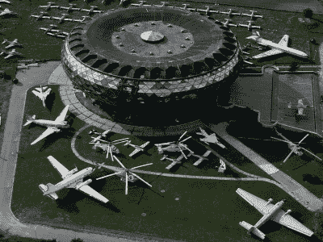
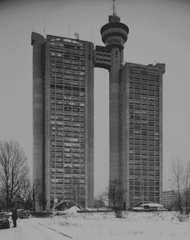

# 贝尔格莱德颂歌

> 原文：<https://hackaday.com/2018/05/09/an-ode-to-belgrade/>

两周后，Hackaday 社区将聚集在贝尔格莱德，参加欧洲最大的硬件展会——hack aday 贝尔格莱德大会(T1)——这是一个不容错过的盛会——当然，这座城市本身也是一个非常值得参观的地方，对于那些喜欢制造电子产品的人来说，它有着完美的感觉。为什么不加入我们的塞尔维亚极客世界之旅呢？这里有一些你在贝尔格莱德想看的东西。

[Aeronautical Museum Belgrade](http://aeronauticalmuseum.business.site/)

## 飞机、发明家、建筑

贝尔格莱德是一个技术中心，是欧洲隐藏的宝石。需要证明吗？飞往贝列得，你会在尼古拉·特斯拉机场降落。在机场取车，你会经过一个巨大的玻璃圆环，里面是塞尔维亚航空博物馆。在这里，你会发现冷战双方的飞机，军刀和米格战机，飓风和梅塞施米特战机，非常罕见的 Sud Caravelle，以及唯一被击落的隐形轰炸机的座舱盖。这是航空爱好者的天堂，*，你甚至还没有离开机场。*

当你访问贝尔格莱德时，还有什么在等着你呢？对于黑客一族来说，最有趣的可能是尼古拉·特斯拉博物馆。你可能从网络漫画中知道尼古拉·特斯拉[，但他实际上是有史以来最伟大的发明家，甚至比埃隆·马斯克还要伟大。特斯拉发明了无线电，尽管功劳是马可尼的。特斯拉发明了雷达，发现了 x 射线。他们能找到的唯一一个能在《声望》中扮演泰斯拉的人是大卫·鲍依。尼古拉·特斯拉是有史以来最具标志性的发明家(改变我的想法)，他的博物馆在贝尔格莱德。](http://theoatmeal.com/comics/tesla)

贝尔格莱德是这位当代最伟大的发明家的故乡和长眠之地，有许多雕像纪念这位伟大的思想家。他甚至在钱上。在博物馆，你会发现这个伟大的人所创造的展品(顺便说一下，是英文的)。

这里有 1887 年特斯拉两相感应电机的复制品，他的多相系统的演示，甚至还有特斯拉遥控模型船的复制品——有史以来第一辆遥控车辆。特斯拉的骨灰被安放在一个金色的球体中，旁边是一个沃登克利夫大厦的模型，这是特斯拉向世界提供无线电力的实验。

 

贝尔格莱德的西城门，或称 Genex 塔。这是野兽派的杰作。图片鸣谢:[【błażej 品多】](https://commons.wikimedia.org/wiki/File:Jugotours_Beograd_Dec_2003.jpg)

饮食方面呢？Pivo 是啤酒，杜松子酒和滋补品在每种语言中都是一样的，但这里真正吸引人的是 rakija，一种会毁了你的水果白兰地。很多都是自制的。我们有没有提到贝尔格莱德会议将持续到凌晨？

这还不够吗？你不开心吗？贝尔格莱德是世界上一些最伟大建筑的故乡。你会发现贝尔格莱德被称为辛吉杜努姆时的废墟，奥斯曼帝国征服时的建筑(贝尔格莱德曾是欧洲第二大奥斯曼城镇，仅次于君士坦丁堡)，以及这里展示的西方城门(俗称 Genex Tower)等野兽派杰作，文章顶部更具艺术性。这座令人印象深刻的双子摩天大楼由一座天桥连接，顶部有一个旋转餐厅。这座塔是东方集团建筑[或者奥威尔式反乌托邦 Def Con 今年宣称的主题](https://www.defcon.org/html/defcon-26/dc-26-theme.html)的最纯粹表达。

## 苏联时代的硅谷

贝尔格莱德是前南斯拉夫的工业中心，苏联时代的电脑中的许多芯片和部件都是在这里制造的。事实上，贝尔格莱德称我们自己的沃佳·安东尼奇是她的儿子之一，我们称他为南斯拉夫的沃兹。Voja 是 Galaksija 微型计算机的设计者，这是一台臭名昭著的家用计算机，在那个时代，拥有自己的计算机在法律上有点麻烦。我们很幸运，他还在为[打造 Hackaday Belgrade 会议](https://hackaday.io/project/80627-badge-for-hackaday-conference-2018-in-belgrade)的会议徽章，这简直太棒了。像 Galaksija 一样，贝尔格莱德徽章是一个基本的微型计算机，充满了太多的按钮、窥视孔和戳孔，以及你在手持计算机中想要的一切。这是当代一位伟大的 PCB 工匠的艺术作品。为了支持这种说法，你需要看看 [Voja 的 Hackaday.io 组合](https://hackaday.io/voja)。

## 氛围

贝尔格莱德有很棒的食物，丰富的娱乐，而且不贵(一辆皮沃车的价格不到两个特斯拉)。城市熬夜；它通过工作到晚上和从深夜到早晨的聚会来保持黑客的时间表。如果你没去过，这就是你的借口。如果你去过那里，我们打赌你已经计划好加入我们了。

[参加 5 月 26 日的贝尔格莱德黑客日会议](https://www.eventbrite.com/e/hackaday-belgrade-2018-tickets-42286732756?aff=hadcom0509)。我们有一系列令人惊叹的[讲座和研讨会](https://hackaday.com/2018/04/29/hackaday-belgrade-schedule-announced/)，庆祝活动延伸到第二天，黑客村由现场 IDM 和 DJ、演示和演示、闪电讲座，当然还有徽章黑客组成。这是一整天你会遇到的最伟大的人和大量的硬件黑客。但是一定要在享受城市本身的前一天和后一天花些时间。在那里，你可以毫不费力地找到镇上的一些闲荡人群。