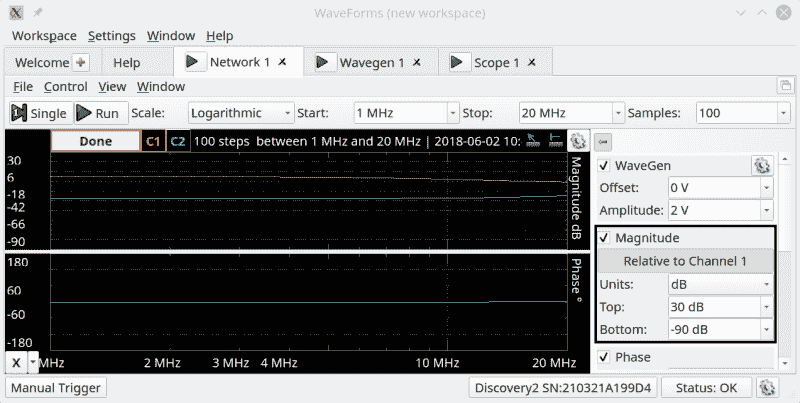
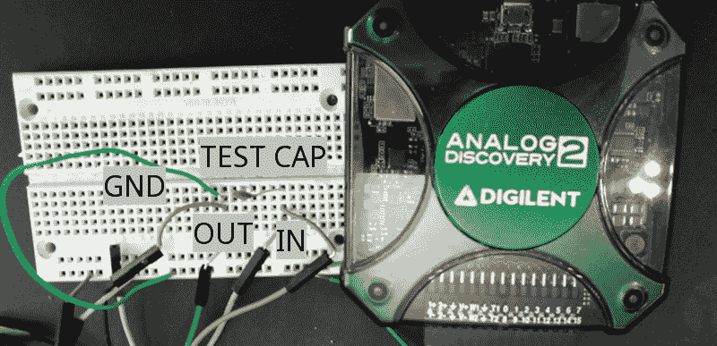
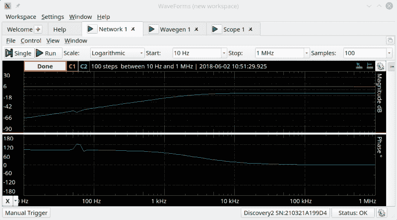
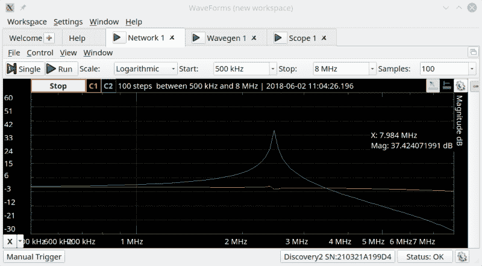
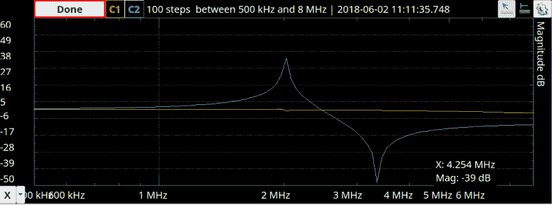
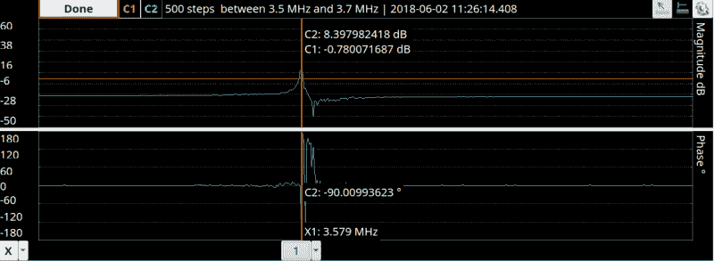

# Analog Discovery 2 作为矢量网络分析仪

> 原文：<https://hackaday.com/2018/06/20/analog-discovery-2-as-a-vector-network-analyzer/>

不久前，我发布了一篇对 Analog Discovery 2 的评论，这是一种 USB“万能”仪器。你可能还记得，我总体上很喜欢它，尽管我并不喜欢它的价格，也不喜欢 BNC 连接器是额外的东西。然而，在同一篇文章中，我提到我会在未来的某个时候看看这款设备作为网络分析仪(NA)的能力。正如他们所说，未来就是现在。

## 安娜是什么？

简单来说，安娜没什么了不起的。你用频率发生器扫描某个频率范围。将它输入某个元件或元件网络，然后测量输出功率，与输入功率进行比较。奇特的仪器可以做一些其他的测量，但这确实是它的核心。

输出通常分为两部分。你会看到一个类似示波器的图形，X 轴是频率，Y 轴是某种幅度。通常，幅度将是输出功率与输入功率的比值，以[分贝](https://hackaday.com/2017/03/07/saved-by-the-bel-understanding-decibels/)表示。此外，另一个类似示波器的输出将显示通过网络的相移(Y 轴)与频率(X 轴)的关系。Discovery 2 有这些输出，您也可以添加自定义显示。

你为什么在乎？安娜可以帮助你理解调谐电路、天线或任何有频率响应的东西，甚至有源滤波器或振荡器的反馈网络。你能手工做同样的测量吗？你当然可以。但是在每个八度上进行数百次测量将是乏味且容易出错的。

## 建立

软件设置非常简单，与 Discovery 2 上的所有其他功能一样。您创建了一个“网络”乐器，您想要调整的最常见设置位于顶部。您可以选择 X 轴上的线性或对数刻度。您还可以选择最小和最大扫描频率，以及要采集的样本数量。如果您愿意，您可以在右侧选择波形发生器的电压输出。您还可以设置 Y 轴单位以及通道的增益。

该设备的工作原理是将示波器的通道 1 探头连接到被测设备的输入端，然后将通道 2 连接到输出端。该设备的输入也连接到波形发生器的输出，你要确保所有的地面都连接在一起。你可以在这篇文章的结尾看到如何使用这种模式的 Digilent 视频。

## 从简单开始

你能看到的最简单有趣的东西是电容器。然而，这显示了 Discovery 2 的一些缺陷。这种飞线的设置方式，很难在这种情况下建立良好的连接。BNC 配件会简单一点。至少它允许更多类型的测试引线容易地连接。我选择将一些电线放入飞行导线中，并将电线连接到试验板。

明显的问题是，试验板有自己的电容和一些串扰。在开路的情况下，参考信号应该有一条 0 dB 的平坦线(上面截图中的绿色),通过测试网络的信号在蓝色轨迹上大约为负无穷大。然而，正如您所见，信号在 3 MHz 左右开始弯曲，在 10 MHz 时确实有问题。我不认为这是仪器固有的，而是劣质测试引线和无焊试验板影响的副产品。

这是一个 10 pF 电容的曲线:

我假设 60 Hz 的小凸起是交流电源线的噪声产物，要么是通过 USB 电缆传导的，要么是从空气中拾取的。该设备配有一根集成铁氧体磁芯的 USB 电缆，但我使用了我电脑上悬挂的任何东西，所以这可能解释了这一点。

可以看到，这是电容的预期响应。低频时损耗高，越来越好，直到在较高频率时趋于平稳。请注意，图表左侧的频率为 10 Hz。仪器在那个频率下读数明显变慢。它似乎等待一定数量的周期，而不是一定的时间，所以扫描频率越高，读数越快。如果您不小心在其中一个框中输入了 MHz 而不是 mHz，您将得到 mHz，并且运行时间确实很长。重要的一课。

## 洪亮的

接下来，我用一个 100 uH 的电感代替电容。这看起来并不像你所期望的那样，除非你意识到电感会与来自试验板和引线的寄生电容发生谐振。剧情是这样的:

峰值约为 2.5 MHz，因此可以计算出测试设置的杂散电容略低于 41 pF。这忽略了杂散电感的影响，但对于这种设置，我认为可以合理假设在这些频率下杂散电感相对较小。从峰值的形状来看，电容大部分是串联的，因为信号正在通过。很高兴知道。然而，如果忽略峰值，可以看到预期的电感行为会随着频率的增加而下降。

顺便说一下，谐振时通过电感泵入一伏电压会产生一个大的尖峰信号，这会扰乱图形。仪器会进行自我保护，并显示超出范围的信息。答案是调低右边面板上的波形输出电压。

接下来，我在电感两端施加 20 pF 的电容。理论上，这应该在 3.56 MHz 左右共振。就此而言，这还没有考虑额外的电容或元件容差。正如你在下面看到的，真实的数字是 3.4 MHz。

请注意，您仍然可以看到杂散串联尖峰，但由于引入了额外电容，它也改变了频率。

## 晶体法

为了好玩，我把所有其他组件都拿出来，从一台老式电视上拿了一块彩色水晶。从下图可以看出，series peak 对于频率来说是恰到好处的。请注意，频率接近，但不同，它是在并联谐振。这就是为什么当你指定一个晶体，你必须叫出来，如果你是寻找串联或并联谐振频率。

## 只是为了好玩

因为 NA 是如此简单的布局，而且由于 NA 使用示波器和波形导联，我认为手动设置频率发生器并查看示波器而不依赖 NA 仪器本身会很有趣。你可以在下面的视频中看到，观看响应随频率的变化是令人满意的。我把扫描时间设置为 5 秒钟，以便更容易观察。

 [https://www.youtube.com/embed/YcQcbS7HOIc?version=3&rel=1&showsearch=0&showinfo=1&iv_load_policy=1&fs=1&hl=en-US&autohide=2&wmode=transparent](https://www.youtube.com/embed/YcQcbS7HOIc?version=3&rel=1&showsearch=0&showinfo=1&iv_load_policy=1&fs=1&hl=en-US&autohide=2&wmode=transparent)

请注意，蓝色 FFT 尖峰随着向谐振方向移动而变大。您还可以看到范围跟踪变大了。请注意，蓝色示波器描迹比黄色源描迹更灵敏。尽管外表上看，它们并不接近同一数量级。还要记住，示波器上的电压不会直接转化为电能。1 A 时的 5 V 信号比 10 mA 时的 10 V 信号具有更大的功率。

## 结论

我只看了几个无源例子，但你可以用这个器件来测量天线、有源滤波器或任何具有频率响应的器件。注意接地，不要给被测器件输出太多信号。您可能已经注意到，虽然您获得了幅度和相位信息，但在专门为此目的制造的非常昂贵的仪器(如 VSWR)上，您无法获得一些预期的测量结果。

Discover 2 的 NA 模式有用吗？是的。完美吗？不会。频率越高，互连问题就越棘手。如果你已经有了其中的一个，无论如何，使用 NA，特别是对于低频工作。但是如果你真的需要安娜，这可能不是你的首选。

有网络分析仪有负担得起的，虽然他们可能有奇数频率范围。例如，我们最近看到一款价格为 150 美元[的手机，其频率不会低于 137 MHz](https://hackaday.com/2018/03/29/putting-a-poor-mans-vector-analyzer-through-its-paces/) 。然而，它将上升到 2.4 GHz。如果你想要更多的背景知识，我们之前有一篇关于这种[整类设备](https://hackaday.com/2017/09/22/network-analysers-the-electrical-kind/)的文章。你可能也喜欢 Digilent 的视频，关于如何设置网络分析仪，如下。

 [https://www.youtube.com/embed/31tq_A_2TcY?version=3&rel=1&showsearch=0&showinfo=1&iv_load_policy=1&fs=1&hl=en-US&autohide=2&wmode=transparent](https://www.youtube.com/embed/31tq_A_2TcY?version=3&rel=1&showsearch=0&showinfo=1&iv_load_policy=1&fs=1&hl=en-US&autohide=2&wmode=transparent)

