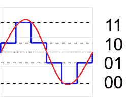
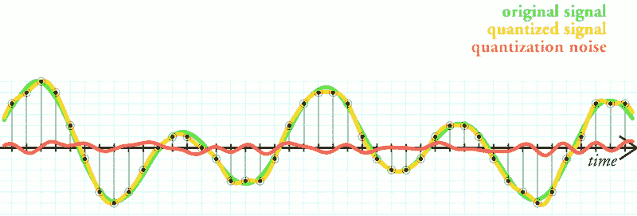
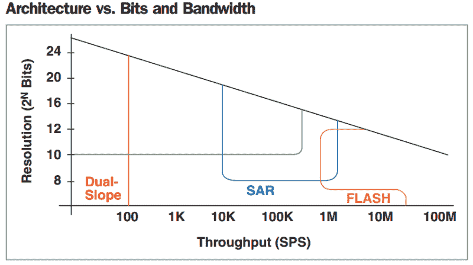
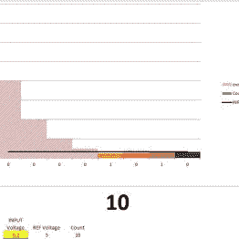
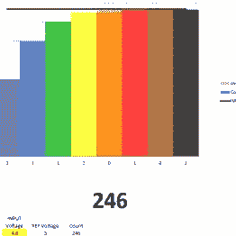
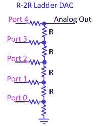
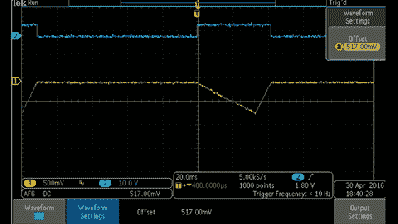
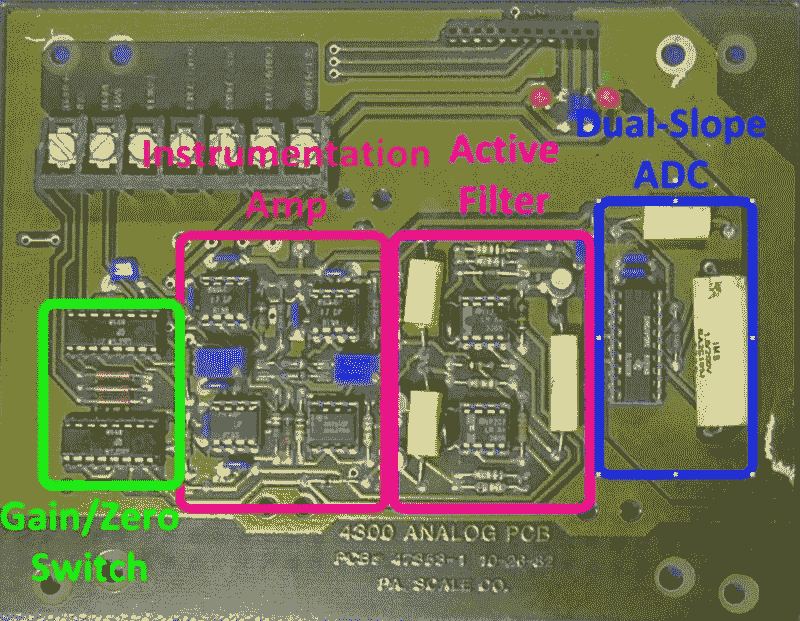

# 模数转换器(ADC):真正的理解

> 原文：<https://hackaday.com/2016/05/05/analog-to-digital-conversion/>

早在微处理器是我们的标准构建模块的时候，我们往往专注于数据的计算和处理，而不是 I/O。简单地说，我们必须让许多东西工作，这样我们才能读取 I/O 端口或计数器的状态。

如今，微控制器已经满足了大部分系统级需求，内置了丰富的 RAM 存储器，并且能够上传我们的代码。这让我们能够专注于微控制器的主要作用:解释环境的一些事情，做出决定，并经常输出结果以激励电机、LED 或其他一些微不足道的比特。

小型微控制器项目的有用性通常取决于能否以电压或电流的形式解释外部信号。例如，光电池或温度传感器的输出可以使用模拟电压来指示亮度或温度。模数转换器(ADC)能够将外部信号转换为处理器可读值。

 [https://www.youtube.com/embed/_gZjBx9cdro?version=3&rel=1&showsearch=0&showinfo=1&iv_load_policy=1&fs=1&hl=en-US&autohide=2&wmode=transparent](https://www.youtube.com/embed/_gZjBx9cdro?version=3&rel=1&showsearch=0&showinfo=1&iv_load_policy=1&fs=1&hl=en-US&autohide=2&wmode=transparent)

## ADC 的

将模拟格式转换为数字格式需要权衡:信号更新的频率(采样速率)、需要了解的程度(分辨率)以及成本(口袋里有多少)。高分辨率和高速度往往具有更高的成本。

将模拟值转换成数字表示的行为有点容易出错，权衡处理的是我们能容忍多少误差。看下面的两张图，我们看到一个正弦波的 3 位数字表示。蓝色数字“步长”和红线之间的区域表示原始信号的失真量。使用更多的步长或数字值和位，我们可以降低失真，并且我们的数字副本更接近真实信号。

Source: Wikipedia

Source: Wikipedia

采样率也很重要，即我们将模拟信号转换为数字信号的频率。正如电压“步长”(分辨率)过小会导致失真一样，时间步长(采样速率)过小也会导致失真。在该图中，绿线和黄线之间的距离代表基于时间的失真，如红色所示。

Source: Wikipedia

## ADC 的类型

从下图中，我们可以看到四种最常见的 ADC 技术及其性能。我可能会花一整篇视频来讨论德尔塔适马，因为它结合了数字和模拟处理，这里我将集中讨论其他三个:Flash、逐次逼近和双斜率。

Source: Analog-to-Digital Converter Design Guide

## 闪光型转换器

Flash 型转换器速度最快，因此得名，但分辨率有一些固有限制，而且成本也不低。flash 型转换器是高速比较器的集合，每个比较器的基准电压略有不同，但信号与之进行比较。

对于 8 位分辨率，总共需要 256 个比较器以及支持数量的半精密电阻。同样，一个 10 位转换器需要 1024 个比较器，这也是 flash 型转换器尽管速度很高，但由于随着位数的增加而出现的缩放问题，其分辨率多少会受到限制的原因。

还示出了被称为优先级编码器的离散信号到二进制编码器。该逻辑创建一个二进制值，表示最高的比较器活动状态(将其视为解码器的对立面，例如用于从 3 条地址线创建 8 个芯片选择的解码器)。

## 逐次逼近寄存器(SAR)

 SAR 利用内置的数模转换器(DAC)，与 ADC 相反，将输入信号与 DAC 的输出进行比较并进行调整，直到它非常接近输入信号。

SAR 首先获取并设置 DAC 值的 MSB，表示满量程的 1/2，然后测试输入是大于还是小于该值。如果该位大于 1/4，SAR 将设置该位，然后测试代表总数 1/4 的下一位。SAR 在 1/8、1/16、1/32 测试中向下移动该位至 LSB，同时在输入较大时设置该位。

随着测试的位越来越多，这一系列近似值会变得越来越精确，从而有效地找到测试电压的最佳近似值。我展示了一些使用电子表格表示 8 位 SAR 的例子。

      

 首先测试 D7，如果 D7 大于输入(用红色交叉线表示)，则记录为 0，否则存储为 1，并测试 D6(同时记住 D7 的状态)。每位转换使用一个周期，因此所示 SAR 转换每次需要 8 个周期(而 flash 只需一次采集时间)。

我在视频中演示了这一过程，但如果你想有机会亲自动手操作，你可以下载 [SAR 计算电子表格](https://hackaday.com/wp-content/uploads/2016/05/sar-calc-spreadsheet.xlsx)。

我构建了一个 SAR 系统，使用 FPGA 提供控制逻辑、我们在[DDS 视频](http://hackaday.com/2014/11/24/direct-digital-synthesis-dds-explained-by-bil-herd/)中构建的 R-2R 梯形电阻和一个简单的比较器。有没有见过带 1 位比较器的微控制器，想知道它为什么会在那里？这里有一个原因；您可以利用 I/O 端口上的几个电阻和一个 1 位比较器来制作 SAR。

## 样本及保存

如上所述，8 位 SAR 需要 8 个周期来完成采集。在此期间，重要的是电压值不会随着一系列近似的发生而改变。

进入采样保持(S/H)电路。最简单的形式是，它以电容电荷的形式捕捉信号值，然后通过断开输入的开关进行隔离。采样保持电路可作为集成电路使用，它还能最大限度地降低电容上的放电电压(称为压降),并确保开关对信号的影响最小。

## 双斜率

双斜率转换之所以得名，是因为它在已知的一段时间内对输入信号进行积分，从而产生与输入信号相等的累积电荷，同时在此过程中提供一些低通滤波。然后，通过施加极性相反的已知参考电压，并对时钟脉冲进行计数，直到信号归零，从而对电荷进行积分。每个测量周期之间是一个自动调零阶段，有助于消除基线漂移等影响。

双斜率用于需要更高分辨率且转换时间不太重要的情况。由于双斜率也可以是低功耗的，它经常出现在手持式设备中，如伏特欧姆表，或者我在最后展示的例子中，精密数字称重仪器。

    

双斜率的输出最终是一串时钟脉冲，尽管它们可以在内部转换为二进制值，如上面所示的 TC7109 IC。如果输出是需要计数的脉冲串，微控制器可以使用专用计数电路或外部分频计数器的溢出计数，其中每个溢出代表已知数量的脉冲。使用外部计数器进行缩放并获得全分辨率优势的一个技巧是手动脉冲计数器，直到检测到最后一个溢出。采集阶段后，手动脉冲的数量用于确定计数器中剩余的数量。

## 把它放在一起

下面你可以看到我在 1982 年做的精密模拟部分。设计中包括一个双斜率 ADC、一个具有零点和增益校正功能的仪表放大器(类似于斩波稳定或零漂移放大器)和有源滤波器，所有这些我们在 Hackaday 视频中都有[介绍。该设计仍然可行，但现在可以用小型专用芯片取代仪表放大器，双斜率转换器使用较小的电容运行速度更快，这降低了对电容的一些要求，使其泄漏或介电吸收不那么低。](http://hackaday.com/2015/03/16/instrumentation-amplifiers-and-how-to-measure-miniscule-change/)

## 结论

了解 ADC 的工作原理有助于理解返回的结果，或者最终是否应该使用不同的技术。如今，SPI 和 I ² C 接口广泛应用于各种 ADC 中，几乎可以连接到任何处理器架构，而无需考虑数据总线架构和时序。