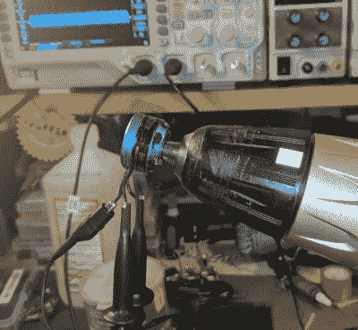

# 用示波器分析业余爱好马达

> 原文：<https://hackaday.com/2018/02/16/analyzing-hobby-motors-with-an-oscilloscope/>

我们总是喜欢寻找新的~~借口~~理由来使用我们的测试设备，所以我们不禁对[Joe Mosfet]的这个提示感兴趣。他用广受欢迎的 Rigol DS1054Z 向[展示了当手持电钻以恒定转速旋转时，几个无刷电机](https://imgur.com/a/LuPkS)之间的差异。他不仅能够识别出一个损坏的马达，还能想象出它们的规格，否则会显得有点神秘。

 每个电机的一根电线用作地线，通道一和通道二连接到其余电线。尽管 DS1054Z 有四个通道，但[Joe]实际上只使用了其中的两个。显示的第三个通道是由示波器上的数学函数创建的虚拟通道。

给它们接线后，每个马达都被放入钻机的卡盘中，转速达到 1430 转/分。得到的波形被捕获，[Joe]带我们浏览每一个波形，解释我们在示波器上看到了什么。

坏电机很容易识别:相位不对齐，通常输出看起来不稳定。在良好的电机之间，电机的 Kv 额定值越高，示波器上看到的电压越低。这是因为在无刷电机的背景下，Kv 是衡量每伏特电机旋转速度的指标。反过来也是正确的，[乔]解释说，如果他能让他的 2450 千伏电机以每分钟 2450 转的速度旋转，我们应该会看到 1 伏特的输出。

除了展示 Kv 额定值的实际一面，[Joe]还从理论上证明了波形可以让我们一窥电机结构的质量。他指出，他的高端电机产生一个漂亮干净的正弦波，而他的廉价电机在峰值处显示失真。一个有趣的注意，尽管他强调他不能确认这是否对现实世界的性能有影响。

去年，我们展示了一种类似的方法[使用钻床和示波器](https://hackaday.com/2017/10/18/testing-brushless-motors-with-a-scope-or-a-meter/)来识别不良无刷电机，但我们喜欢[Joe]经历了测试多个电机并解释其输出差异的麻烦。

[通过[/r/多机](https://www.reddit.com/r/Multicopter/comments/7xo4wj/i_hooked_some_miniquad_motors_to_my_oscilloscope/)