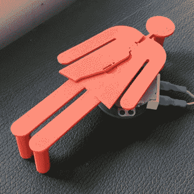

# 动画浴室标志

> 原文：<https://hackaday.com/2017/06/25/animated-bathroom-sign/>

曾几何时，裤子被创造出来。过了一段时间，女人也可以穿了。这让很多人感到高兴，并被广泛认为是一件好事。然而，有一个问题——浴室标志很大程度上是基于这样一种观点，即所有人都必须分为两种严格的性别，它们是由你是穿着裤子还是裙子来定义的。[，[Robb Godshaw]和其他人不同意这一点，并着手建立一个性别流体浴室标志。](http://www.instructables.com/id/Gender-Fluid-Bathroom-Sign/)

The sign assembled on the motor.

该项目试图利用“男性”和“女性”的传统符号——穿着裤子或裙子的人形——通过创建一个每 15 秒在两者之间切换的标志。这一开始可能会令人困惑——人们可能会想象浴室实际上正在快速改变其性别名称，迫使用户在难以置信的短时间内完成他们的业务。然而，这个项目背后的信息是强调用裤子、颜色或者二元性来定义性别的荒谬性。[Robb]还有益地指出，所有人类都必须排泄废物，不分性别。

该标志由 3D 打印组件制成，使用曲柄机构来驱动移动部件。该机制旨在为裤子和服装配置提供相等的时间。[Robb]分享了复制该造型所需的重要细节，例如如何用回形针和打火机组装金属曲柄销插件。这种机制集成到零件本身的方式非常简洁。在真正的黑客风格中，电机是一个标准的微波炉转盘电机，可以很容易地从垃圾电器中获得，并可以直接插入主电源进行操作，如果你知道你在做什么的话。如果你不知道，看看我们关于这个话题的入门书。

总的来说，该项目很好地利用了黑客技术，如 3D 打印和收集零件，来发表声明和开始对话，同时还很有趣。我们以前也看过[罗柏]的一些作品，比如这个给人看的巨大仓鼠轮。休息后的视频。

 [https://www.youtube.com/embed/dm2EU1PINeE?version=3&rel=1&showsearch=0&showinfo=1&iv_load_policy=1&fs=1&hl=en-US&autohide=2&wmode=transparent](https://www.youtube.com/embed/dm2EU1PINeE?version=3&rel=1&showsearch=0&showinfo=1&iv_load_policy=1&fs=1&hl=en-US&autohide=2&wmode=transparent)

