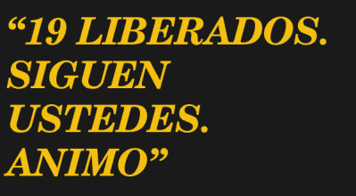

# 学习莫尔斯电码的另一个原因:绑架

> 原文：<https://hackaday.com/2018/04/13/another-reason-to-learn-morse-code-kidnapping/>

莫尔斯电码——一系列的点和破折号——在最奇怪的情况下也很有用。小时候，我记得《星际迷航》中有一集，受伤的克里斯托弗·派克只能眨一次灯表示是，眨两次灯表示不是。甚至在小时候，我还记得自己在想，“真糟糕，他们没想到教他莫尔斯电码。”当然，莫尔斯电码的奇怪用法不仅仅出现在电视和电影中。也许现实生活中最奇怪的应用是哥伦比亚政府在流行音乐中隐藏代码，向人质发送信息。

2010 年，[何塞·埃斯佩约]即将从哥伦比亚军队退役。但令他烦恼的是，他的一些战友被 FARC(哥伦比亚革命武装力量；反政府游击队)，有的长达十年之久。解救人质的努力正在进行中，他们希望人质知道这一点，以提高士气，这样他们就可以准备好逃跑。但是你如何向被囚禁的人传递信息而不惊动他们的俘获者呢？

[埃斯佩约]聘请了一位外籍广告主管[胡安·卡洛斯·奥尔蒂斯]来设计一种传递信息的方式。[Oritz]离开哥伦比亚是因为他的反毒品广告招致了 FARC 的死亡威胁。他住在美国，不喜欢哥伦比亚革命武装力量，并且乐于为自己的祖国伸出援手。

## 心理战广告狂人风格

这并不是奥尔蒂斯第一次用他的广告技巧来对付哥伦比亚革命武装力量。从空投橡皮奶头到漂浮的足球，奥尔蒂斯一直在努力鼓励哥伦比亚革命武装力量士兵逃跑。但是这些信息应该被哥伦比亚革命武装力量士兵阅读。这个新消息必须是秘密的。

The hidden message delivered via pop music.

众所周知，人质通常可以使用无线电。事实上，有一个广播节目允许人质的家人给他们所爱的人留下 30 秒的信息。这似乎是传递信息的一种显而易见的方式，但如何隐藏它呢？答案是莫尔斯电码。

这似乎合乎逻辑，因为许多士兵知道密码，但哥伦比亚革命武装力量叛军不太可能受过训练。当然，仍然存在如何隐藏代码的问题。显然，如果捕获者听到的是代码，他们可以找人解码，即使他们自己也不明白。他们需要某种形式的隐写术来将代码隐藏在众目睽睽之下——嗯，也许 earshot 是一个更好的词。

## 有节奏

答案是将代码嵌入歌曲中。政府控制了当地的广播电台，因此获得播出时间不成问题。下面的视频中有这首英文歌曲《Mejores Dias or Better Days》。通过一些实验，他们发现他们可以在副歌中加入大约 20 个词而不明显。这也使得代码可以重复，更容易复制。

 [https://www.youtube.com/embed/7CqOYM7cCX8?version=3&rel=1&showsearch=0&showinfo=1&iv_load_policy=1&fs=1&hl=en-US&autohide=2&wmode=transparent](https://www.youtube.com/embed/7CqOYM7cCX8?version=3&rel=1&showsearch=0&showinfo=1&iv_load_policy=1&fs=1&hl=en-US&autohide=2&wmode=transparent)

信息内容如下:

> 19 人获释。你们跟着我。我的灵魂
> 
> (19 人获救。你是下一个。振作起来)

这首歌本身就有歌词，好像是关于某人被劫持的，甚至在代码开始前有一句台词，“Escucha este mensaje，hermano”，意思是“听听这条消息，兄弟。”如果你很好奇，而且你高中时的西班牙语还没达到标准，谷歌翻译可以给你看西班牙语和英语的歌词。

这首歌在哥伦比亚革命武装力量控制的农村地区非常流行。显然，一些人质破译了信息。老实说，我不认为我会。也许我的耳朵太老了。

## 到处都是莫尔斯

歌曲中的莫尔斯电码并不是一个新想法。Rush 有 [YYZ](https://www.youtube.com/watch?v=LdpMpfp-J_I&list=RDLdpMpfp-J_I) (这是多伦多的机场代码)。发电厂乐团的[辐射中有信息。它在](https://www.youtube.com/watch?v=M0D7MBBI2Ik)[闪光冻结](https://www.youtube.com/watch?v=f5JDqGNXxCU)中有一个相当明显的外观。

仔细想想，莫尔斯电码对人质事件也不陌生。当他还是战俘时，在电视直播的忏悔中，杰里迈亚·丹顿上将用他的眼皮眨着眼睛说出了酷刑。从阿卡特兹到伊朗，囚犯使用莫尔斯电码交流的故事也很常见。

 [https://www.youtube.com/embed/rufnWLVQcKg?version=3&rel=1&showsearch=0&showinfo=1&iv_load_policy=1&fs=1&hl=en-US&autohide=2&wmode=transparent](https://www.youtube.com/embed/rufnWLVQcKg?version=3&rel=1&showsearch=0&showinfo=1&iv_load_policy=1&fs=1&hl=en-US&autohide=2&wmode=transparent)

如果你看不懂莫尔斯电码，你永远不知道你错过了什么。你知道著名的国会记录大楼有一个飞机信标，用莫尔斯电码拼出好莱坞吗？他们偶尔会像 2013 年那样改变信息，以宣传凯蒂·佩里的新专辑。显然，几乎没有人注意到。

你见过的莫尔斯电码最奇怪的用法是什么？在更好的日子里你能听到代码吗？请在评论中告诉我们。