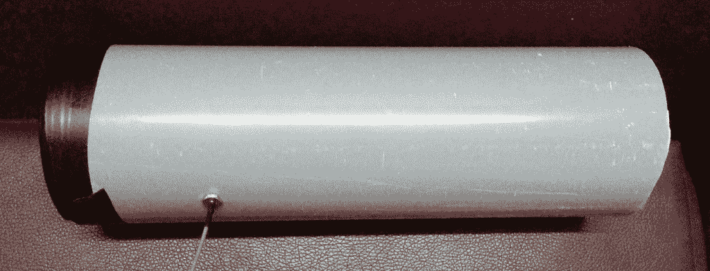
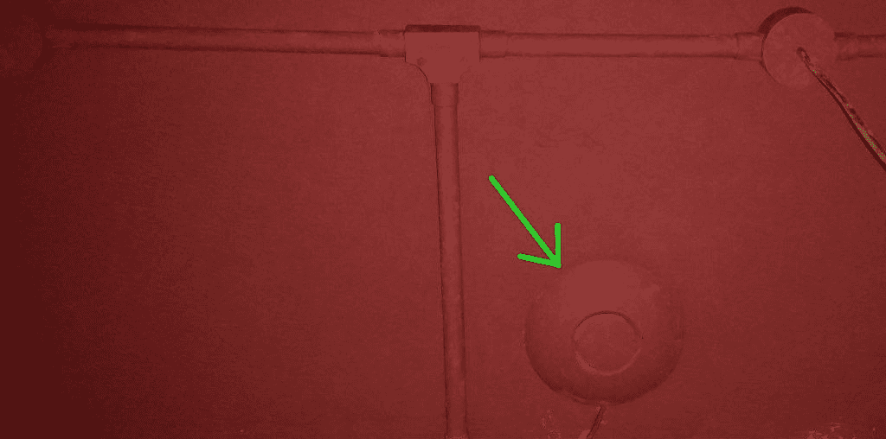

# 使用 ESP8266 搜寻非法接入点

> 原文：<https://hackaday.com/2017/12/28/antenna-alignment-and-hunting-rogue-access-points-with-the-esp8266/>

Cantennas 比我购买的所有消费级 Wi-Fi 天线都要好。Cantenna 是“can”和“antenna”的混搭，这是一个由重新利用的钢罐制成的定向波导天线的昵称。对于任何还没有建立一个的人来说，这是一个很好的下午项目。这里有一些[构建说明和技术细节](http://jacobsalmela.com/2013/09/07/wi-fi-cantenna-2-4ghz-how-to-make-a-long-range-wi-fi-antenna)。除此之外，我还在这个过程中发现了一个恶意的 WiFi 接入点。

当我需要扩展一些基于 ESP8266 的传感器的范围时，cantennas 是我最想尝试的东西。制作一个很容易，把它连接到 Wemos Mini D1 Pro 上，然后就大功告成了……给我留下了足够的时间来过度设计它，我最终陷入了一个兔子洞。

我做的第一件事是停止使用易拉罐。罐头食品不仅在我的世界角落里很贵，而且更重要的是，它们不太适合批量生产标准化的天线。我也只能吃这么多豆子！仅后一个原因就足以考虑类似于[模块化碟形反射镜](http://hackaday.com/2017/01/30/increase-the-range-of-an-esp8266-with-duct-tape)的替代设计。

### 建设一个更好的食堂:扔掉罐头

然而，用和一个大罐头食品差不多的价格，我可以买到一张 0.6 毫米厚的铜片。在量出并切割后，我将它缠绕在一根 80 毫米的 PVC 管内，形成了一根大约 79 毫米宽的管子。后来，我发现更容易的方法是将铜缠绕在管子的外面，并连接 90 毫米直径的软管夹来固定它。在这两种情况下，我都将结果焊接在铜基座上。



Not over-engineered enough!

然后，我测量并安装了一个 IPEX 天线连接器，在将一根正确长度的电线插入之前，它应该在拾音器电线的位置。它似乎工作得很好，但如果我能稍微描述一下它的特征，或者至少想出一种方法来方便地对齐几个食堂，那就更好了。事实证明，获取运行 NodeMCU 的 ESP8266 所连接的接入点的 RSSI(接收信号强度指示)很容易:

```
x = wifi.sta.getrssi()

print (x)
```

## 使用 RSSI 进行天线对准

虽然 RSSI 是一种测量信号强度的模糊方法，但它似乎足以校准天线。为了测试它，我设置了一个连接 cantenna 的迷你 D1 Pro，既作为接入点，又连接到我的路由器。

```
wifi.setphymode(wifi.PHYMODE_B)
tries=0
ssid=&quot;Home Network Name&quot;
pswd=&quot;myrealpassword&quot;
--start by setting both station and AP modes
wifi.setmode(wifi.STATIONAP)
wifi.ap.setip({ip = &quot;192.168.4.1&quot;, netmask = &quot;255.255.255.0&quot;, gateway = &quot;192.168.0.1&quot;});
wifi.ap.config({ssid=&quot;Tenna&quot;,pwd = &quot;foxhunting&quot;})
tmr.alarm(0, 100, 1, function(Q)
if wifi.ap.getip() == nil then
tries=tries+1 --wait for AP to come up
else
tmr.stop(0)
print(&quot;after &quot;..tries..&quot; AP IP=&quot;,wifi.ap.getip())

--now connect to LAN
wifi.sta.config(ssid,pswd)
wifi.sta.connect()
tries=0
tmr.alarm(0, 100, 1, function(Q)
if wifi.sta.getip() == nil then
tries=tries+1 --wait for LAN to come up
else
tmr.stop(0)
print(&quot;after &quot;..tries..&quot; STA IP=&quot;,wifi.sta.getip())
dofile(&quot;server.lua&quot;)
end
end)
end
end)
```

一旦接入点运行并连接到我的路由器，它在某个端口上收到的任何 UDP 数据包都会被上传到物联网数据记录器。我使用了 Thingsboard，但是其他服务也可以正常工作。我就这样看到了-2 到-91 dBi 的范围，用的是 Wi-Fi 802.11b。

```
port=10001
ClientID = 'put anything here'
token = 'put token here'

m = mqtt.Client(ClientID, 120, token)
srv=net.createServer(net.UDP)
srv:on(&quot;receive&quot;, function(srv, pl)
m:connect(&quot;mydomain.com&quot;, 1883, 0, function(client) print(&quot;connected&quot;) m:publish(&quot;v1/devices/me/telemetry&quot;, '{&quot;RSSI&quot;:'..pl..'}', 2, 1) m:close() end)

end)
srv:listen(port)
```

第二台与 cantenna 连接的迷你 D1 Pro 被编程为测量 RSSI，并将其作为 UDP 数据包发送给第一台。我用一小块备用手机电池给它供电。这非常有效，为我节省了一个屏幕，因为我可以带着这个系统到处走，并让我的智能手机在物联网数据记录后端打开。范围很大，穿过了一些混凝土建筑。由于被报告为“未知错误”，UDP 数据包发送函数每隔几分钟就崩溃一次，但我没有调试它，而是在保护模式下调用了这个有问题的函数(pcall ),从那以后，它就完美地工作了:

```
sda = 2 -- SDA Pin
scl = 1 -- SCL Pin
port=10001
sla = 0x3C
i2c.setup(0, sda, scl, i2c.SLOW)
disp = u8g.ssd1306_64x48_i2c(sla)
disp:setFontRefHeightExtendedText()
disp:setDefaultForegroundColor()
disp:setFontPosTop()
disp:firstPage()
repeat
pl = &quot;Fox&quot;
deg = &quot;Hunt&quot;
disp:setFont(u8g.font_profont17r)
disp:drawStr(0, 20, pl)
disp:setFont(u8g.font_profont17r)
disp:drawStr(0, 35, deg)
until disp:nextPage() == false

enduser_setup.start(
function()
print(&quot;Connected to wifi as:&quot; .. wifi.sta.getip())
end,
function(err, str)
print(&quot;enduser_setup: Err #&quot; .. err .. &quot;: &quot; .. str)
end,
print -- Lua print function can serve as the debug callback
);

function poll(level)
pl = wifi.sta.getrssi()
if pl == nil then
print &quot;NC&quot;
pl = &quot;NC&quot;
sla = 0x3C
i2c.setup(0, sda, scl, i2c.SLOW)
disp = u8g.ssd1306_64x48_i2c(sla)
disp:setFontRefHeightExtendedText()
disp:setDefaultForegroundColor()
disp:setFontPosTop()
disp:firstPage()
repeat
cee = &quot;dBi&quot;
disp:setFont(u8g.font_profont17r)
disp:drawStr(5, 15, pl)
disp:setFont(u8g.font_profont17r)
disp:drawStr(5, 35, cee)
until disp:nextPage() == false

else
sla = 0x3C
i2c.setup(0, sda, scl, i2c.SLOW)
disp = u8g.ssd1306_64x48_i2c(sla)
disp:setFontRefHeightExtendedText()
disp:setDefaultForegroundColor()
disp:setFontPosTop()
disp:firstPage()
repeat
cee = &quot;dBi&quot;
disp:setFont(u8g.font_profont17r)
disp:drawStr(5, 15, pl)
disp:setFont(u8g.font_profont17r)
disp:drawStr(5, 35, cee)

until disp:nextPage() == false
end
pcall(send)
end
function send(level)
pl = wifi.sta.getrssi()
if pl == nil then
print &quot;NC&quot;
pl = &quot;NC&quot;

else
print (pl)
udpSocket = net.createUDPSocket()
udpSocket:send(port,&quot;192.168.4.1&quot;,pl)
end
end
tmr.alarm(1, 1000, tmr.ALARM_AUTO, function() poll(0) end)
```

我注意到的一件事是，使用 RSSI 读数直接对准天线非常容易，即使没有良好的视线。我开始想这可能是一个定位流氓接入点的好工具…所以我添加了一个小屏幕来显示所选网络的 RSSI，并使用“最终用户配置”功能(如上所述)，这样我的智能手机就可以指示它扫描并连接到任意网络。

## 作为 AP 定位器的现场测试


I was going to add a LiPo cell and charge monitor too, but ran out of cells. Looks like a prop from Ghostbusters!

我把它带到一家咖啡店，我知道我可以在不激怒员工的情况下尝试一下。我能够在不到一分钟的时间内找到路由器，这可能是我可以在大约相同的时间内完成的，因为它只是一个现成的路由器，放在桌子上，显而易见，但关键是它工作得很好。然后一些记忆突然出现，我想起了一些事情…

几个月前，我看到一家餐厅的 Wi-Fi 网络比想象中多了一个。每层都有一个网络，一个显然是用于 POS 系统的，另一个在 SSID 中的大小写略有不同。我当时也没想什么，但是是时候去一趟了。

很明显，这是一个流氓接入点，因为它使用了工作人员给我的相同密码，但重定向我下载了一个名为“facebook.scr”的文件(这是一个过去的爆炸-为什么是。SCR 文件还可以执行吗？).互联网仍然工作，因为流氓接入点是作为一个正确的 Wi-Fi 网络的桥梁。

于是我下载了文件，打开了一个终端，运行了‘strings Facebook . SCR > output . txt’，浏览了一遍，发现是运行了 mill 比特币挖矿恶意软件。文件中有足够的信息来查看采矿池中的采矿量。无论如何，我得找到一个接入点！

它在另一层楼，但没多久就找到了。合法的接入点只是贴在墙上的普通住宅路由器，很容易被发现，但流氓接入点是另一回事。很明显，在公司搬进来之前，它就已经被专业地安装好了:电线穿过了与安装在墙上的电源插座相同的导管。它也被涂上了和其他东西一样的天花板漆。换句话说，它不只是留在周围。它安装得非常小心，可能由一个升级了固件的商用吊顶式 Wi-Fi 路由器组成。



I found no good images of rogue access points in the wild with Google search… so here you go.

更有趣的是，这个池的比特币挖掘能力并不巨大，但远远大于单个这样的设备所能解释的，如果它代表了他们的主要载体。如果仔细安装，有可能是这样的。不过，我不是蒙面义警——我已经把我的发现告诉了相关部门，他们可以从现在开始按照他们认为合适的方式处理。