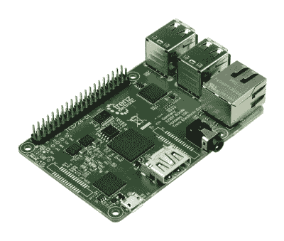

# Antti Lukats:可编程逻辑的过去、现在和未来

> 原文：<https://hackaday.com/2015/12/19/antti-lukats-the-past-present-and-future-of-programmable-logic/>

[Antti]在[Hackaday.io](https://hackaday.io/projects/hacker/38504)上有点名气——他在 hack aday . io 上有大量 FPGA 项目，而且都是开源的。如果你正在寻找 FPGAs 的街头信誉，[Antti]有。他在 FPGAs 和 CPLDs 方面的实践经验可以追溯到 70 年代的第一批芯片。我们很高兴他正在努力分享这种深度的知识，包括他几周前在[黑客日超级会议](http://hackaday.io/superconference)上的演讲。看一看，然后在休息之后加入我们，对 FPGA 的过去和现在进行概述。

 [https://www.youtube.com/embed/PtSNOFpv8Hg?version=3&rel=1&showsearch=0&showinfo=1&iv_load_policy=1&fs=1&hl=en-US&autohide=2&wmode=transparent](https://www.youtube.com/embed/PtSNOFpv8Hg?version=3&rel=1&showsearch=0&showinfo=1&iv_load_policy=1&fs=1&hl=en-US&autohide=2&wmode=transparent)

在开始的时候，FPGAs 和 CPLDs 并没有那么好。你只需要看看 20 世纪 70 年代的女孩和伙伴们就能找到 FPGAs 的起源——他们是带有几十个逻辑门的单片芯片，实际上需要通过*烧录*来编程。给 PAL 编程意味着用电切断芯片内部的几根小电线，如果你知道你在做什么，你可以在合理的范围内用你想要的任何一系列输入和输出构建一个芯片。

据 Antti 称，FPGAs 的“黄金时代”是在 2007 年左右，大型设备拥有数千个单元。有了这些芯片，你可以构建一个 HDMI 收发器，制作一个旧微处理器的完美硅复制品，或者任何你能想到的东西。虽然这些 FPGA 过去和现在都令人惊叹，但大多数包含 FPGA 的设计也需要快速的微处理器。这导致了当前一代的 FPGAs，即片上系统，如 Xilinx Zynq。

Xilinx Zynq 是一个 FPGA，但在这个金属和环氧树脂中还隐藏着一个 ARM Cortex-A9 处理器，用于 DDR2 和 DDR3 内存的接口，以及包括 USB 和以太网在内的外设。问题是，你用这样的设备实际上能造出什么呢？

Antti 有这个问题的答案，它以树莓派的形式出现。他制作了 ZynqBerry ，这款设备看起来和 Raspberry Pi 2 没有太大区别。它拥有你想要的一切——HDMI、以太网和四个 USB 端口，但这款设备不是基于 Broadcom 片上系统构建的。它基于 Xilinx Zynq 构建，这意味着混合中有一个 FPGA，可以模拟旧芯片，作为 HDMI 接口，或者只是从芯片的 ARM 部分卸载计算。

目前，Antti 的 ZynqBerry 是 FPGAs 目前所能做的最纯粹的例子。未来会怎样？这些设备可以随时重新配置。[英特尔收购 Altera 毕竟是有原因的](http://hackaday.com/2015/06/01/intel-buys-altera-for-16-7-billion/)，不久我们将在单个晶片上结合 CPU 和 FPGAs，这将能够为有史以来最强大的计算平台重新配置自己。

这仍需要几年时间，在此之前，最先进的 FPGA 将是 Xilinx Zynq。当新设备问世时，Antti 将忙于做他一直在做的事情:用 FPGAs 构建有趣的应用程序。不过，下一次，它将是一台超级计算机。