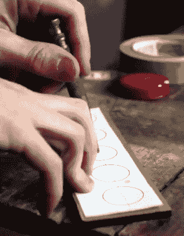

# 街机风格的电脑热键

> 原文：<https://hackaday.com/2018/01/28/arcade-style-computer-hotkeys/>

多产的制造商(Sean Hodgins)已经揭开了他最新的一天建设的面纱，像往常一样，它采用了大多数阅读 Hackaday 的人在他们的零件箱中会有的那种备件，并将其变成有趣和有用的东西。这一次，他从以前的项目中获得了一堆备用的街机风格的按钮，并将它们与 Adafruit 小饰品(SAMD21 风味)[结合起来，为他的计算机](https://hackaday.io/project/38556-quick-arduino-hot-key-panel)制作了一个 USB 输入设备。

[Sean]使用 1/4 英寸的丙烯酸树脂制作外壳，尽管他提到它可以很容易地进行 3D 打印。但使用丙烯酸树脂很容易，并给最终的硬件带来漂亮的光泽。有了锯子和钻床，你可以用丙烯酸制作一些非常专业的盒子，这表明你不一定需要高端 3D 打印机来制作漂亮的外壳。

正如视频中所解释的，阿达果饰品对于这个版本来说并不是绝对必要的，它只是[肖恩]放在周围的东西。任何可以作为 USB 人机接口设备(HID)呈现给操作系统的微控制器都适合这样的项目。

在软件方面，一个经过修改的 Arduino 演示程序用于将数字引脚的状态等同于发送到计算机的预定义组合键。在这个简单的例子中，组合键被硬编码到小饰品的源代码中，但是未来的增强可能是添加一个用配置工具设置新组合键的方法。

我们已经介绍了相当多的非传统 USB 输入设备，它们都基于基本相同的原理运行在 T2 上。事实证明，黑客因制造古怪的输入设备而获得[可观的退休金。](https://hackaday.com/2016/07/20/binary-keyboard-is-the-purest-form-of-input-device/)

 [https://www.youtube.com/embed/1wWT9QnN1YI?version=3&rel=1&showsearch=0&showinfo=1&iv_load_policy=1&fs=1&hl=en-US&autohide=2&wmode=transparent](https://www.youtube.com/embed/1wWT9QnN1YI?version=3&rel=1&showsearch=0&showinfo=1&iv_load_policy=1&fs=1&hl=en-US&autohide=2&wmode=transparent)

