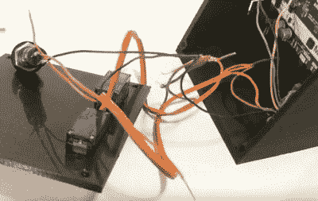

# Arduino 时钟用紫外线记录时间

> 原文：<https://hackaday.com/2018/03/22/arduino-clock-jots-down-the-time-in-uv/>

我们是 Hackaday 不切实际的粉丝。当然，想出最有效的方法来实现你的目标是有一定吸引力的，这种方法准确地做了它需要做的事情，没有任何多余的元素。但是这并没有那么有趣。如果至少有一个人没有问“但是为什么？”，那么你可能在桌子上留下了一些东西，设计明智。

 所以当我们看到这个由[塔克·香农]设计的令人愉悦的复杂时钟时，我们立刻坠入爱河。该时钟由 Arduino 驱动，使用一个带紫外线 LED 的[铰接臂，在一块夜光材料上写出当前时间](https://www.thingiverse.com/thing:2833916)。根据房间的照明情况，时间不会停留很长时间，但至少只要按一下按钮，只需要一两秒钟就可以写出来。

3D 打印外壳内部的事情非常简单。有一个 Arduino 与一个 RTC 模块耦合来保持时间，它连接到安装在前面板上的两个标准爱好伺服系统。一个紫外线 LED 和一个简单的按钮完成了材料清单的其余部分。提供了源代码，所以如果你想在家里试一试，你不必弄清楚让两个伺服系统很好地一起玩的运动学问题。

这些年来，我们已经看到了许多由 [Arduinos 驱动的时钟](https://hackaday.com/2017/12/13/color-changing-clock-uses-pcb-digits/)，偶尔[它们甚至还有指针](https://hackaday.com/2017/11/17/modernizing-a-170-year-old-antique-grandfather-clock/)。但是很少有人能拥有自己的机械臂。

 [https://www.youtube.com/embed/-MnolVyKqvo?version=3&rel=1&showsearch=0&showinfo=1&iv_load_policy=1&fs=1&hl=en-US&autohide=2&wmode=transparent](https://www.youtube.com/embed/-MnolVyKqvo?version=3&rel=1&showsearch=0&showinfo=1&iv_load_policy=1&fs=1&hl=en-US&autohide=2&wmode=transparent)

