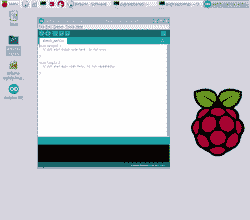

# Arduino 来到 Raspberry Pi，Linux ARM 设备

> 原文：<https://hackaday.com/2016/04/12/arduino-comes-to-the-raspberry-pi-linux-arm-devices/>

Arduino 是微控制器和电子产品的完美入门。最近流行的强大、廉价、基于 ARM 的单板 Linux 计算机是对计算机科学、编程和一般 Linux 魔法的完美介绍。然而，直到现在，Arduino 和这些微型 ARM 计算机一直处于两个不同的世界。现在，终于在 Raspberry Pi 和其他单板 Linux 计算机上有了 Arduino IDE 的夜间版本。

本周早些时候，ARM Linux 的最新 Arduino 版本出现在 arduino.cc 下载页面的[上。这是 Arduino 项目中几十个开源开发者大量工作的结果。现在，只需简单的下载并在终端键入“install ”, Arduino IDE 就可以在几乎每台单板 Linux 计算机上使用，而无需从源代码构建 IDE。当然，Arduino 在树莓 Pi 上已经存在很长时间了，有`sudo apt-get install arduino`、](https://www.arduino.cc/en/Main/Software)[，但这是一个旧版本](http://playground.arduino.cc/Linux/Raspbian)，不能与新的 Arduino 板一起工作。

这个 Arduino IDE 的发行版和你在 OS X 和 Windows 上看到的一样吗？是的，一切都是一样的:

虽然这实际上只是 arduino.cc 改进他们的自动化构建过程，并在他们的下载页面上放置一个链接，但它确实使任何人都可以非常容易地建立一个高中电子实验室。Raspberry Pi 几乎是一个一次性的计算设备，将它与 Arduino 结合起来可以成为一个伟大的便携式电子实验室。