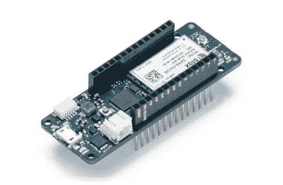

# Arduino 刚刚推出了 FPGA 板，宣布调试和更好的软件

> 原文：<https://hackaday.com/2018/05/18/arduino-just-introduced-an-fpga-board-announces-debugging-and-better-software/>

今天，在湾区制造商大会之前，Arduino 已经[宣布了一系列新的主板](https://blog.arduino.cc/2018/05/17/say-hello-to-the-next-generation-of-arduino-boards/)，为 Arduino 生态系统带来了现代功能和现代芯片。

这些新产品中最具雄心的是结合了快速 ARM 微控制器、WiFi、蓝牙和 FPGA 的电路板。所有这些都封装在一个包中，提供迷你 HDMI 输出和 PCIe 高速插槽的引脚。他们称之为 Arduino MKR 维多 4000。

将 FPGA 引入 Arduino 生态系统是近年来 DIY 电子产品中最有趣的进步之一，这里有很多东西需要解开。FPGA 开发板并不新鲜。你可以在任何一所大学的电子实验室的储藏室里找到几箱这样的东西。如果你想买一个 FPGA 开发板， [Terasic DE10](http://www.terasic.com.tw/cgi-bin/page/archive.pl?Language=English&No=1046) 是一个很好的入门套件， [iCEstick](http://www.latticesemi.com/icestick) 有一个开源工具链，[这个有粉色阻焊膜](https://hackaday.com/2016/11/04/new-part-day-pynq-zynq/)。随着 MKR Vidor 的发布，Arduino 的目标不仅仅是发布一个带 FPGA 的电路板；目标是发布一个工具，允许任何人使用 FPGA。

FPGA 开发民主化的关键是 Arduino 与 [Arduino Create 生态系统](https://create.arduino.cc/)的合作。Arduino Create 是该公司的在线 IDE，让每个人都能够共享项目和上传代码，并通过空中下载进行更新。MKR Vidor 将集成到 Arduino Create 生态系统中，其中包括一个可视化编辑器，用于处理 FPGA 的预编译 IP。这并不是说你不能把你自己的 VHDL 插在这个板上并让它工作；这还是有可能的。但是 Arduino 想创造一个系统，任何人*都可以用一个对初学者来说很容易的工具来移动 IP 块。*

## Uno 无线网的翻新

首先是全新的 Arduino Uno WiFi。虽然这些年来也有其他电路板冠以“Arduino Uno WiFi”的名称，但在过去几年里，微型无线电模块和 8 位微控制器的世界发生了很多变化。新的 Arduino Uno WiFi 由新的 8 位 AVR 驱动，即 [ATMega4809](http://www.microchip.com/wwwproducts/en/ATMEGA4809) 。ATMega4809 是一款新器件[几个月前刚刚发布](https://hackaday.com/2018/03/02/new-part-day-atmegas-with-programmable-logic/)，它就是你所期待的下一代 8 位 Arduino 它的工作频率为 20MHz，具有 48 kB 的闪存和 6 kB 的 SRAM，采用 48 引脚封装。ATMega4809 从微芯片的剧本中取出了一些硅晶格，并添加了定制的可配置逻辑。新 ATMega 中的 CCL 是一个外围设备，有点像 T4，有点像芯片上的 CPLD。如果你曾经有过用逻辑门比用软件更容易完成的事情，那么 CCL 就是完成这项工作的工具。

但是一个新的 8 位微控制器并不能制造一个支持 WiFi 的 Arduino。新 Arduino 背后的无线电源来自 u-blox 的定制 ESP-32 模块。还有一个微型加密芯片(微芯片的 ATECC508A)，因此 Uno WiFi 将与 AWS 配合使用。Arduino Uno WiFi 将于今年 6 月上市。

但这并不是 Arduino org 今天发布的唯一公告。他们已经为一些杀手级功能努力了一段时间，现在他们终于准备好发布了。有什么大新闻？调试器。易于使用的 Arduino 的真正调试器。还有针对 Arduino 物联网战略的新董事会。

## Arduino 的未来

 正如你所料，在嵌入式开发领域，未来是物联网。上周， [Arduino 宣布发布两款新卡](https://blog.arduino.cc/2018/05/12/the-mkr-family-gets-bigger-with-two-new-iot-boards/)，MKR WiFi 1010 和 MKR NB 1500。MKR WiFi 1010 采用 SAMD21 Cortex-M0+微控制器和 u-blox 模块(同样采用 ESP-32)，为主板提供 WiFi。MKR NB 1500 专为蜂窝网络而设计，采用与 MKR WiFi 1010 相同的 SAMD21 Cortex-M0+微控制器，但也增加了一个 u-blox 蜂窝模块，该模块将使用窄带物联网连接到 LTE 网络，但该模块也支持卡特彼勒 M1 网络。

但是物联网并不是 Arduino 唯一在做的事情。在本周末的世界创客大会之前，我有机会与 Arduino 的首席执行官 Fabio Violante 和 Arduino 的联合创始人 Massimo Banzi 进行了交谈，我听到了一些不同寻常的事情。Arduino IDE 将很快更新，真正的调试将在 Arduino 生态系统中进行。这是 Arduino 软件工作的一个重大进展，当 Fabio 去年 7 月被任命为首席执行官时，这是他想做的第一件事。

即将到来的硬件也将从 ARM Cortex-M0 部件缓慢升级到 Cortex-M4 部件。虽然这种变化并没有完全过时，但它是可用微控制器不断增强的能力的直接结果。这种变化的原因是嵌入式平台对更高计算能力的需求不断增长，以及更强大的芯片现在更便宜的事实。

马西莫、法比奥和 Arduino 团队的其他成员将于本周末在 Maker Faire Bay Area 展示他们的最新产品，我们将发布更新。FPGA Arduino——MKR Vidor 4000——将在展会上运行计算机视觉演示，当然，现场还会有新奇的新主板。我们将发布更新，请关注 Hackaday！