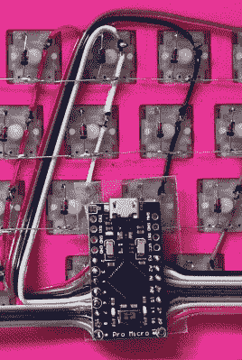

# Arduino 键盘从里到外都很华丽

> 原文：<https://hackaday.com/2018/02/15/arduino-keyboard-is-gorgeous-inside-and-out/>

虽然我们中的绝大多数人都满足于我们笔记本电脑上黏糊糊的 chiclet 键盘，或者我们在亚马逊上可以找到的最便宜的 USB 薄膜键盘，但有一种特殊的人需要更多的东西。对他们来说，没有什么比老式的机械键盘更好的了，每一次按键听起来都像是宙斯自己的脚步声。他们是真正的输入设备世界的“乍得”。

 但是如果即使是最高端的机械键盘也不能满足你对弹簧式完美的渴望呢？在这种情况下，剩下唯一要做的事情就是设计和建造你自己的。[Matthew Cordier]最近发布了他一直在为工作的[定制机械键盘，说这是一个优雅的工程设计有点轻描淡写。它的内部甚至可能比外部更好看。](https://www.reddit.com/r/MechanicalKeyboards/comments/7x93y5/pictures_of_my_completed_handwired_build_working/)

这款被他称为 z.48 的键盘是基于 Arduino Pro Micro 的，运行的是在[kbfirmware.com](http://kbfirmware.com)上生成的固件，并且具有一些绝对奇妙的手工布线功能。这里没有印刷电路板，只有五颜六色的电线和和尚的耐心。特别细心的读者可能会注意到[Matthew]用他的烙铁融化了电线上与按键接触的绝缘层，使最后的布线工作看起来非常干净。

说到钥匙，它们是带 [DSA Hana](https://pimpmykeyboard.com/dsa-hana-keyset/) 帽的 [Gateron](http://www.switchtop.com/product/gateron-switches) 开关。如果这些话对你没有任何意义，不要担心。我们现在透过镜子进入了键盘爱好者的世界。

最后，表壳本身采用 0.3 毫米的喷嘴和 0.2 毫米的涂层印刷在 CR-10 上，形成非常精细的表面。在 70%的填充，我们想象它有一个很好的交易以及分量。[Matthew]提到未来可能会有生产案例和 PCB，因为他希望对这些电路板进行小规模商业运作。与此同时，我们都可以沉浸在他的世界中作为原型的荣耀中。

这些年来，我们已经看到了一些令人印象深刻的机械键盘，包括偶尔出现的奇怪键盘，比如 T2 的全 3D 打印键盘，甚至还有 T4 的令人费解地绕着 T5 移动的键盘。但是这个由马修建造的建筑是我们见过的最优雅的建筑之一。