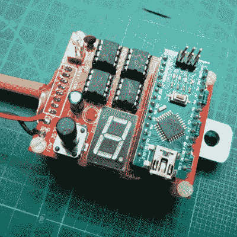

# Arduino Nano 运行电池点焊机

> 原文：<https://hackaday.com/2016/03/22/arduino-nano-runs-battery-spot-welder/>

在制造或维修电池组时，焊接可能看起来是一种诱人而廉价的替代方法，但熨斗的热量可能会损坏电池，因此连接效果不如焊接。不过幸运的是，一台像样的点焊机并不那么难制造，正如[KaeptnBalu]用他的 [Arduino 控制的电池点焊机](http://www.instructables.com/id/DIY-Arduino-Battery-Spot-Welder/)向我们展示的那样。

说到提供点焊所需的高电流，Arduino Nano 不一定是第一个想到的。但是对精确控制焊接脉冲的需求使得微控制器成为这种构建的自然选择，只要电流处理是外包的。在[KaeptnBalu]的设计中，他让一块独立的 PCB 上的一系列结实的 MOSFETs 来处理焊接电流。高电流布线特别有趣——粗规格绞合线被一分为二，形成 U 形，镀锡，每个引脚焊接到 MOSFET 板上。焊接头是简单的实心铜线，整个装置由一个汽车电池供电，或者如果工作需要额外的电流，可能需要两个电池。下面的视频显示了钻机可以生产的高质量焊缝。

点焊机是 Hackaday 上最受欢迎的，我们已经看到了简单的和复杂的版本。这种构建触及了复杂性和功能性的最佳点，手头有一个将打开许多电池黑客攻击的可能性。

 [https://www.youtube.com/embed/3RLVuy5PUKo?version=3&rel=1&showsearch=0&showinfo=1&iv_load_policy=1&fs=1&hl=en-US&autohide=2&wmode=transparent](https://www.youtube.com/embed/3RLVuy5PUKo?version=3&rel=1&showsearch=0&showinfo=1&iv_load_policy=1&fs=1&hl=en-US&autohide=2&wmode=transparent)

谢谢[克里斯·芒西]的提示。