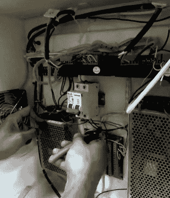

# arduino 评论垃圾场激光切割机

> 原文：<https://hackaday.com/2018/04/19/arduino-revives-junkyard-laser-cutter/>

有些人运气很好。[MakerMan]写信给~~幸灾乐祸的~~告诉我们最近去垃圾场的一次经历，在那里[他得到了一个看起来相当严肃的激光切割机](https://www.youtube.com/watch?v=D7AweNwrrN0)。这不是我们在这里谈论的台式机大小的 K40 它的重量不到 800 磅(350 公斤)，用了一台起重机才把它送到他家。但他的运气只到此为止，因为对机器的进一步检查发现，它几乎丢失了所有的内部组件。尽管如此，他有框架，工作电机，和激光光学，这比我们在垃圾中发现的要多得多。

 在与他的钢丝钳进行了一场旋风式的会议后，【MakerMan】剥去了电子舱内部大部分现有的线路和原来的控制板。取代原始控制器的是运行 Grbl 的 Arduino Nano，这可能使这台复兴的激光切割机与流行的开源工具的兼容性比原来更好。尽管激光切割机缺少大量的硬件，但他很幸运，电机驱动器仍然存在(并工作),双电源运行一切。

运动测试成功后，[MakerMan]接着安装一个新的 90W 激光管。支撑管子的是一个装配好的水冷系统，使用一个塑料罐和一个便宜的舱底泵。他还增加了一个空气辅助系统，配有侧面安装的压缩机。这将空气推过激光孔，帮助烟雾和碎片远离光束。最后，在机器的底部安装了一个鼓风机，通过柔性管道将激光器工作时产生的烟雾排出。

这台机器是对以前的激光[MakerMan]制造的的一次相当大的升级[,尽管这次重建迄今为止令人印象深刻，但我们有兴趣看看它从这里走向何方。如果你问我们，这东西在乞求一个](http://hackaday.com/2017/10/31/homebuilt-laser-engraver-using-salvaged-parts/)[嵌入式 LaserWeb 服务器](https://hackaday.com/2016/07/17/open-source-laser-cutter-software-gets-major-update-new-features/)。

 [https://www.youtube.com/embed/D7AweNwrrN0?version=3&rel=1&showsearch=0&showinfo=1&iv_load_policy=1&fs=1&hl=en-US&autohide=2&wmode=transparent](https://www.youtube.com/embed/D7AweNwrrN0?version=3&rel=1&showsearch=0&showinfo=1&iv_load_policy=1&fs=1&hl=en-US&autohide=2&wmode=transparent)

